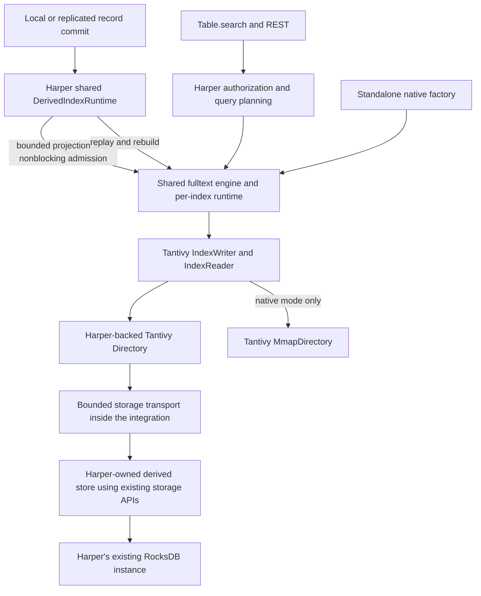
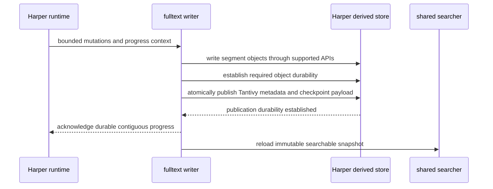

# Tantivy storage through Harper

> Storage architecture superseded September 14, 2026. The current design is
> [Native Tantivy storage and Harper derived indexes](https://github.com/HarperFast/fulltext/blob/codex/native-storage-design/docs/native-storage-integration.md).
> The wrapper and Harper now use native Tantivy files only, with local replay/rebuild on each node.
> RocksDB Directory, host transport, and dual-backend release requirements below are historical,
> not implementation requirements. Existing storage-independent schema, analysis, query, API safety,
> and packaging decisions remain requirements unless explicitly superseded by the current design.

## Scope and release boundary

The library has two delivery targets: the existing standalone native Tantivy backend and a Harper
integration that stores all persistent Tantivy index state in Harper's existing RocksDB database.
The planned Harper entry point is `@harperfast/fulltext/harper`; it is not an implemented export yet.
The native entry point remains `@harperfast/fulltext/native`.

There is no supported standalone rocksdb-js backend, optional rocksdb-js peer dependency, or required
native addon-to-addon lease. Engineering will not add the proposed fulltext storage functionality to
base rocksdb-js. The experimental branch `codex/issue-831-phase0-lease` is retained unmerged. Existing
experimental fulltext code may supply reusable Directory tests and mapping logic, but its lease
consumer is not the production integration or a release prerequisite. A three-backend benchmark is
optional investigation if a measured question warrants it, not a planned delivery gate.

Harper has no native-filesystem fallback or local Tantivy file cache. Keeping a second on-disk copy,
even if rebuildable from RocksDB, is outside the approved RocksDB-only storage scope. This is a
product boundary, not a claim that a file cache could not improve performance. The delivery scope
is recorded in [Ship native full-text search for Harper v5.3](https://github.com/HarperFast/fulltext/issues/1).
If the supported storage proof misses the workload target, report that result rather than silently
adding a file cache or relaxing the target.
A native-only library release is possible; a Harper fulltext release requires the qualified RocksDB
path. No second RocksDB runtime, database opener,
private patched rocksdb-js distribution, or external Tantivy service is introduced.

This is the current storage and integration plan. The earlier native-lease experiment remains
historical evidence. Storage-independent schema, English analysis, query, and result contracts
remain in the full product and wrapper designs.

## Architecture and ownership

| Concern                                                                               | Owner                                      |
| ------------------------------------------------------------------------------------- | ------------------------------------------ |
| Schema, records, authorization, REST and Table.search                                 | Harper                                     |
| Post-commit delivery, replay positions, retention policy, rebuild scan and activation | Harper shared derived-index runtime        |
| Analysis, BM25, query execution, postings, segments and merges                        | Tantivy through the shared fulltext engine |
| Bounded native admission, writer/search scheduling, errors and result buffers         | fulltext                                   |
| Tantivy logical-file mapping and storage transport                                    | fulltext Harper integration                |
| Derived-store registration, supported storage operations, backup/drop/close ordering  | Harper                                     |
| Database handles, transactions, WAL, flush, compaction and block cache                | Existing rocksdb-js/RocksDB implementation |

`DerivedIndexBackend` is the delivery/recovery protocol proposed in
[Derived-index delivery protocol (DerivedIndexBackend): shared post-commit delivery, watermark/replay, and blob-content contract for HNSW and full-text indexes](https://github.com/HarperFast/harper/issues/2489).
It is not itself a binary storage API. Its implementation status and exact replay contract must be
verified in Harper before freezing the integration. The fulltext wrapper does not parse Harper log
files, invent cursor ordering, or implement a second retention service.

Harper supplies an internal store integration using the database it already owns. This means a
Harper module calling supported storage APIs; it does not mean Harper can manufacture access to
rocksdb-js's private native handles. The exact store interface and transport are proof-stage work,
not a new customer-extensible provider API.

The engine, query builders, batch codec, commit actor, reader reload and error/lifecycle behavior
remain shared with native mode. The Harper integration supplies storage and derived-delivery
adaptation. It does not contain a second fulltext engine.

## First milestone: a real Harper vertical slice

Build the smallest integrated path before broad storage implementation:

1. Register a private derived index store within Harper's normal database lifecycle.
2. Route a bounded projected batch from Harper's post-commit runtime into the existing Tantivy
   engine. All write-capable workers, including replication applies, use the same delivery contract.
3. Write Tantivy objects and publication metadata through existing Harper/rocksdb-js APIs.
4. Commit, reload, query, close, restart Harper and reopen the same persistent index.
5. Force a process crash between source commit and delivery, and at storage-publication boundaries.
   Recover the previous complete index or the new complete index, then replay without missing data.
6. Repeat with concurrent record writes and multiple fulltext indexes. Record event-loop delay,
   queue occupancy, copied bytes, storage wait, ingestion throughput and search latency.

A mocked store or the experimental native lease does not clear this milestone. Native mode remains
the behavior reference. The first slice may use a narrow term query, but its storage contract must
exercise actual Tantivy flush, immutable slices and metadata publication.

This slice is an automated integration suite against a pinned Harper checkout and supported
rocksdb-js build. The source and storage failure cases gate its completion in CI; they are not
manual demonstration steps. FaultingKv and process-kill tests supplement this suite but do not
establish the production storage API's durability semantics.

## Storage transport: establish feasibility, then measure

Tantivy issues synchronous Directory operations from native indexing, merge and search threads.
Existing JavaScript storage methods cannot simply be invoked from those threads. The integration
must provide a legal, bounded handoff to a JavaScript environment that owns a supported store view,
or a bounded staging/read strategy using those APIs. This is a threading problem to implement and
measure, not evidence that rocksdb-js needs a new native ABI.

The first proof should test a request/response transport with batched chunk operations and explicit
buffer ownership. Select the storage worker arrangement from Harper's existing worker facilities.
Verify that those workers can obtain the intended store view and participate in Harper close/drop.
Do not assign all storage traffic permanently to worker 0 or promise zero JavaScript storage
callbacks. Batching may reduce crossings; random query misses still need measured service capacity.

Required transport properties:

- Record post-commit hooks only project/enqueue and return; they never wait for storage or queue space.
- Only package-owned native workers may wait for storage completion. A JS thread servicing storage
  must not synchronously wait for a Tantivy task that needs that same JS thread.
- Bound queued request count, bytes, response buffers and outstanding operations across all indexes.
  Include concurrently blocked native threads in a process-wide execution budget, covering writer,
  indexing, merge and search work; a bounded request queue alone does not bound thread growth.
  Establish capacity before starting native work, including internal Tantivy threads. Threads parked
  waiting for a permit still count; admission cannot hide an unbounded second waiting pool. This
  shared budget is a Harper integration requirement, not a claim about the shipped native backend.
  The proof must account for caller-sized indexing threads, package search threads and the pinned
  engine's internal merge pool. Where an internal pool cannot be resized, bound resident writers
  and concurrent opens/rebuilds using its verified thread cost. Transport permits alone cannot
  enforce a thread bound if additional threads wait outside the permit count.
  Give query work and control/shutdown operations explicit progress under sustained ingestion.
- A native storage wait must not hold a mutex or permit needed by a JS-facing entry point, the
  storage service or its completion path. Admission and resource limits must leave the completion
  path able to run.
- Define response ownership, cancellation, environment exit and late-completion behavior. Stopping
  the storage worker must wake native waiters with errors; closing the database must not strand them.
- Reject new work and drain or cancel dependencies before releasing the Harper store. Do not hold
  database locks across a round trip that requires another JS callback to finish.
- A runtime identifies the actual Harper database, index and generation. Reopening or recreating
  a store cannot make an old handle valid again.

Graceful close stops new admission, then drains or cancels accepted work within Harper's existing
shutdown deadline. Keep storage servicing alive while writers finish or roll back, merge threads
exit and searches release their slices. Quiesce all native users of the store and settle outstanding
transport requests before stopping the storage service and releasing its store view. Await this
sequence asynchronously; never join native threads from the JS thread they need for storage.

Unexpected worker exit or an expired shutdown deadline cannot depend on that worker running a final
callback. A surviving lifecycle path must fail queued and in-flight requests, wake native waiters,
and reject late submissions. Request state and buffers remain owned until native users and late
completions can no longer access them. Cancellation does not prove an executing storage operation
has stopped or rolled back; fence late completions and establish safe store release separately.
Test normal close, deadline expiry and worker loss during read, merge and publication, including
late responses. A timeout is not permission to free state still in use. Charge retained requests to
the transport budget until the last possible access is gone; persistent teardown failure cannot
permit unbounded replacement workers or indexes to accumulate retained state.

A bounded staging or read cache may be considered only after measurements show why it is needed;
its memory, invalidation and recovery obligations must then be specified. Whole-index RAM residency
is unsuitable for the target catalog scale. No local Tantivy files are used as a fallback.
If supported APIs cannot satisfy correctness, record the exact missing guarantee and stop that
milestone. Do not silently substitute the unmerged bridge or declare the Harper backend complete.

## Logical files and Directory conformance

Tantivy keeps its own segment formats. The derived store contains chunked segment objects (term
dictionaries, postings, optional positions, field norms, fast fields and configured stored content),
logical file bindings, delete metadata, `meta.json`, `.managed.json` and generation/format metadata.
It contains no duplicate authoritative records or independent mutation journal.

A per-index store with separate generation prefixes is the initial layout to test against Harper's
existing index-store lifecycle. Confirm allocation and cleanup APIs before fixing a physical
column-family layout; qualify column-family and memtable overhead with multiple indexes.

| Operation                   | Required behavior                                                                                                 |
| --------------------------- | ----------------------------------------------------------------------------------------------------------------- |
| Open/write/flush            | Newly created logical files are readable; repeated flush permits continued append and preserves visible prefixes. |
| Open slice/read             | Freeze object identity and visible length; existing slices never observe changed bytes.                           |
| Atomic metadata replacement | Readers see one complete old or new value, never a partial value.                                                 |
| Delete                      | Remove the logical binding while keeping already-open slices valid.                                               |
| Termination and sync        | Honor the pinned Tantivy contract, with visibility and durable completion distinguished explicitly.               |
| Locks and watch             | Preserve Tantivy writer exclusion and notification lifetime without inventing a distributed lock service.         |

Reuse the existing backend-parameterized Directory harness and experimental immutable-object tests
where they describe Tantivy semantics rather than native-lease mechanics. Given offset-addressable
objects, exact chunk sizing, batched
reads and copy strategy are measurement choices. Pinned native reads, MultiGet, target-CF flush,
native lock tokens and external SST ingestion are not required APIs in this plan.

### Prototype constraints that must change before storage qualification

The existing Phase 0 Directory is reusable evidence, not a production implementation. The source
at the native-backend baseline has these limitations:

- `KvFileHandle::read_bytes` walks fragments from zero to find a byte offset. A footer read can
  therefore fetch the whole file. Production bindings must address chunks by offset, through
  fixed-size chunks or a bounded offset index, without reading preceding payloads.
- `KvWriter::flush` re-reads its binding while holding the directory-wide mutation mutex, and
  `open_write` uses the default BufWriter capacity. Production code must not serialize unrelated
  file writes behind a lock held across host storage waits. Define per-file state and narrowly
  scoped metadata synchronization; preserve deletion/replacement detection when removing reads.
- `delete` removes bindings but leaves fragment values. Add bounded physical reclamation after
  the last referencing binding and open slice disappear. A crash must leave discoverable garbage,
  and repeated merge/delete cycles must reclaim it without an unbounded foreground scan.
- `atomic_write` always requests WAL_SYNC. Trace all Tantivy metadata writes, including
  `.managed.json`, and count actual storage synchronization calls. Reduce redundant syncs only
  where the pinned Directory contract and crash tests permit; do not weaken atomic_write durability
  merely to promise one fsync per commit.

Offset-addressable reads are a structural requirement; exact chunk size, batching and any bounded
in-memory cache are measurement choices. Before qualification, CI must assert storage-operation and fetched-byte budgets for
the same-sized range at the beginning and end of a growing file. It must also bound operations per MB
written, test concurrent file/merge progress, and measure live versus reclaimable object bytes
through repeated merge cycles. Logical reclamation is measured separately from RocksDB compaction
returning physical disk space. Establish these bounds before treating a transport benchmark as
representative of the production design.

Crash-orphan discovery must be incremental: bound each scan/delete batch by keys, bytes and elapsed
work, yield between batches, and resume safely after interruption. A generation prefix bounds the
scope, not the amount of work; scanning an entire large generation is not a bounded startup step.
Prefer existing ordered iteration and object/binding metadata before introducing another registry.
Use key and binding metadata for discovery, not segment payload scans. Reachability must include
published and retained heads, unpublished active writers and open slices. Establish a safe scan
boundary and revalidate deletion so concurrent allocation or publication cannot turn a live object
into garbage. Persist or safely reconstruct scan progress without a full blocking startup pass.
Do not block query readiness on a complete garbage sweep; required recovery validation has
its own bound and failure policy. Transactions protect individual storage updates, but objects
written across completed transactions can still become orphaned before index publication.

Internal namespace, generation, object and path encodings must be unambiguous. Use an existing
appropriate binary encoding or length-prefixed components and test delimiter-containing identifiers
and adjacent namespace scans. This is ordinary index isolation, not a multi-tenant feature.

## Publication, recovery and lifecycle

The checkpoint names only a contiguous set of completed source work represented in the published
index. Durable progress never outruns durable referenced objects. Searcher visibility follows
reload and is reported separately from storage durability.

The proof must name the exact current APIs and write options providing atomicity and durability.
It must evaluate a WAL-enabled derived-write path using existing APIs before assuming specialized
flush support. If WAL-disabled objects are used, their supported durability barrier must complete
before the metadata that references them can be acknowledged durable. An ordinary write promise,
a visibility flush or a process-kill test alone does not prove power-loss durability.

The transport preserves dependencies across enqueue, execution and acknowledgement: every object
write required by a publication completes under the selected durability contract before metadata
is published. Queue batching cannot move dependent writes across that barrier. A later sync proves
earlier WAL writes durable only when they use the same applicable WAL and ordering is established.
Audit the actual write options in integration tests; inject delayed, reordered and lost responses
around the barrier and verify that no newer checkpoint is acknowledged.

An atomic, ordered, durable replacement must recover a complete old or new publication after a
crash. That guarantee does not by itself provide fallback after later corruption or deletion of an
object. If recovery retains a prior head, it must retain that head's referenced objects as well;
otherwise corruption fails closed and Harper rebuilds. Metadata history alone is not recovery.

Do not change Harper's global WAL, flush or transaction-log truncation policy to make this adapter
work. Measure database-wide flush/write-stall coupling if the existing barrier has that scope.
Backup/checkpoint tests must prove referenced objects and metadata survive restore together, and
that a derived-only operation never falsely advances authoritative-record durability or log purge.

Harper coordinates rebuild scans, retention gaps, schema activation, cache residency, replicated
content retries and generation swaps through the shared protocol. The wrapper reports completion
and failure; it never scans Harper's primary store or decides that missing replay history is safe
to skip. Precise cursor/resume and retention gaps in the proposed protocol remain Harper-owned
integration blockers. They are separate from the rejected native storage bridge and must be
resolved explicitly using the supported stack before qualification.

A terminal engine or storage failure freezes durable progress, rejects further mutation admission
and reports the failure to Harper. Queries follow Harper's bounded stale-searcher policy and fail
closed when that policy expires; a healthy-looking frozen searcher cannot serve indefinitely.
Unknown partial application requires reopening from a validated durable commit or rebuilding.
Lock poisoning and worker exit must produce terminal errors and wake waiters, not continue mutation
with synchronization state whose invariants are unknown.

## Writer topology and throughput

Tantivy permits one IndexWriter for a physical index generation because segment publication,
deletion state and merge coordination share one authority. That writer can use Tantivy's indexing
threads; it does not imply one JavaScript worker, one writer per database or one writer per cluster.

The supported ownership model must be tested, not extended with a new distributed writer lease.
One writable RocksDB owner process and the shared in-process fulltext registry together must exclude
duplicate writers across Harper worker attachments. A second process must be rejected from opening
the same database for writing, rather than being allowed to race object allocation. Verify this
against the supported deployment. All worker views of the same live backing store must resolve to
one shared store identity and index/generation registry, not per-view identities. Reopening a live
attachment preserves identity; closing/recreating the underlying store changes its lifetime identity
and fences old views. Verify physical-store aliasing on supported platforms rather than relying on
path spelling. Test this identity contract, duplicate worker attachment, process-open rejection and
close/recreate. Any deployment with multiple writable owner processes requires a separate design;
it is not implicitly supported by the Directory.

Independent fulltext indexes may ingest, merge and search concurrently. Each has its own writer,
reader and generation state; shared native and storage-transport budgets bound aggregate work.
Storage workers and queues must allow useful progress across indexes without recreating a global
serial write lane. Saturation defers derived delivery to Harper replay while preserving the source
commit. Benchmarks must measure both throughput and backlog growth: a fast enqueue rate with
unbounded indexing lag is not throughput success.

## Performance and CI

The primary comparison is the existing native backend versus the actual Harper RocksDB-backed
integration. Use the same Tantivy/fulltext build, corpus, analyzer, mutation sequence, durability
cadence, query set, result validation and resource budgets wherever the layers permit.

Report two scopes separately:

- Engine/storage measurements through native and Harper-backed Directories, when the real Harper
  harness can exercise equivalent operations.
- Harper product measurements through Table.search and REST, including authorization, filtering,
  record materialization and protocol overhead.

An end-to-end Harper/native ratio is not a pure RocksDB overhead measurement. Attribute differences
with spans/counters for projection, packing, transport queue wait, copies, storage calls, commit,
reload, Tantivy execution and record retrieval. Include event-loop delay on the JS environments
servicing storage, native blocked-thread count and wait duration, and request/response handoff time.
Separate queueing and handoff from the storage call itself; report inclusive waits separately from
nested spans so they are not added twice. Exercise saturation, unrelated Harper traffic and shutdown
while native storage waits are active. Record peak and mean blocked-thread occupancy against the
configured budget. If counters enter the packed status API, update its versioned codec and parity
tests together rather than inserting unversioned fields. Run focused experiments only when those measurements
identify a question. Direct rocksdb-js benchmark results from the retained branch are experimental,
not a third supported backend and not a release blocker.

Measure ingest and update throughput, commit-to-searchable lag, search p50/p95/p99, errors/timeouts,
recovery/rebuild time, CPU/RSS, storage size and write amplification where available. Include warm
and cold reads, concurrent indexes, heavy-tail document sizes, sustained updates, delete/eviction,
replication, shared-database writes and increasing dataset sizes up to the target catalog scale.

The Harper goal remains p99 below 50 ms for the agreed workload at hundreds-of-millions scale.
Record sizes, query mix, concurrency, hardware and acceptable lag must accompany any claim.
The existing small native benchmark does not establish that product goal.

PR CI runs correctness, Directory parity, packed-package tests, schema-valid benchmark output and
small smoke workloads. Stable hardware runs scheduled and release profiles with reviewed thresholds;
no noisy hosted-runner latency ratio becomes a release gate. GitHub stores versioned JSON summaries,
environment/build/workload fingerprints and immutable release evidence so results compare across
releases. Experimental results have a distinct cohort and cannot replace production baselines.
A changed Harper/storage stack requires compatibility and performance requalification, not a new
lease-ABI pairing.

## Packaging and documentation

The native import remains independently usable. Add the Harper import only with its tested
integration; do not export a placeholder or advertise it as available before then. Harper owns its
rocksdb-js version, database configuration and dependency updates. fulltext neither declares the
proposed rocksdb-js peer nor bundles RocksDB into its Rust addon.

Release documentation includes native quick start, Harper setup and schema/query examples, supported
versions/platforms, ownership and shutdown, durability versus visibility, recovery/backup, errors,
limits, performance methodology and troubleshooting. Examples run against packed artifacts and the
qualified Harper checkout. Apache-2.0 applies to source and published artifacts.

## Approaches considered

| Axis                | Approach and disposition                                                                                                                                                                                                          |
| ------------------- | --------------------------------------------------------------------------------------------------------------------------------------------------------------------------------------------------------------------------------- |
| Different layer     | A native capability table in base rocksdb-js would serve direct native I/O, but engineering has rejected that addition. It is not a production dependency.                                                                        |
| Deeper cause        | Adapt the existing KvDirectory unchanged. Rejected: offset reads fetch preceding payloads, directory-wide locks span storage calls, and fragments are not reclaimed. Fix those invariants in the Directory before qualification.  |
| Do less             | Service storage through existing Harper workers rather than adding dedicated workers. Keep this candidate in the transport proof; it qualifies only if event-loop delay, progress and shutdown bounds hold under concurrent load. |
| Chosen              | Use offset-addressable Directory objects and bounded host storage transport over existing APIs, sharing the engine and Harper lifecycle. Select worker topology, chunk sizes and optional in-memory caching from the proof.       |
| Storage alternative | Materialize Tantivy files as a local disk cache of RocksDB objects. Excluded by the approved RocksDB-only storage boundary; its possible latency benefit does not authorize a second on-disk index copy.                          |

## Execution and decisions still to resolve

1. Prove storage worker/view ownership, bounded request/response transport and Directory semantics
   on the supported Harper stack; record exact source revisions and APIs.
2. Select the offset-addressable layout in the first storage slice: fixed-size chunks or a bounded
   offset index. Record metadata lookup bounds, chunk-size sweeps, read/space/write amplification,
   append/flush behavior and storage-format versioning before treating benchmarks as representative.
   Include offset metadata atomicity and reclamation reachability in the choice; a layout that
   reduces reads but cannot be recovered or safely reclaimed does not qualify.
3. Prove object/metadata durability, incremental orphan reclamation, close/drop/backup ordering and
   crash/reopen behavior.
4. Integrate the shared derived protocol, including exact replay, retention-gap detection,
   replication, eviction and rebuild. Do not represent the issue sketch as shipped code.
5. Reuse the shared engine for full query behavior and multi-index operation.
6. Qualify performance, documentation and packages; investigate measured differences as needed.

Before the Harper factory is frozen, engineering must resolve transport topology, memory/queue
budgets, durability options, store registration, and the shared protocol's exact progress/resume
contract. These are implementation proof obligations, not authorization to add native capabilities
to rocksdb-js. The schema and query design do not expose these internal choices to customers.
