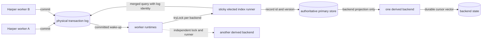
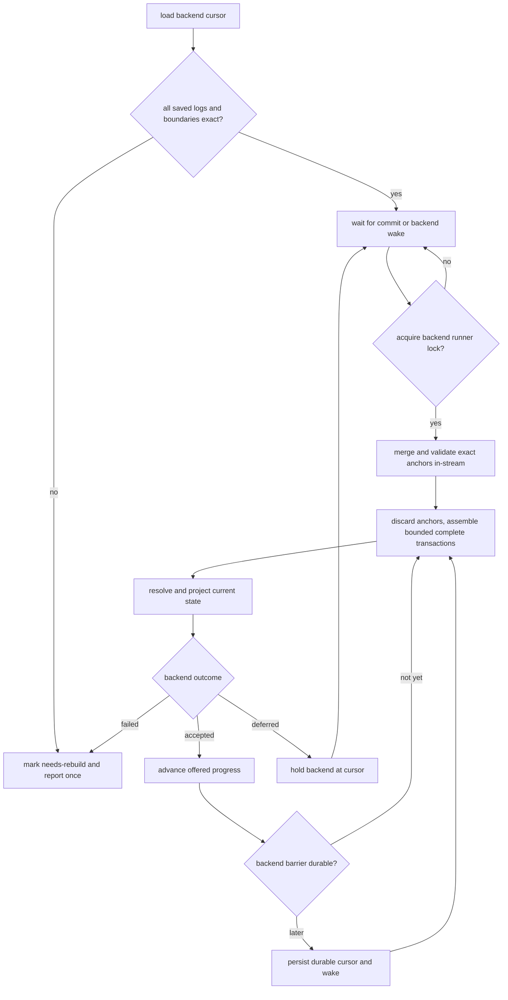

# Derived-index runtime: committed log delivery and exact replay foundation

## Goal

Implement the Harper-owned portion of the `DerivedIndexBackend` protocol from
[HarperFast/harper#2489](https://github.com/HarperFast/harper/issues/2489) before connecting
Tantivy. Stage 1 must prove that a fake backend receives the authoritative state produced by
committed mutations, preserves physical transaction-log boundaries, and resumes without skipping
retained work.

The transaction log is the data path in steady state and after restart. Commit notifications only
wake bounded index runners. This keeps ordinary delivery off the record transaction, gives live
delivery and recovery identical semantics, and avoids assigning all work to worker 0.

This stage is internal. It does not add schema directives, query syntax, Tantivy, a customer-visible
API, blob extraction, generation activation, or HNSW migration.

## Source-grounded constraints

- A RocksDB database has one set of transaction logs partitioned by origin. Every Harper worker can
  append to the same physical `local` log, while each worker has its own JavaScript
  `RocksTransactionLogStore` instance.
- `RocksTransactionLogStore.getRange()` can query one physical log with `start`, `exactStart`, and
  `exclusiveStart`. Entries carry a transaction timestamp and `endTxn`; ordinary queries exclude
  uncommitted entries.
- `RocksDatabase.tryLock()` and `getUserSharedBuffer()` already coordinate work across Harper worker
  threads. The subscription path uses these primitives where one worker must drain shared state.
- The root store's `committed` event is a cross-thread notification. It is a wake-up, not proof of
  which entries a particular worker observed.
- Conflict retries can re-resolve a record after its transaction-log payload was first staged. The
  audit entry therefore provides durable mutation identity and version evidence, but its embedded
  record is not authoritative for derived-index projection.
- `Table.evict()` ordinarily removes the primary row and its transactional custom indexes without
  writing an audit entry. A registered derived index adds a local-only eviction marker to that same
  RocksDB transaction so asynchronous indexing can mirror the removal.
- Transaction-log retention removes whole files. `TransactionLog.getStats()` exposes the oldest
  retained file sequence, while `exactStart` proves whether a saved transaction boundary remains
  readable.
- An `exactStart` miss can scan to the end of a physical log. Because transaction timestamps can
  move backward, neither the first retained timestamp nor `oldestSequenceNumber` can prove that a
  timestamp cursor was purged. Stage 1 accepts this reconstruction-time scan rather than making an
  unsafe timestamp comparison.
- `RocksTransactionLogStore.getRange()` converts native framing failures into
  `corruptFrameStop`; a decode failure yields a sentinel with no table or type. A derived reader
  must consume both signals rather than treating them as end-of-log or an irrelevant entry.
- The aggregate iterator's `safeNext()` also converts a non-framing iterator failure to
  `{ done: true }` without updating `corruptFrameStop`. Stage 1 adds a stable failed-log signal to
  the iterable so derived readers cannot confuse an I/O failure with a clean drain.
- A peer log can append a transaction key lower than an earlier physical entry. Resumption must use
  `exactStart` and consume its anchor from the same iterator: after locating the exact physical
  boundary, rocksdb-js returns every following transaction regardless of timestamp order.
- Harper replay and rocksdb-js `exactStart` already treat a transaction timestamp as the identity of
  one transaction within a physical log. Stage 1 keeps that existing invariant rather than adding a
  second log identity. If the runner observes the same timestamp closing twice in one physical log,
  it fails the backend closed and requires a rebuild.
- The installed rocksdb-js crash-recovery contract restores durable committed entries to ordinary
  committed queries on reopen, including entries written after the last RocksDB flush. Stage 1
  verifies that behavior through Harper instead of using `readUncommitted`.
- Current HNSW mutation remains synchronous and transactional. Stage 1 establishes the shared
  post-commit runtime without changing HNSW behavior.

## Invariants

1. Only committed transaction-log entries are delivered. The runtime never enables
   `readUncommitted`.
2. At most one worker runs a given backend/index for a database at a time. The elected runner merges
   that backend's physical logs into one serial delivery stream while keeping a cursor per log.
3. A backend's cursor is a versioned vector of `log name -> completed transaction timestamp`.
   Progress advances only at `endTxn` and only after that backend's durability barrier covers the
   complete transaction.
4. The live path and restart path use the same cursor validation, aggregate iterator, and dispatch
   code. Losing a wake-up or filling a backend queue can delay indexing but cannot skip durable log
   work.
5. Resume first proves every saved transaction with `exactStart`. A missing, corrupt, truncated, or
   ambiguous boundary moves the affected backend to `needs-rebuild`; approximate resume is not
   permitted.
6. The runtime resolves the current committed primary entry once per changed record in a runner
   batch and projects only the attributes registered for that backend. Backends never receive the
   full record or the log entry's potentially stale body.
7. No exception from log iteration, primary reads, projection, backend delivery, or native unlock
   callbacks can escape the scheduled drain, block another backend, or interfere with subscriptions
   and replication.
8. Ordinary commit-time work is limited to emitting the transaction log and coalescing a wake-up.
   Registration adds no `aftercommit` listener, retains no `AuditRecord` objects, does not hook
   `recordUpdater`, and never awaits index work. The only new write-path fact is a local-only eviction
   marker when a registered caching table removes a row without an existing audit event.

## Architecture



### Runtime ownership and wake-up

Each worker creates one `DerivedIndexRuntime` for a RocksDB root store when that database has at
least one registered derived backend. Worker-local runtimes have the same schema-derived
registrations. Each registered backend/index has its own process-wide lock, cursor vector, and
runner; multiple full-text indexes can therefore be owned by different workers and enqueue into
different Tantivy writers in parallel.

The runtime listens to the root store's existing `committed` event. The listener only marks a drain
scheduled and uses `setImmediate`, so commit bursts coalesce. A scheduled runner attempts the
backend's process-wide lock. A failed `tryLock(key, onUnlocked)` call does not confer ownership when
`onUnlocked` fires; the callback schedules a fresh acquisition attempt, matching the documented
rocksdb-js contract.

The winner keeps a reusable aggregate iterator and retains this derived-only lock while work is
active. It drains for bounded count, bytes, and wall time, then yields with `setImmediate`. The lock
is not taken by record writers, so retaining it across these turns cannot delay commits. After an
idle grace period—and only after durable progress has caught offered progress—it releases ownership
and discards the iterator. Cleanup, backend failure, and runtime shutdown release in `finally`;
another worker can then acquire and exact-resume. Native unlock callbacks are guarded and only
schedule a fresh `tryLock` attempt. This sticky-but-recoverable ownership avoids rebuilding and
seeking an iterator for every commit without permanently assigning worker 0.

### Per-backend scan and transaction assembly

Stage 1 adds an opt-in `includeLogName` value to `RocksTransactionLogStore.getRange()` and otherwise
reuses its existing aggregate iterator, per-log corrupt-frame tracking, new-log discovery, and
timestamp merge. `AuditRecord.logName` is initialized to `undefined` on both decoded and sentinel
entries so existing hot consumers keep one stable object shape; it is assigned only when requested.
The returned iterable also exposes `failedLogs`, naming any physical iterator that ended on an
unexpected non-corruption error; a derived-index runner treats either that signal or the existing
corrupt-frame signal as an availability failure and never advances its cursor through it.
A runner starts the aggregate with its backend's `startByLog` vector and preserves the physical log
name on every result. Entries from one physical log are assembled through `endTxn`; a drain budget
is checked only between complete transactions, never in the middle of one.

On construction or reconstruction, the aggregate reader exact-seeks each saved log cursor, validates
and consumes exactly one complete anchor transaction per saved log, then merges from those same
per-log iterators. It reports a missing or incomplete anchor and a second transaction boundary with
the same timestamp. Keeping validation and continuation in one iterator closes the race in which an
independently validated duplicate timestamp could commit before an exclusive resume and then be
skipped. A later physical transaction with a lower timestamp still follows the anchor and is
delivered. A newly discovered log without a saved cursor scans from its beginning only when its
oldest retained sequence is `1`; otherwise it forces a rebuild. One runner serializes all logs for
one backend, so two logs cannot apply competing states for the same primary key concurrently.

A bounded drain produces one backend batch, not one call per source transaction. Relevant
transactions retain their log name and boundary; the batch's `through` vector also records the last
complete transaction read from every log. A batch containing no relevant mutation can therefore
advance cursor-only progress with one delivery call instead of allocating an empty transaction for
every unrelated commit.

Each backend has an independent runner, iterator, progress vector, and backpressure state. If one
returns `deferred`, only that runner stops. Other indexes continue from their own positions without
re-reading a lagging backend's history. This deliberately accepts one log decode per index rather
than a shared scan whose start is pinned to the slowest cursor. Sharing may be added later only for a
cohort whose cursor distance is bounded and whose independent fallback is preserved.

Within a runner batch, repeated mutations for one `(tableId, recordId)` share one authoritative
primary read and one backend projection. The runtime never calls the resource `get()` path: a cache
miss must not fetch from an origin inside the drain. The configured projection runs in Harper and
returns only declared derived-index attributes; record bodies, credentials, and unrelated fields do
not cross the backend boundary or enter diagnostic logs.

### Offered progress versus durable progress

Native backends may accept several transactions before their next durability barrier. The runtime
therefore distinguishes:

- **offered progress**: the current owner's in-memory record of complete cursor vectors the backend
  accepted into its queue; and
- **durable progress**: the backend-owned cursor included in its durable index state.

Offered progress is read or changed only while holding the backend runner lock. A shared owner epoch
is minted from an atomic process-wide counter for each ownership acquisition and included in every
batch, allowing a backend to distinguish callbacks or queued work from different owners. When a new
epoch acquires the lock—including after an individual Harper worker restart—it resets offered
progress to the backend's durable cursor before constructing its iterator. Replaying work that
survived in a native queue is safe; trusting the dead worker's non-durable position is not.

A backend state-change notification wakes the runner after capacity returns or a barrier advances.
If the current owner reports that accepted work was lost, it also resets offered progress to durable
progress and reconstructs the iterator. A full process crash discards all offered progress and
replays from the durable cursor.

The owner retains the complete cursor vector for each accepted batch until the backend advances its
durable barrier. A reported durable cursor must exactly equal one of those vectors; validating each
log independently would allow a backend to assemble a cursor from different batch boundaries and
hide work. Once a full vector becomes durable, older offered vectors and their duplicate-detection
window are discarded. The backend must therefore publish the `through` vector atomically with the
index state made durable by that barrier.

Accepted-but-not-durable progress is capped at 64 batches by default. At the cap, the runner retains
ownership but stops reading and enters `waiting-durable`; database commit wakes do not retry it. A
backend state-change wake reconciles its cursor and resumes only after a complete offered vector has
become durable. Backend-returned `deferred` batches follow the same wake discipline, preventing an
unrelated database write stream from repeatedly probing a saturated native queue.

The fake Stage 1 backend acknowledges each complete transaction durably before returning
`accepted`. This proves the cursor and cross-worker mechanics without pretending to implement the
later Tantivy queue and barrier.

### Authoritative record resolution

The transaction log decides what must be revisited; the primary store decides what should be in the
index now. Before delivery, the runtime loads the current committed entry with raw
`primaryStore.getEntry()` for every unique record id referenced by a relevant mutation:

- a present, locally valid entry yields its current version and projected indexed attributes;
- a missing, deleted, evicted, or invalidated entry yields absence only because every supported
  removal now has a durable `delete`, `invalidate`, `relocate`, or local-only `evict` fact;
- a record newer than the log mutation is delivered at its current version; later log entries for
  that version are harmless overlap; and
- `message`, `publish`, and structure-only entries advance progress without becoming indexed
  documents; a `reload` marker makes affected backends rebuild because its base-copy rows have no
  per-record log entries.

This is deliberately a latest-state protocol rather than an event-history protocol. Full-text and
HNSW are materialized views, and backend mutations replace state idempotently by primary key. Reading
the primary store costs more than passing the in-memory write object, but it avoids indexing an
attempt that lost a retry and keeps live and replay payloads identical. Drain batching and shared
resolution amortize that cost outside the commit path.

### Cache eviction marker

For a caching table with a registered derived backend, both `Table.evict()` and
`createEvictionBatcher().stageInto()` call one helper that stages a bodyless internal eviction entry
in the existing physical transaction log before removing the primary row. It uses the same RocksDB
transaction as the version-guarded removal and is `LOCAL_ONLY`: cache residency is local and must not
replicate. If the transaction conflicts or aborts, neither removal nor marker commits.

The internal action is a no-op in boot replay and does not increment replayed-record counts.
Customer-facing history and subscription replay filter it, while raw transaction-log readers retain
it for the derived runtime. Replication continues to reject it through `LOCAL_ONLY`.

This is the only Stage 1 producer change. It is necessary because HNSW and ordinary secondary
indexes are currently removed synchronously by `updateIndices`, while an asynchronous derived
index otherwise has no durable evidence that the cached row disappeared. Tables without a derived
backend pay only an O(1) registration guard and retain the existing storage writes.

### Cursor validation and retention gaps

The cursor format is canonical and versioned. It records a completed transaction timestamp for
every known physical log, including logs whose transactions had no entries relevant to a backend;
otherwise a quiet index could retain an old cursor until normal log retention forced an unnecessary
rebuild.

Before opening an iterator, the runtime checks `rootStore.listLogs()` so querying a removed cursor
name does not recreate an empty log through `useLog()`. Every new iterator—startup, owner handoff, or
recovery after lost accepted work—uses `exactStart` for saved logs and asks the aggregate reader to
resume after one physical transaction rather than applying a value-based exclusive filter. Its
in-stream anchor phase requires the first matching transaction to close exactly once before any
following transaction is eligible for delivery. The range's `exactStartFailures` map distinguishes a
missing, incomplete, or duplicate boundary. Any such failure or a missing saved log produces
`needs-rebuild` for that backend.

`oldestSequenceNumber` remains useful for lag telemetry and for deciding whether a newly discovered
log can safely start at its beginning, but it is not compared with a timestamp cursor. The current
rocksdb-js iterator does not expose the physical sequence and offset of yielded entries, and a lower
timestamp can be appended in a later sequence. Stage 1 therefore pays a possible full-log scan only
when reconstructing an owner whose exact cursor has been lost to retention; sticky ownership keeps
that work off steady-state drains.

After every bounded iterator pass, the runner inspects `corruptFrameStop` and the new failed-log set.
Any frame break, terminated per-log iterator, audit decode sentinel, primary read failure, or
projection failure is fail-closed: the runtime cannot prove the transaction's state, so the backend
transitions to rebuild rather than treating it as absence or advancing through it. Other backend
runners encounter the same durable fault independently. This rule is intentionally stricter than
subscription delivery.

Activation must persist the complete set of log names and a boundary for each log before a base
scan begins. A subsequently discovered log may start at its first retained transaction only when
`TransactionLog.getStats().oldestSequenceNumber === 1`; otherwise its unknown prefix requires a
rebuild. Generation activation and the scan-to-replay handoff are later work, but Stage 1 keeps the
cursor shape compatible with that requirement.

Supported retention and purge operations are covered by these proofs. Transaction-log mappings can
continue reading a file after it was purged from disk, so an in-process test cannot prove the
retention-gap branch. Qualification closes and reopens the database in a child process before
asserting the exact-anchor miss and rebuild transition. Out-of-band deletion and
recreation of a log directory with the same name and no surviving cursor boundary cannot be
distinguished with the supported rocksdb-js API. Harper will not claim detection for that
unsupported filesystem mutation. A saved boundary normally makes recreation fail `exactStart` and
therefore rebuild.

Harper does not pin transaction-log retention in Stage 1. A backend lagging past retention rebuilds
when its next exact anchor fails. Runtime status records cursor age and log-floor distance, and emits
one error and one metric per transition to `needs-rebuild`, so this availability loss is visible.

### Backend boundary

The runtime-facing contract remains storage-engine-neutral:

```ts
type DerivedIndexCursor = {
	format: 1;
	logs: Record<string, number>;
};

type DerivedIndexTransaction = {
	logName: string;
	timestamp: number;
	mutations: DerivedIndexMutation[];
};

type DerivedIndexBatch = {
	ownerEpoch: bigint;
	transactions: DerivedIndexTransaction[];
	through: DerivedIndexCursor;
};

type DerivedIndexMutation = {
	tableId: number;
	recordId: Id;
	logVersion: number;
	state: { kind: 'record'; version: number; projection: unknown } | { kind: 'absent' };
};

interface DerivedIndexBackend {
	readonly id: string;
	getDurableCursor(): DerivedIndexCursor | undefined;
	deliver(batch: DerivedIndexBatch): DerivedIndexDeliveryResult;
	onStateChange(wake: (change?: 'changed' | 'accepted-work-lost' | 'failed') => void): () => void;
}

type DerivedIndexRegistration = {
	backend: DerivedIndexBackend;
	projections: ReadonlyMap<number, (record: unknown) => unknown>;
};
```

`DerivedIndexRegistration` belongs to Harper. Its projection functions are compiled from schema
attributes and execute before `deliver()`, so the backend receives only its declared materialized
view. They are not customer callbacks.

`DerivedIndexDeliveryResult` uses the exported numeric constants `DERIVED_INDEX_ACCEPTED`,
`DERIVED_INDEX_DEFERRED`, and `DERIVED_INDEX_FAILED` rather than allocating result objects on the
drain path. A `deliver()` call is included in the runner's wall-time budget and may not wait on a
writer mutex or merge. `accepted` means the backend owns the batch; it does not authorize durable
cursor advancement until the backend's barrier includes its `through` vector. `deferred` preserves
the batch and requires a later state-change wake. A backend reports discarded accepted-but-not-
durable queue contents as `accepted-work-lost`, causing the current owner to reconstruct from the
durable cursor. A permanent failure transitions the backend to `needs-rebuild` and emits one
contextual error outside the write path.

The cursor remains backend-owned because its atomic durability mechanism differs by engine:
Tantivy includes it in published index state, while a future HNSW implementation stores it with the
plane generation. Harper owns validation, iteration, coordination, and rebuild transitions.

## Failure and recovery flow



## Approaches considered

**Invariant:** every committed mutation relevant to a derived index is eventually reflected in the
index, or that index is explicitly unavailable pending rebuild; cursor advancement can never hide
unapplied work.

### Different layer

The transaction-log reader in the resource layer owns delivery. Extending `transactionBroadcast`
with full-database subscriptions and a durable cursor would reuse its wake-up and batching, but its
state is one scalar per subscription set, its active-count lifecycle is customer-facing, and its
aggregate results omit the log identity required by a cursor vector. Stage 1 reuses the aggregate
iterator and scheduling patterns without coupling index availability or backpressure to customer
subscriptions. Putting the reader in each backend would duplicate Harper's corruption, retention,
and replay rules.

### Deeper cause

Running derived-index mutation inside the primary write transaction would prevent divergence and is
how current HNSW custom-index updates behave. It is rejected for this protocol because neither
Tantivy nor the native HNSW plane shares RocksDB transaction rollback: pre-commit application can
leave phantoms after abort, adds index latency to record writes, and cannot atomically commit the two
stores.

A transactional intent outbox would instead write `(tableId, recordId, version)` into a separate
column family in the same RocksDB transaction and drain that durable queue. It avoids transaction-log
retention, but adds another write, compaction stream, cleanup protocol, and recovery store to every
indexed mutation even though the existing transaction log already records the same identity. The
design rejects that hot-path write amplification and second source of mutation truth.

### Do less

Rebuilding every derived index from the primary table on every process start avoids cursors and
replay. It is correct but not operationally viable for catalogs containing hundreds of millions of
records, and it turns an ordinary restart into a long period without search. Rebuild remains the
fail-closed recovery path when retained log continuity cannot be proved.

Pinning log reclamation to the slowest derived cursor would reduce rebuilds. Current rocksdb-js has
no protected-position registration: `purgeLogs()` accepts time/name filters and its configured
retention still applies independently. Harper will not introduce a rocksdb-js primitive for this
stage. Instead it exposes lag, exact-checks every reconstructed reader, and rebuilds when retention
wins. A later availability improvement may add a Harper-controlled maximum-lag policy, but cannot
silently weaken the exactness rule.

Keeping evicted documents in the derived index and filtering search candidates against the primary
store would avoid an eviction marker. Harper's transactional indexes, including current HNSW, remove
their entries during both direct and batched eviction. Retaining full-text documents would make this
index the exception and add a primary point read to result filtering, directly consuming the search
latency budget. The design instead mirrors Harper's existing index lifecycle.

### Chosen

A bounded, lock-elected runner per backend uses the transaction log for both live and restart
delivery. Compared with same-thread `aftercommit` dispatch, it gives one serial backend stream and a
well-defined cursor vector for logs shared by all workers, avoids retaining every audit object in a
database transaction, and resolves the authoritative post-retry record. Compared with a permanent
worker-0 drainer, different indexes can elect different workers and run in parallel. Compared with a
single shared scan, a lagging index cannot force healthy indexes to rescan its backlog or starve at
the head.

A later optimization may run one shared head reader for indexes whose cursors remain within a
bounded cohort and move a lagging member to its own catch-up runner. That avoids N decodes in the
common aligned case without pinning healthy indexes to the slowest cursor. Stage 1 has one fake
backend and no measured N-scan bottleneck, so it establishes the independent runner fallback first;
the cursor and batch contracts do not prevent adding cohorts after comparative benchmarks.

## Verification

### Correctness

- Real audited RocksDB writes: put, patch, delete, eviction/invalidation, multi-record transaction,
  aborted transaction, and replicated/source-timestamp transaction.
- Prove ordinary queries exclude a failed commit's staged log entries.
- Force coordinated and `ERR_BUSY` retry paths; compare delivered state with the committed primary
  state.
- Interleave two workers writing the same `local` log and prove one complete, ordered delivery per
  transaction with no cursor leap.
- Interleave local and replicated writes to the same record across two physical logs; prove one
  backend runner preserves enqueue order and converges to current primary state.
- Append a lower origin transaction key after a higher key in one physical peer log, resume from
  the higher boundary, and prove same-iterator anchor consumption still delivers the later physical
  entry.
- Prove one backend's throw, malformed result, deferral, and recovery do not affect another backend
  or the existing subscription and replication listeners.
- Force primary-read and projection throws inside a scheduled drain; prove the backend rebuilds,
  the lock releases, and the worker remains healthy.
- Compare an uninterrupted fake index with one rebuilt by exact replay from every possible durable
  transaction boundary.
- Prove exact resume, missing saved log, exact-start miss, new-log discovery, retention gap,
  corrupt/truncated transaction, and duplicate transaction timestamp behavior.
- Prove a corrupt-frame stop and undecodable sentinel transition to rebuild without advancing any
  affected cursor.
- Inject a non-framing per-log iterator failure and prove the failed-log signal rebuilds rather than
  presenting a clean end-of-log.
- Prove direct, expires-at sweep, and `createEvictionBatcher` eviction while delivery is deferred all
  remove the document, while a failed eviction transaction emits neither removal nor marker.
- Prove internal eviction entries are hidden from customer history and subscription APIs, ignored
  and uncounted by boot replay, and never sent to a peer.
- Prove an out-of-band reload marker triggers rebuild rather than cursor advancement.
- Reopen after an unclean shutdown and prove the installed rocksdb-js exposes recovered durable
  entries to the ordinary committed reader; never substitute `readUncommitted` in the runtime.
- Queue behind an occupied backend lock and prove its unlock callback retries `tryLock` before
  running and that every acquired path releases on stop or failure.
- Terminate the elected worker with accepted but non-durable work; prove the new owner epoch resets
  offered progress to the durable cursor and redelivers it.
- Use an asynchronous fake durability barrier and bounded queue, not only the immediate-durable fake,
  for backpressure, handoff, and crash tests.
- Assert the runtime-observed eligible mutation identity multiset against the committed workload in
  addition to comparing final index state, so convergence cannot hide a skipped transaction.
- Saturate the fake backend, drop live wake-ups, then release capacity and prove it catches up from
  its durable cursor without missing a mutation.

### Performance and bounds

- Assert that backend registration does not add an `aftercommit` listener or cause
  `transaction.logEntries` retention solely for derived indexing, including while an unrelated
  same-thread subscription is active.
- Assert one backend call per bounded drain batch, including cursor-only batches, rather than one
  empty delivery per unrelated transaction.
- Verify `AuditRecord` keeps a stable `logName` field shape with and without `includeLogName` and run
  the existing subscription/replication performance coverage against the default iterator.
- Apply count, byte, and wall-time budgets between complete transactions; a single oversized
  transaction is handled as an explicit bounded exception rather than silently split.
- Benchmark write throughput and event-loop delay with no backend, an idle backend on an unrelated
  table, and an active backend.
- Benchmark one versus several derived indexes to measure per-index log decoding and seeks, sticky
  iterator reuse, native enqueue throughput, deferred recovery, and independent runner parallelism.
- Benchmark aligned and intentionally divergent index cursors before considering a shared scan
  cohort; no cohort optimization is part of Stage 1.
- Exercise a large transaction to prove memory is bounded by the configured drain batch plus one
  complete transaction, not by all writes retained until commit.

### Repository gates

- Add focused resource unit coverage and the existing cross-worker harness coverage.
- Run the resource unit gate and the repository's full required unit and integration gates before
  PR promotion.
- End-to-end verification for Stage 1 is a real audited RocksDB table feeding the fake backend
  through commit, bounded drain, cursor persistence, restart, and replay. Tantivy equivalence is a
  later integration gate.
