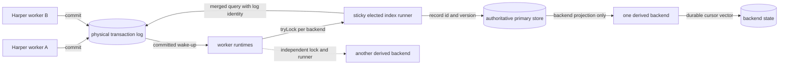
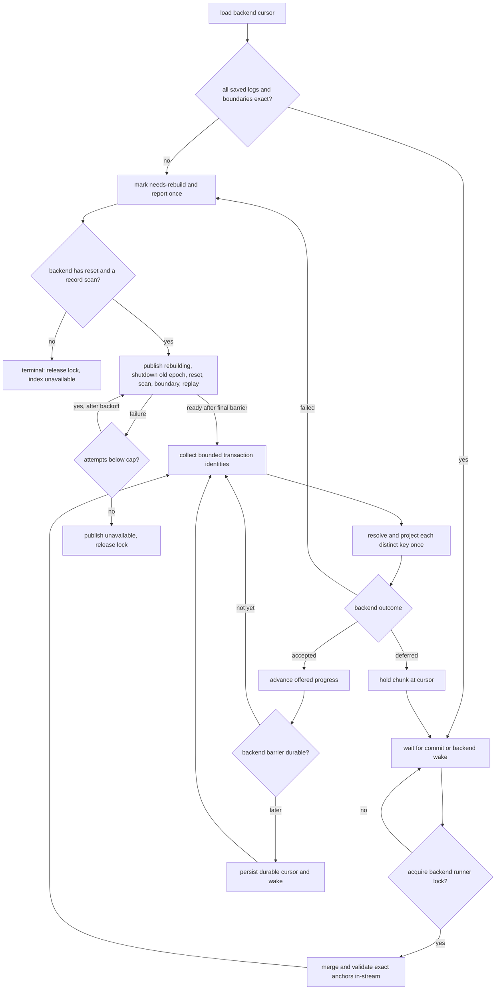

# Derived-index runtime: committed log delivery and exact replay foundation

## Goal

Implement the Harper-owned portion of the `DerivedIndexBackend` protocol from
[HarperFast/harper#2489](https://github.com/HarperFast/harper/issues/2489) before connecting
Tantivy. Stage 1 must prove that a fake backend receives the authoritative state produced by
committed mutations, preserves physical transaction-log boundaries, and resumes without skipping
retained work.

The transaction log is the data path in steady state and after restart. Commit notifications only
wake bounded index runners. This keeps ordinary delivery off the record transaction, gives live
delivery and recovery identical semantics, and avoids assigning all work to worker 0.

This stage is internal. It does not add schema directives, query syntax, Tantivy, a customer-visible
API, blob extraction, generation activation, or HNSW migration.

## Source-grounded constraints

- A RocksDB database has one set of transaction logs partitioned by origin. Every Harper worker can
  append to the same physical `local` log, while each worker has its own JavaScript
  `RocksTransactionLogStore` instance.
- `RocksTransactionLogStore.getRange()` can query one physical log with `start`, `exactStart`, and
  `exclusiveStart`. Entries carry a transaction timestamp and `endTxn`; ordinary queries exclude
  uncommitted entries.
- `RocksDatabase.tryLock()` and `getUserSharedBuffer()` already coordinate work across Harper worker
  threads. The subscription path uses these primitives where one worker must drain shared state.
- The root store's `committed` event is a cross-thread notification. It is a wake-up, not proof of
  which entries a particular worker observed.
- Conflict retries can re-resolve a record after its transaction-log payload was first staged. The
  audit entry therefore provides durable mutation identity and version evidence, but its embedded
  record is not authoritative for derived-index projection.
- `Table.evict()` ordinarily removes the primary row and its transactional custom indexes without
  writing an audit entry. A registered derived index adds a local-only eviction marker to that same
  RocksDB transaction so asynchronous indexing can mirror the removal.
- Transaction-log retention removes whole files. `TransactionLog.getStats()` exposes the oldest
  retained file sequence, while `exactStart` proves whether a saved transaction boundary remains
  readable.
- An `exactStart` miss can scan to the end of a physical log. Because transaction timestamps can
  move backward, neither the first retained timestamp nor `oldestSequenceNumber` can prove that a
  timestamp cursor was purged. Stage 1 accepts this reconstruction-time scan rather than making an
  unsafe timestamp comparison.
- `RocksTransactionLogStore.getRange()` converts native framing failures into
  `corruptFrameStop`; a decode failure yields a sentinel with no table or type. A derived reader
  must consume both signals rather than treating them as end-of-log or an irrelevant entry.
- The aggregate iterator's `safeNext()` also converts a non-framing iterator failure to
  `{ done: true }` without updating `corruptFrameStop`. Stage 1 adds a stable failed-log signal to
  the iterable so derived readers cannot confuse an I/O failure with a clean drain.
- A peer log can append a transaction key lower than an earlier physical entry. Resumption must use
  `exactStart` and consume its anchor from the same iterator: after locating the exact physical
  boundary, rocksdb-js returns every following transaction regardless of timestamp order.
- Harper replay and rocksdb-js `exactStart` already treat a transaction timestamp as the identity of
  one transaction within a physical log. Stage 1 keeps that existing invariant rather than adding a
  second log identity. If the runner observes the same timestamp closing twice in one physical log,
  it fails the backend closed and requires a rebuild.
- The installed rocksdb-js crash-recovery contract restores durable committed entries to ordinary
  committed queries on reopen, including entries written after the last RocksDB flush. Stage 1
  verifies that behavior through Harper instead of using `readUncommitted`.
- Current HNSW mutation remains synchronous and transactional. Stage 1 establishes the shared
  post-commit runtime without changing HNSW behavior.

## Invariants

1. Only committed transaction-log entries are delivered. The runtime never enables
   `readUncommitted`.
2. At most one worker runs a given backend/index for a database at a time. The elected runner merges
   that backend's physical logs into one serial delivery stream while keeping a cursor per log.
3. A backend's cursor is a versioned vector of `log name -> completed transaction timestamp`.
   Progress advances only at `endTxn` and only after that backend's durability barrier covers the
   complete transaction.
4. The live path and restart path use the same cursor validation, aggregate iterator, and dispatch
   code. Losing a wake-up or filling a backend queue can delay indexing but cannot skip durable log
   work.
5. Resume first proves every saved transaction with `exactStart`. A missing, corrupt, truncated, or
   ambiguous boundary moves the affected backend to `needs-rebuild`; approximate resume is not
   permitted.
6. The runtime resolves the current committed primary entry once per changed record in a runner
   batch and projects only the attributes registered for that backend. Backends never receive the
   full record or the log entry's potentially stale body.
7. No exception from log iteration, primary reads, projection, backend delivery, or native unlock
   callbacks can escape the scheduled drain, block another backend, or interfere with subscriptions
   and replication.
8. Ordinary commit-time work is limited to emitting the transaction log and coalescing a wake-up.
   Registration adds no `aftercommit` listener, retains no `AuditRecord` objects, does not hook
   `recordUpdater`, and never awaits index work. The only new write-path fact is a local-only eviction
   marker when a registered caching table removes a row without an existing audit event.

## Architecture



### Runtime ownership and wake-up

Each worker creates one `DerivedIndexRuntime` for a RocksDB root store when that database has at
least one registered derived backend. Worker-local runtimes have the same schema-derived
registrations. Each registered backend/index has its own process-wide lock, cursor vector, and
runner; multiple full-text indexes can therefore be owned by different workers and enqueue into
different Tantivy writers in parallel.

Registration is distinct from runner ownership. Schema activation must install the same table
registrations in every worker before that worker can accept table operations or run eviction; only
the derived-index drain is lock-elected. This makes the worker-local O(1) eviction guard reliable
even when another worker owns the backend runner. Schema deactivation removes those registrations
only after the worker can no longer evict for the old schema.

The runtime listens to the root store's existing `committed` event. The listener only marks a drain
scheduled and uses `setImmediate`, so commit bursts coalesce. A scheduled runner attempts the
backend's process-wide lock. A failed `tryLock(key, onUnlocked)` call does not confer ownership when
`onUnlocked` fires; the callback schedules a fresh acquisition attempt, matching the documented
rocksdb-js contract.

The winner keeps a reusable aggregate iterator and retains this derived-only lock while work is
active. It drains for bounded count, bytes, and wall time, then yields with `setImmediate`. The lock
is not taken by record writers, so retaining it across these turns cannot delay commits. After an
idle grace period—and only after durable progress has caught offered progress—it releases ownership
and discards the iterator. Cleanup, backend failure, and runtime shutdown release in `finally`;
another worker can then acquire and exact-resume. Native unlock callbacks are guarded and only
schedule a fresh `tryLock` attempt. This sticky-but-recoverable ownership avoids rebuilding and
seeking an iterator for every commit without permanently assigning worker 0.

### Per-backend scan and transaction assembly

Stage 1 adds an opt-in `includeLogName` value to `RocksTransactionLogStore.getRange()` and otherwise
reuses its existing aggregate iterator, per-log corrupt-frame tracking, new-log discovery, and
timestamp merge. `AuditRecord.logName` is initialized to `undefined` on both decoded and sentinel
entries so existing hot consumers keep one stable object shape; it is assigned only when requested.
The returned iterable also exposes `failedLogs`, naming any physical iterator that ended on an
unexpected non-corruption error; a derived-index runner treats either that signal or the existing
corrupt-frame signal as an availability failure and never advances its cursor through it.
A runner starts the aggregate with its backend's `startByLog` vector and preserves the physical log
name on every result. Entries from one physical log are assembled through `endTxn`. The transaction
count and byte budgets are checked only between complete transactions; an oversized transaction is
cut into explicitly marked partial chunks by the distinct-record and wall-time bounds described in
[Bounded collection, resolution and delivery](#bounded-collection-resolution-and-delivery), and no
cursor is published for it until its `endTxn` entry has been delivered.

On construction or reconstruction, the aggregate reader exact-seeks each saved log cursor, validates
and consumes exactly one complete anchor transaction per saved log, then merges from those same
per-log iterators. It reports a missing or incomplete anchor and a second transaction boundary with
the same timestamp. Keeping validation and continuation in one iterator closes the race in which an
independently validated duplicate timestamp could commit before an exclusive resume and then be
skipped. A later physical transaction with a lower timestamp still follows the anchor and is
delivered. A newly discovered log without a saved cursor scans from its beginning only when its
oldest retained sequence is `1`; otherwise it forces a rebuild. One runner serializes all logs for
one backend, so two logs cannot apply competing states for the same primary key concurrently.

A bounded drain produces one backend batch, not one call per source transaction. Relevant
transactions retain their log name and boundary; the batch's `through` vector also records the last
complete transaction read from every log. A batch containing no relevant mutation can therefore
advance cursor-only progress with one delivery call instead of allocating an empty transaction for
every unrelated commit.

Each backend has an independent runner, iterator, progress vector, and backpressure state. If one
returns `deferred`, only that runner stops. Other indexes continue from their own positions without
re-reading a lagging backend's history. This deliberately accepts one log decode per index rather
than a shared scan whose start is pinned to the slowest cursor. Sharing may be added later only for a
cohort whose cursor distance is bounded and whose independent fallback is preserved.

Within a runner batch, repeated mutations for one `(tableId, recordId)` share one authoritative
primary read and one backend projection, and the batch's `records` view lists each such key once
(see [Coalesced delivery view](#coalesced-delivery-view)). The runtime never calls the resource
`get()` path: a cache miss must not fetch from an origin inside the drain. The configured projection runs in Harper and
returns only declared derived-index attributes; record bodies, credentials, and unrelated fields do
not cross the backend boundary or enter diagnostic logs.

### Offered progress versus durable progress

Native backends may accept several transactions before their next durability barrier. The runtime
therefore distinguishes:

- **offered progress**: the current owner's in-memory record of complete cursor vectors the backend
  accepted into its queue; and
- **durable progress**: the backend-owned cursor included in its durable index state.

Offered progress is read or changed only while holding the backend runner lock. A shared owner epoch
is minted from an atomic process-wide counter for each ownership acquisition and included in every
batch, allowing a backend to distinguish callbacks or queued work from different owners. When a new
epoch acquires the lock—including after an individual Harper worker restart—it resets offered
progress to the backend's durable cursor before constructing its iterator. Replaying work that
survived in a native queue is safe; trusting the dead worker's non-durable position is not.

A backend state-change notification wakes the runner after capacity returns or a barrier advances.
If the current owner reports that accepted work was lost, it also resets offered progress to durable
progress and reconstructs the iterator. A full process crash discards all offered progress and
replays from the durable cursor.

The owner retains the complete cursor vector for each accepted batch until the backend advances its
durable barrier. A reported durable cursor must exactly equal one of those vectors; validating each
log independently would allow a backend to assemble a cursor from different batch boundaries and
hide work. Once a full vector becomes durable, older offered vectors and their duplicate-detection
window are discarded. The backend must therefore publish the `through` vector atomically with the
index state made durable by that barrier.

Accepted-but-not-durable progress is capped at 64 cursor-advancing batches by default
(`maxAcceptedBatchesAhead`, settable per registration). At the cap, the runner retains ownership
but stops reading and enters `waiting-durable`; database commit wakes do not retry it. A backend
state-change wake reconciles its cursor and resumes only after a complete offered vector has become
durable. The cap never blocks while a transaction is open, because the durable cursor cannot move
until that transaction closes; memory pressure from an oversized transaction is the backend's
`deferred`. Backend-returned `deferred` batches follow the same wake discipline, preventing an
unrelated database write stream from repeatedly probing a saturated native queue. The cap is a
ceiling on durability lag, not a flush schedule; the schedule is the
[durability cadence](#durability-cadence).

The fake Stage 1 backend acknowledges each complete transaction durably before returning
`accepted`. This proves the cursor and cross-worker mechanics without pretending to implement the
later Tantivy queue and barrier. The native-backend suite adds a queue-and-accept fake whose apply
and barrier run asynchronously, which is the shape a native backend is expected to use.

### Authoritative record resolution

The transaction log decides what must be revisited; the primary store decides what should be in the
index now. Before delivery, the runtime loads the current committed entry with raw
`primaryStore.getEntry()` for every unique record id referenced by a relevant mutation:

- a present, locally valid entry yields its current version and projected indexed attributes;
- a missing, deleted, evicted, or invalidated entry yields absence only because every supported
  removal now has a durable `delete`, `invalidate`, `relocate`, or local-only `evict` fact;
- a record newer than the log mutation is delivered at its current version; later log entries for
  that version are harmless overlap; and
- `message`, `publish`, and structure-only entries advance progress without becoming indexed
  documents; a `reload` marker makes affected backends rebuild because its base-copy rows have no
  per-record log entries.

This is deliberately a latest-state protocol rather than an event-history protocol. Full-text and
HNSW are materialized views, and backend mutations replace state idempotently by primary key. Reading
the primary store costs more than passing the in-memory write object, but it avoids indexing an
attempt that lost a retry and keeps live and replay payloads identical. Drain batching and shared
resolution amortize that cost outside the commit path.

### Cache eviction marker

For a caching table with a registered derived backend, both `Table.evict()` and
`createEvictionBatcher().stageInto()` call one helper that stages a bodyless internal eviction entry
in the existing physical transaction log before removing the primary row. It uses the same RocksDB
transaction as the version-guarded removal and is `LOCAL_ONLY`: cache residency is local and must not
replicate. If the transaction conflicts or aborts, neither removal nor marker commits.

The internal action is a no-op in boot replay and does not increment replayed-record counts.
Customer-facing history and subscription replay filter it, while raw transaction-log readers retain
it for the derived runtime. Replication continues to reject it through `LOCAL_ONLY`.

This is the only Stage 1 producer change. It is necessary because HNSW and ordinary secondary
indexes are currently removed synchronously by `updateIndices`, while an asynchronous derived
index otherwise has no durable evidence that the cached row disappeared. Tables without a derived
backend pay only an O(1) registration guard and retain the existing storage writes.

### Cursor validation and retention gaps

The cursor format is canonical and versioned. It records a completed transaction timestamp for
every known physical log, including logs whose transactions had no entries relevant to a backend;
otherwise a quiet index could retain an old cursor until normal log retention forced an unnecessary
rebuild.

Before opening an iterator, the runtime checks `rootStore.listLogs()` so querying a removed cursor
name does not recreate an empty log through `useLog()`. Every new iterator—startup, owner handoff, or
recovery after lost accepted work—uses `exactStart` for saved logs and asks the aggregate reader to
resume after one physical transaction rather than applying a value-based exclusive filter. Its
in-stream anchor phase requires the first matching transaction to close exactly once before any
following transaction is eligible for delivery. The range's `exactStartFailures` map distinguishes a
missing, incomplete, or duplicate boundary. Any such failure or a missing saved log produces
`needs-rebuild` for that backend.

`oldestSequenceNumber` remains useful for lag telemetry and for deciding whether a newly discovered
log can safely start at its beginning, but it is not compared with a timestamp cursor. The current
rocksdb-js iterator does not expose the physical sequence and offset of yielded entries, and a lower
timestamp can be appended in a later sequence. Stage 1 therefore pays a possible full-log scan only
when reconstructing an owner whose exact cursor has been lost to retention; sticky ownership keeps
that work off steady-state drains.

After every bounded iterator pass, the runner inspects `corruptFrameStop` and the new failed-log set.
Any frame break, terminated per-log iterator, audit decode sentinel, primary read failure, or
projection failure is fail-closed: the runtime cannot prove the transaction's state, so the backend
transitions to rebuild rather than treating it as absence or advancing through it. Other backend
runners encounter the same durable fault independently. This rule is intentionally stricter than
subscription delivery.

Activation must persist the complete set of log names and a boundary for each log before a base
scan begins. A subsequently discovered log may start at its first retained transaction only when
`TransactionLog.getStats().oldestSequenceNumber === 1`; otherwise its unknown prefix requires a
rebuild. Generation activation and the scan-to-replay handoff are later work, but Stage 1 keeps the
cursor shape compatible with that requirement.

Supported retention and purge operations are covered by these proofs. Transaction-log mappings can
continue reading a file after it was purged from disk, so an in-process test cannot prove the
retention-gap branch. Qualification closes and reopens the database in a child process before
asserting the exact-anchor miss and rebuild transition. Out-of-band deletion and
recreation of a log directory with the same name and no surviving cursor boundary cannot be
distinguished with the supported rocksdb-js API. Harper will not claim detection for that
unsupported filesystem mutation. A saved boundary normally makes recreation fail `exactStart` and
therefore rebuild.

Harper does not pin transaction-log retention in Stage 1. A backend lagging past retention rebuilds
when its next exact anchor fails. `getMetrics()` reports `cursorLagMilliseconds` (latest transaction this runner has read minus the
durable position, per log — it cannot see transactions the runner has not read, so a parked
runner's lag is reported through `stalledMilliseconds`, the time spent on backend backpressure or
the durability ceiling) separately from backend backpressure (`deferredBytes`, the `deferred`
status) so retention lag and queue memory pressure are distinguishable, and the runtime emits one error per transition to `needs-rebuild`, so this
availability loss is visible. Writer backpressure above a lag threshold is the opt-in [lag policy](#lag-policy).

### Backend boundary

The runtime-facing contract remains storage-engine-neutral:

```ts
type DerivedIndexCursor = {
	format: 1;
	logs: Record<string, number>;
};

type DerivedIndexTransaction = {
	logName: string;
	timestamp: number;
	mutations: DerivedIndexMutation[];
	partial?: true; // a chunk of an oversized transaction that does not include its endTxn entry
};

type DerivedIndexBatch = {
	ownerEpoch: bigint;
	transactions: DerivedIndexTransaction[];
	records: DerivedIndexMutation[]; // coalesced last-write-wins view; non-enumerable
	through?: DerivedIndexCursor; // absent only on a rebuild scan chunk
	bytes: number; // estimated payload bytes; non-enumerable
	rebuild?: true;
};

type DerivedIndexMutation = {
	tableId: number;
	recordId: Id;
	logVersion: number;
	state:
		| { kind: 'record'; version: number; projection: unknown }
		| { kind: 'absent' }
		| { kind: 'unindexable'; version: number; reason: string };
};

interface DerivedIndexBackendHost {
	isOwnerEpoch(epoch: bigint): boolean;
	getReadiness(): DerivedIndexReadiness;
}

interface SynchronousDerivedIndexBackend {
	readonly id: string;
	asynchronous?: false;
	getDurableCursor(): DerivedIndexCursor | undefined;
	deliver(batch: DerivedIndexBatch): DerivedIndexDeliveryResult; // applies before returning
	onStateChange(wake: (change?: 'changed' | 'accepted-work-lost' | 'failed') => void): () => void;
	reset?(ownerEpoch: bigint): void | Promise<void>;
	attach?(host: DerivedIndexBackendHost): void;
	flush?(reason: 'age' | 'threshold' | 'shutdown'): void; // must complete before returning
	shutdown?(ownerEpoch: bigint): void | Promise<void>;
}

interface AsynchronousDerivedIndexBackend {
	readonly id: string;
	readonly asynchronous: true; // any effect that survives a method return
	getDurableCursor(): DerivedIndexCursor | undefined;
	deliver(batch: DerivedIndexBatch): DerivedIndexDeliveryResult; // enqueues; applies asynchronously
	onStateChange(wake: (change?: 'changed' | 'accepted-work-lost' | 'failed') => void): () => void;
	reset?(ownerEpoch: bigint): void | Promise<void>;
	attach(host: DerivedIndexBackendHost): void; // required: the epoch fence
	flush(reason: 'age' | 'threshold' | 'shutdown'): void | Promise<void>; // required: the barrier request
	shutdown(ownerEpoch: bigint): void | Promise<void>; // required: the quiescence handshake
}

type DerivedIndexBackend = SynchronousDerivedIndexBackend | AsynchronousDerivedIndexBackend;

type DerivedIndexRegistration = {
	backend: DerivedIndexBackend;
	projections: ReadonlyMap<number, (record: unknown) => unknown>;
	options?: DerivedIndexRunnerOptions; // per-index turn, chunk, cadence and rebuild bounds
};
```

`records` and `bytes` are non-enumerable properties so the enumerable batch shape stays the Stage 1
`{ ownerEpoch, transactions, through }` contract; a backend reads them like any other field. The
contract is split on **asynchronous effects** — work or publication that survives a method return
— because that, not the apply style, is what can outlive an ownership handoff. A **synchronous**
backend applies and makes the batch durable inside `deliver()`, completes any `flush` before
returning, and publishes nothing on its own, so the fence, barrier request and quiescence
handshake are optional for it; a synchronous backend that returns a promise from `flush` is failed
closed as an undeclared asynchronous backend. An **asynchronous** backend — a queued apply, a
barrier that completes later, a durable cursor that trails delivery — declares `asynchronous:
true`, and registration rejects it unless `attach`, `flush` and `shutdown` are all implemented,
because without them its work can land in the next owner's generation. Release awaits the shutdown
flush and any in-flight reset before quiescing the epoch and unlocking. `reset` is optional for
both: a backend that omits it keeps Stage 1's terminal `needs-rebuild`; a backend that implements
it owns its crash safety — its first durable action must invalidate the cursor or its generation
before anything destructive, so an interrupted reset reopens as cursorless rather than as a valid
cursor over partially destroyed state (shared readiness is process memory and is no evidence after
a restart). Registration that fails part-way (an `attach` or `onStateChange` that throws) leaves
no readiness subscription or table admission behind.

`DerivedIndexRegistration` belongs to Harper. Its projection functions are compiled from schema
attributes and execute before `deliver()`, so the backend receives only its declared materialized
view. They are not customer callbacks.

`DerivedIndexDeliveryResult` uses the exported numeric constants `DERIVED_INDEX_ACCEPTED`,
`DERIVED_INDEX_DEFERRED`, and `DERIVED_INDEX_FAILED` rather than allocating result objects on the
drain path. A `deliver()` call runs after the runner's wall-time budget has been spent on collection
and resolution and is **not** bounded by it: the runtime cannot bound work it does not perform, and a
native backend cannot honour a 5 ms budget for a batch of milliseconds-per-mutation applies. The
shape a native backend is expected to use is therefore: accept the batch into its own queue and
return `DERIVED_INDEX_ACCEPTED` immediately; apply asynchronously in its own bounded time slices;
advance `getDurableCursor()` at its own barrier; and return `DERIVED_INDEX_DEFERRED` when its queue
is full. `deliver()` may not wait on a writer mutex or merge. `accepted` means the backend owns the
batch; it does not authorize durable cursor advancement until the backend's barrier includes its
`through` vector. `deferred` preserves the batch and requires a later state-change wake. A backend
reports discarded accepted-but-not-durable queue contents as `accepted-work-lost`, causing the
current owner to reconstruct from the durable cursor. A permanent failure reported as `'failed'` or
`DERIVED_INDEX_FAILED` transitions the backend to `needs-rebuild`, emits one contextual error outside
the write path, and enters the bounded [rebuild](#rebuild-as-a-runtime-phase) when the backend
supports it. A record the backend itself cannot index (a malformed vector, an oversized document) is
never a permanent failure: the backend skips it, counts it, and continues, so the same record cannot
abort every future rebuild.

The cursor remains backend-owned because its atomic durability mechanism differs by engine:
Tantivy includes it in published index state, while a future HNSW implementation stores it with the
plane generation. Harper owns validation, iteration, coordination, and rebuild transitions.

## Failure and recovery flow



## Native-backend readiness

The additions below make the runtime safe and efficient for a backend whose apply costs 0.2–1.4 ms
of synchronous CPU per mutation and whose durability barrier is an `msync` (measured on the HNSW
native plane at 384 dimensions: apply 0.356 ms/mutation, barrier 13.5 ms/call independent of delta
size, event loop blocked 62 ms max during ordinary ingest). They are runtime changes only; nothing
here is specific to one backend.

### Coalesced delivery view

`DerivedIndexBatch.records` lists each distinct `(tableId, writeKeyId(recordId))` of the batch once,
in first-occurrence order, with the last `logVersion` in batch order and the same resolved `state`
object its occurrences in `transactions` carry. `transactions` is unchanged, so consumers that need
per-transaction metadata keep it; a backend that materializes latest state iterates `records`. The
primary read was already shared; what the view removes is the per-occurrence mutation wrapper and
the repeated backend apply. Bench (`derivedIndexRuntime.bench.js`, 350 µs/apply): 1000 transactions
over 50 keys in one window cost 1000 applies / 362 ms through `transactions` and 50 applies / 26 ms
through `records`.

### Bounded collection, resolution and delivery

A drain turn has two phases. **Collection** reads transaction identities from the log iterator —
`(tableId, recordId, logVersion)` per eligible entry, no primary read — until one of the turn budgets
is met: `maxTransactionsPerTurn` and `maxBytesPerTurn` (log entry bytes) between complete
transactions, `maxMillisecondsPerTurn` after any entry, and `maxChunkRecords` distinct keys
(default 4096) after any entry. **Resolution** then reads the current primary entry once per distinct
key and projects it, checking `maxChunkBytes` and the same wall-time budget after every key; when
either is reached with at least one record already in the chunk, the remaining collected identities
(including the rest of the transaction being resolved) are carried to the next turn, so neither
phase can hold the event loop for more than one budget plus one record. Resolution happens after
every collected occurrence of the key has been read, so the delivered state is never older than a
log entry the batch's cursor certifies; a concurrent writer that commits between the two
occurrences of a key is reflected, not skipped. This ordering is the reason resolution is not done
inline as entries are read.

An oversized transaction — one that meets the record or time bound before its `endTxn`, or whose
resolution meets the byte or time bound — is delivered in **partial chunks**: the transaction
appears in `transactions` with `partial: true`, `through` stays at the last complete transaction,
and the unread or unresolved remainder is carried to the next turn. The chunk that delivers the
transaction's last key after its `endTxn` was read advances `through`. A partial chunk
that advances no cursor is accepted work whose durability the next cursor-advancing batch
certifies; it does not count against `maxAcceptedBatchesAhead`, and the backend bounds its memory
with `deferred`, which the runtime honours by holding the chunk until a backend wake. A key repeated
across chunks is resolved again (idempotent latest state); repeats within a chunk are coalesced.

Payload bytes are an **estimate, not an admission bound**: each resolved record contributes its
stored size when the resolver reports one (`DerivedIndexRecord.size`; the projection is a subset of
the record) and the log entry's size otherwise, and nothing is serialized to compute it. The hard
bound on a chunk is `maxChunkRecords`; `maxChunkBytes` (default 4 MiB) stops resolution once the
estimate is reached, carrying the remaining collected identities to the next turn. `getMetrics()`
reports deferred (held chunk) and accepted-not-durable bytes.

All bounds are settable per `DerivedIndexRegistration.options`, falling back to the runtime-wide
values, because a vector backend and a full-text backend want different turn sizes.

### Durability cadence

`maxAcceptedBatchesAhead` is a ceiling; the schedule below is what obliges a backend to flush. The
runtime is the scheduler because it already tracks accepted-not-durable work; the backend supplies
the barrier through the optional `flush(reason)` request and reports completion through the
existing `onStateChange` wake. `flush` is a request, not a barrier call: the backend runs it
asynchronously, coalesces requests that arrive while a barrier is in flight into one following
barrier, and publishes the `through` vector atomically with the state that barrier makes durable.

| trigger                                                 | option                    | default |
| ------------------------------------------------------- | ------------------------- | ------- |
| first accepted batch since the last request is this old | `maxFlushAgeMilliseconds` | 1000 ms |
| accepted mutations since the last request reach         | `flushAfterMutations`     | 4096    |
| accepted estimated bytes since the last request reach   | `flushAfterBytes`         | 8 MiB   |
| runner release or runtime stop                          | always (`'shutdown'`)     |         |

The age timer is armed by the first accepted batch after a request and re-armed after every
request while accepted work is not yet durable, so an isolated write becomes durable within
`maxFlushAgeMilliseconds`, a burst amortizes to one barrier per threshold, and a backend that
coalesced a request into a barrier already running is asked again rather than left with a
non-durable tail. Idle completion is the age timer: reaching the end of the log does not request an
extra barrier, because arrivals spaced just beyond drain completion would otherwise pay one barrier
per write.
`getMetrics().oldestAcceptedAgeMilliseconds` exposes a backend that ignores requests. Bench at
1500 arrivals/s over 200 keys (5 ms barrier): flush-every-batch gives write→durable p50 21 ms with
281 barriers in 3 s; `maxFlushAgeMilliseconds: 100` / `flushAfterMutations: 512` gives p50 73 ms
with 29 barriers; the defaults give p50 1.27 s with 4 barriers. A backend chooses through its
registration options.

At release the runner calls `flush('shutdown')` and then `shutdown(epoch)`, and unlocks only after
that settles.

### Rebuild as a runtime phase

When the backend implements `reset(ownerEpoch)` and the runtime was constructed with
`scanRecords(tableId)`, `needs-rebuild` is no longer terminal. The lock holder runs, with an
ownership check after every `await`:

1. publish shared readiness `rebuilding` — before anything destructive;
2. `await backend.shutdown(previousEpoch)` so work accepted under the previous epoch is quiescent,
   then mint a new owner epoch, republish `rebuilding` under it, and `backend.reset(newEpoch)`;
   afterwards `getDurableCursor()` must be `undefined`;
3. capture the **conservative boundary**: for every physical log, the first retained committed
   transaction (`getRange({ log, start: 0 })`); a log with no committed transaction is omitted and
   must retain its beginning (`oldestSequenceNumber === 1`), otherwise the attempt fails closed;
4. scan every registered table through `scanRecords` (opened after the capture; a record whose
   `value` is null is a tombstone and one whose key is a symbol is a Harper-internal store entry
   such as id allocation — both are skipped, as the live resolver's null value resolves to
   `absent`), project, and deliver chunks bounded by `maxChunkRecords`, `maxChunkBytes` and `maxMillisecondsPerTurn` with
   `through` absent, yielding between chunks and waiting for a backend wake on `deferred`;
5. deliver one final chunk (possibly empty) carrying `through` = boundary. Until that batch is
   durable the backend's cursor stays `undefined`, so a crash mid-rebuild resumes as a fresh
   rebuild rather than a partial index with a certified cursor;
6. install the boundary as offered progress and open the log iterator from it with the existing
   `exactStart` / `resumeAfterExactStart` validation (the anchor transaction is already reflected
   in the scan because it committed before the capture), replay to the head through the ordinary
   drain, and publish `ready` on the first durable advance past the boundary or the first idle
   pass whose durable cursor equals offered progress, whichever comes first — under sustained
   ingest there may never be an idle pass, and a durable advance already certifies a complete
   prefix.

The boundary is the oldest retained entry, so replay re-walks the retention window; a tighter
boundary derived from staged or uncommitted positions is out of scope (see
[Approaches considered](#approaches-considered)). Every `reload` marker committed before the
boundary capture — the one that triggered the rebuild and any older retained one — is treated as
progress-only by that rebuild's replay, since the scan that follows the capture covers it; markers
are `LOCAL_ONLY`, so the wall-clock capture time (`Date.now()`, the clock transaction timestamps
use, not the injectable budget clock) is compared against the local log's transaction timestamps.
The capture time is also published in the shared readiness record, so an owner that takes over
before the replay has passed the marker inherits the bound instead of rebuilding again; a process
restart in that window costs one extra rebuild. Known residual: if the wall clock steps backwards
between a capture and a later base-copy reload, that reload's marker sits below the bound and is
suppressed; closing it needs a log-tail primitive (newest committed timestamp per log at capture)
that rocksdb-js does not expose today. A
reload committed after the capture triggers another rebuild. Residual: a reload staged before the
capture and committed after it, with a timestamp below the capture, is skipped; that is the same
staged-transaction window the conservative boundary accepts for ordinary entries.

Failure anywhere in the phase, or a `'failed'` report before the index reaches `ready`, retries
with capped exponential backoff (`rebuildBackoffMilliseconds` 1 s doubling to
`maxRebuildBackoffMilliseconds` 5 min) while holding the lock. After `maxRebuildAttempts` (8)
consecutive attempts the index publishes `unavailable` with the reason, releases the lock, and
stops; the attempt count travels in the shared readiness record so a peer that acquires afterwards
honours the exhausted budget instead of starting its own. Only `requestRebuild(backendId)` or
reaching `ready` resets it. An owner that acquires while the shared state is `needs-rebuild` or
`rebuilding` rebuilds rather than trusting a format-valid durable cursor: a previous owner
condemned that generation. `requestRebuild` from a non-owning worker sets a request word in the
shared record that the owner consumes on its next drain turn and any acquisition consumes first,
so a request reaches an owner that never idles or is parked on backpressure or backoff (the
requesting worker also notifies the buffer, which wakes the owner directly, and the word bypasses
those wake gates at the owner's next wake of any kind); a request arriving during a
rebuild is absorbed by it (the rebuild consumes the word when it starts and again when it
completes). A non-owning worker never writes the readiness record itself: only the lock holder
publishes. A budget a previous owner already exhausted is honoured without one more attempt, and
a backend that cannot rebuild parks on a condemned generation instead of resuming from its cursor. A projection that throws a 4xx-classified error (`ClientError`) for one
record yields `state: { kind: 'unindexable' }` whose `reason` is the error's class and status only,
never its message (validation messages can quote record values) — the backend removes any entry and
counts it — in live delivery and rebuild alike, so one malformed record cannot loop a rebuild; any
other exception stays fail-closed, and so does a chunk (of at least 32 records or the chunk bound,
whichever is smaller) in which the projection rejected every one, or a rebuild scan that rejected
every record it found, since that is a schema or projection fault that would otherwise empty the
index.

### Generation fencing and cancellation

Asynchronous acceptance makes ownership handoff unsafe without a handshake: worker A can accept a
batch, release the lock, and later run a scheduled apply or a flush completion after worker B has
reset the index. Three mechanisms close it:

- **Shutdown before unlock.** `#release()` drops ownership immediately, calls `flush('shutdown')`
  then `shutdown(epoch)`, and unlocks only when that settles. One `shutdown` runs per epoch: a
  release that overlaps a rebuild attempt's own quiescence shares its promise instead of calling
  the backend twice. A rejected `shutdown` keeps the lock and publishes `unavailable` with the
  reason: a backend that cannot prove its queue is quiescent must not hand the index to another
  owner. `DerivedIndexRuntime.stop()` and the unregister function return one cached promise per
  runtime or runner — repeated calls return the same promise — that resolves after every backend
  settled (a still-draining backend is waited for even when another already failed) and
  **rejects** when any shutdown failed, so a caller cannot close storage on a fulfilled promise
  while a backend is still draining into it. A release that overlaps an in-flight `reset` waits for
  the reset before quiescing and unlocking. Table registrations are released only after the
  runner's backend settled, so an eviction committed during the drain still writes the marker the
  next owner replays. The runner that holds a lock after a failed shutdown can be revived by
  `requestRebuild`, which resumes under the same epoch and retries that epoch's quiescence before
  minting a successor and resetting; a stopped or unregistered runner in that state stays reachable
  through the runtime's `requestRebuild`, which retries the release so a re-registered runner can
  acquire. There is no automatic bounded hold. A failed shutdown stays in the runtime-wide
  `stop()` wait, so a later `stop()` keeps reporting it.
- **Epoch fence.** `attach(host)` gives the backend `isOwnerEpoch(epoch)`, an `Atomics` read of the
  shared owner-epoch counter. The backend checks it before each apply, after each await, and in
  flush completions; a completion for a superseded epoch is dropped. Each rebuild attempt mints a
  new epoch after quiescing the previous one, so a late completion from a failed attempt cannot
  pass the fence either.
- **Runtime checks.** The runner tracks a generation that changes on every acquisition, discard,
  reset and release, and ignores any delivery result, wake or `await` continuation that belongs to
  an earlier generation.

### Shared cross-worker readiness

`indexStore.isIndexing` is per worker and `getStatus()` is only meaningful on the owner. The owner
publishes readiness — `ready`, `rebuilding`, `needs-rebuild` or `unavailable`, with a reason, the
publishing epoch and the rebuild-attempt count — into a 512-byte shared buffer beside the owner-epoch
counter (`getUserSharedBuffer`), guarded by a sequence lock, with a rebuild-request word beside them. `DerivedIndexRuntime.getReadiness(id)`
and the exported `readDerivedIndexReadiness(logStore, id)` read it synchronously on any worker, so a
query path can choose between a 503 and a stale-but-usable answer without holding the runner lock.
Reads are bounded: a publication abandoned mid-write by a dead owner reads as `unknown` (never a
spin), and the next owner's publication repairs the sequence. `unknown` also means no runtime in
this process has evaluated the index yet. The reason published for a backend or log fault is the
runtime's own description, never the backend error's message, which can quote record content; the
message stays in the owner's local status and log. A runner that latched a shared `unavailable`
drops the latch on its next wake once the shared state has moved on, so a peer's revival does not
strand the other workers. `ready` is published on a validated acquisition and after
a rebuild's final barrier; `rebuilding` before the destructive reset. rocksdb-js hands back a plain
`ArrayBuffer` for a key until another thread has asked for it, so the runtime caches its views of
the readiness and owner-epoch records only once the memory is a `SharedArrayBuffer` and re-fetches
on every use before that; a single-threaded process simply keeps re-fetching. A fault detected in the middle
of a drain turn (a corrupt frame surfacing from the iterator) starts the rebuild from inside that
turn; the turn's generation check prevents its end-of-log path from publishing `ready` over the
`rebuilding` just written.

### Lag policy

Opt-in writer backpressure, per registration (`maxLagMilliseconds`, 0 = no policy; a budget below
two flush ages is raised to that, since catch-up is only proven at a durable barrier). The owner
measures lag as the longest of three terms — cursor distance behind what it has read, time parked
on backpressure or the durability ceiling, and time since it last proved catch-up (end of log with
durable == offered) — because a slow reader that never idles cannot hide from the third term. It
samples on every drain turn, idle pass and age tick and on its own lag timer while parked, and
publishes a lag-exceeded word in the shared readiness buffer: set at `lag >= budget`, cleared only
once this owner has proved catch-up and lag is below half the budget, so the policy neither flaps
nor clears on an ownership handoff before the successor has caught up. The unproven-catch-up clock
restarts whenever an owner discards progress, so a rebuild or lost accepted work does not turn the
owner's age into fabricated lag. An index that becomes `unavailable` — no owner will catch it up —
clears the word, because shedding writes forever would protect nothing.

Every worker's runner registers an admission check for the index's tables
(`registerDerivedIndexTables(store, tableIds, admission)`); `derivedIndexWriteRejection(store,
tableId)` costs one WeakMap miss on tables without a derived index and one `Atomics.load` per
policy-enabled index otherwise. The check sits at the staging layer, `_writeUpdate` and
`_writeDelete`, where every local write converges — put, patch, post and `create()`,
`loadAsInstance: false` writes, held-lock saves, and per-row query deletes — and it bypasses
replication apply (`isNotification`) and replay, because a rejected replicated write would break
convergence; origin cache fills call `updateRecord` directly and are not gated. A shed write fails
with `DerivedIndexLagError`, a `ServerError` with status 503 and `code: 'DERIVED_INDEX_LAGGING'`;
the status and code are the wire contract on every surface, while `retryable: true` is carried on
the error object and serialized only where a surface already serializes it.

What the policy guarantees is that local user writes are shed after the configured budget. It does
not by itself guarantee the cursor is never lost: the budget is chosen by the registration, audit
retention and emergency storage reclamation are configured separately, and replicated writes keep
advancing the log; a registration should keep its budget well inside the effective retention
window. Why not pin retention to the slowest cursor: rocksdb-js has no protected-position
registration (`purgeLogs()` is time/name filtered and configured retention applies independently).
Why not metrics only: sustained overload runs the cursor past retention, rebuilds, and falls behind
again; the bounded retry makes that loop finite, not harmless. Rollout is two-phase: deploy with
the policy off, confirm every worker runs the new runtime (an old worker has no admission check and
keeps accepting writes after a new owner trips), then enable it per registration.

Regardless of the policy, lag and backpressure remain separate observable signals
(`cursorLagMilliseconds` and `stalledMilliseconds` versus `deferredBytes` and the `deferred`
status), a `'failed'` report and every rebuild failure go through the bounded retry above, and
the runtime never lets an exception from a backend call escape the scheduled drain.

## Approaches considered

**Invariant:** every committed mutation relevant to a derived index is eventually reflected in the
index, or that index is explicitly unavailable pending rebuild; cursor advancement can never hide
unapplied work. For the native-backend additions: a published cursor certifies a complete durable
prefix for that index generation, every committed change outside that prefix stays replayable, and
no work accepted under one owner epoch is applied or published once another epoch owns the index.

### Different layer

The transaction-log reader in the resource layer owns delivery. Extending `transactionBroadcast`
with full-database subscriptions and a durable cursor would reuse its wake-up and batching, but its
state is one scalar per subscription set, its active-count lifecycle is customer-facing, and its
aggregate results omit the log identity required by a cursor vector. Stage 1 reuses the aggregate
iterator and scheduling patterns without coupling index availability or backpressure to customer
subscriptions. Putting the reader in each backend would duplicate Harper's corruption, retention,
and replay rules.

### Deeper cause

Running derived-index mutation inside the primary write transaction would prevent divergence and is
how current HNSW custom-index updates behave. It is rejected for this protocol because neither
Tantivy nor the native HNSW plane shares RocksDB transaction rollback: pre-commit application can
leave phantoms after abort, adds index latency to record writes, and cannot atomically commit the two
stores.

A transactional intent outbox would instead write `(tableId, recordId, version)` into a separate
column family in the same RocksDB transaction and drain that durable queue. It avoids transaction-log
retention, but adds another write, compaction stream, cleanup protocol, and recovery store to every
indexed mutation even though the existing transaction log already records the same identity. The
design rejects that hot-path write amplification and second source of mutation truth.

### Do less

Rebuilding every derived index from the primary table on every process start avoids cursors and
replay. It is correct but not operationally viable for catalogs containing hundreds of millions of
records, and it turns an ordinary restart into a long period without search. Rebuild remains the
fail-closed recovery path when retained log continuity cannot be proved.

Pinning log reclamation to the slowest derived cursor would reduce rebuilds. Current rocksdb-js has
no protected-position registration: `purgeLogs()` accepts time/name filters and its configured
retention still applies independently. Harper will not introduce a rocksdb-js primitive for this
stage. Instead it exposes lag, exact-checks every reconstructed reader, and rebuilds when retention
wins. A later availability improvement may add a Harper-controlled maximum-lag policy, but cannot
silently weaken the exactness rule.

Keeping evicted documents in the derived index and filtering search candidates against the primary
store would avoid an eviction marker. Harper's transactional indexes, including current HNSW, remove
their entries during both direct and batched eviction. Retaining full-text documents would make this
index the exception and add a primary point read to result filtering, directly consuming the search
latency budget. The design instead mirrors Harper's existing index lifecycle.

### Chosen

A bounded, lock-elected runner per backend uses the transaction log for both live and restart
delivery. Compared with same-thread `aftercommit` dispatch, it gives one serial backend stream and a
well-defined cursor vector for logs shared by all workers, avoids retaining every audit object in a
database transaction, and resolves the authoritative post-retry record. Compared with a permanent
worker-0 drainer, different indexes can elect different workers and run in parallel. Compared with a
single shared scan, a lagging index cannot force healthy indexes to rescan its backlog or starve at
the head.

A later optimization may run one shared head reader for indexes whose cursors remain within a
bounded cohort and move a lagging member to its own catch-up runner. That avoids N decodes in the
common aligned case without pinning healthy indexes to the slowest cursor. Stage 1 has one fake
backend and no measured N-scan bottleneck, so it establishes the independent runner fallback first;
the cursor and batch contracts do not prevent adding cohorts after comparative benchmarks.

### Native-backend additions

Two implementations of #2489's protocol existed in parallel: this runtime and the HNSW-shaped
runtime on the native-plane branch. The additions above converge on this one.

**Different layer.** Keep both runtimes and share only the transaction-log reader changes.
Rejected: ownership election, exact-cursor validation and recovery stay duplicated, which is the
failure #2489 exists to prevent.

**Deeper cause.** Move native insertion onto a thread pool so delivery cost stops being event-loop
cost. It is the deeper fix for the event-loop term, but the installed native package exposes only a
synchronous insert, it removes neither the duplicated runtime nor the repeated-key work, and it is a
later phase of the native plane. A second deeper-cause candidate, raised by the planning review and
**adopted**: collect bounded mutation identities first and resolve each key after its last collected
occurrence, instead of resolving on first encounter and reusing the result. The first draft resolved
inline, and a concurrent writer committing between two occurrences of a key inside one chunk would
have had its later state certified by the cursor while the earlier state stayed indexed — permanently,
since replay skips both. Identity-first collection prevents that state rather than detecting it, at
no extra primary reads.

**Do less.** Adopt the runtime unchanged and put coalescing, chunking and rebuild inside each
backend. Rejected for rebuild, which is not backend-specific (reset → scan → project → deliver →
replay is identical for full-text and vector backends) and whose duplication is how two runtimes came
to exist. Coalescing in the runtime only removes repeated wrappers and applies, since the primary read
was already shared — still worth doing once. Within bounded delivery, "collect an oversized
transaction across yields but deliver it whole" was the do-less candidate and is rejected because it
materializes the whole resolved payload (100k records × a 1.5 KB projection is 150 MB) before the
backend can defer. Timer-coalesced idle flushing, also raised by the planning review and **adopted**,
is the do-less form of idle completion: an immediate barrier at every idle pass would cost one barrier
per write for arrivals spaced just beyond drain completion.

**Different layer, revisited (adopted from two planning rechecks).** Enforce the handoff invariant
at the backend contract rather than by documentation: a backend with asynchronous effects must
declare itself and must provide the fence, barrier request and quiescence handshake, checked at
registration. Adopted because there is no shipped backend yet, so the contract can still be made
strict at zero migration cost, and because an optional `shutdown` let a queuing backend compile
with no fence at all. The second recheck moved the discriminant from "queued apply" to "any effect
that survives a method return" — a synchronous apply with an asynchronous flush was the gap — and
added the reset crash-safety obligation. Its remaining suggestions were declined on facts: a
commit-time admission recheck only shrinks a staging-to-commit window that the budget and
hysteresis already dwarf; a native-backend restart test needs a native backend, which #2430 owns.

**Different layer, for the lag policy (adopted from its planning gate).** Gate at the staging layer
(`_writeUpdate` / `_writeDelete`) rather than at the public verbs: `create()`, `loadAsInstance:
false` writes and held-lock saves reach the staging layer without passing `update()`, and
replication already marks its writes (`isNotification`) there. Gating `updateRecord` itself was
rejected because origin cache fills share it.

**Chosen.** Coalesced view, identity-first bounded collection with partial chunks and no cursor
publication mid-transaction, runtime-scheduled durability cadence with the age timer as idle
completion, rebuild phase on the existing conservative boundary with bounded retry and an observable
`unavailable` end state carried across owners, shutdown-before-unlock plus a shared epoch fence, and
sequence-locked shared readiness. Excluded: a tighter rebuild boundary from staged or uncommitted
positions (the shared runner resumes after a complete transaction at its exact cursor, so an
uncommitted anchor would skip its own transaction, and an aborted one may never exist as a boundary;
that belongs to the storage layer that owns append and commit order) and the transactional
dirty-key outbox, rejected on the facts under _Deeper cause_ above: a second durable write plus a
compaction stream and cleanup protocol on every indexed mutation, a new column family and therefore
a storage-format migration for every audited table, and no ability to commit an engine-specific
native file (an mmap plane) atomically with RocksDB in any case, so the cursor protocol would still
be needed.

## Verification

### Correctness

- Real audited RocksDB writes: put, patch, delete, eviction/invalidation, multi-record transaction,
  aborted transaction, and replicated/source-timestamp transaction.
- Prove ordinary queries exclude a failed commit's staged log entries.
- Force coordinated and `ERR_BUSY` retry paths; compare delivered state with the committed primary
  state.
- Interleave two workers writing the same `local` log and prove one complete, ordered delivery per
  transaction with no cursor leap.
- Interleave local and replicated writes to the same record across two physical logs; prove one
  backend runner preserves enqueue order and converges to current primary state.
- Append a lower origin transaction key after a higher key in one physical peer log, resume from
  the higher boundary, and prove same-iterator anchor consumption still delivers the later physical
  entry.
- Prove one backend's throw, malformed result, deferral, and recovery do not affect another backend
  or the existing subscription and replication listeners.
- Force primary-read and projection throws inside a scheduled drain; prove the backend rebuilds,
  the lock releases, and the worker remains healthy.
- Compare an uninterrupted fake index with one rebuilt by exact replay from every possible durable
  transaction boundary.
- Prove exact resume, missing saved log, exact-start miss, new-log discovery, retention gap,
  corrupt/truncated transaction, and duplicate transaction timestamp behavior.
- Prove a corrupt-frame stop and undecodable sentinel transition to rebuild without advancing any
  affected cursor.
- Inject a non-framing per-log iterator failure and prove the failed-log signal rebuilds rather than
  presenting a clean end-of-log.
- Prove direct, expires-at sweep, and `createEvictionBatcher` eviction while delivery is deferred all
  remove the document, while a failed eviction transaction emits neither removal nor marker.
- Prove internal eviction entries are hidden from customer history and subscription APIs, ignored
  and uncounted by boot replay, and never sent to a peer.
- Prove an out-of-band reload marker triggers rebuild rather than cursor advancement.
- Reopen after an unclean shutdown and prove the installed rocksdb-js exposes recovered durable
  entries to the ordinary committed reader; never substitute `readUncommitted` in the runtime.
- Queue behind an occupied backend lock and prove its unlock callback retries `tryLock` before
  running and that every acquired path releases on stop or failure.
- Terminate the elected worker with accepted but non-durable work; prove the new owner epoch resets
  offered progress to the durable cursor and redelivers it.
- Use an asynchronous fake durability barrier and bounded queue, not only the immediate-durable fake,
  for backpressure, handoff, and crash tests.
- Assert the runtime-observed eligible mutation identity multiset against the committed workload in
  addition to comparing final index state, so convergence cannot hide a skipped transaction.
- Saturate the fake backend, drop live wake-ups, then release capacity and prove it catches up from
  its durable cursor without missing a mutation.

### Performance and bounds

- Assert that backend registration does not add an `aftercommit` listener or cause
  `transaction.logEntries` retention solely for derived indexing, including while an unrelated
  same-thread subscription is active.
- Assert one backend call per bounded drain batch, including cursor-only batches, rather than one
  empty delivery per unrelated transaction.
- Verify `AuditRecord` keeps a stable `logName` field shape with and without `includeLogName` and run
  the existing subscription/replication performance coverage against the default iterator.
- Apply count, byte, and wall-time budgets between complete transactions; a single oversized
  transaction is handled as an explicit bounded exception rather than silently split.
- Benchmark write throughput and event-loop delay with no backend, an idle backend on an unrelated
  table, and an active backend.
- Benchmark one versus several derived indexes to measure per-index log decoding and seeks, sticky
  iterator reuse, native enqueue throughput, deferred recovery, and independent runner parallelism.
- Benchmark aligned and intentionally divergent index cursors before considering a shared scan
  cohort; no cohort optimization is part of Stage 1.
- Exercise a large transaction to prove memory is bounded by the configured chunk, not by the whole
  transaction: the native-backend suite delivers one transaction in partial chunks that advance no
  cursor, lets the backend defer after the first chunk, and checks that only the closing chunk
  advances `through`.

### Native-backend suite and bench

`unitTests/resources/derivedIndexRuntimeNativeBackend.test.js` proves, with a queue-and-accept fake
backend: coalescing with the last `logVersion` and preserved key identity while `transactions` and
the enumerable batch shape are unchanged; resolution after the last collected occurrence under a
concurrent write; oversized-transaction chunking with deferral; per-registration option override;
flush requests by threshold, age and shutdown; a rebuild driven through reset → scan → boundary →
replay with `rebuilding` observed before the reset and `ready` only after the final barrier;
ownership handoff while an apply is scheduled and while a flush is pending, with the old epoch
fenced; a rejected shutdown holding the lock; a non-owning worker reading the shared readiness; a
mid-write abandoned publication reading as `unknown`; a 4xx projection rejection delivered as
`unindexable`; a backend failing every rebuild settling into `unavailable` with the budget honoured
by a peer and revived by `requestRebuild`; a boundary lost to retention during the scan; and a
reload marker handled once. Every test asserts no unhandled rejection.

`unitTests/resources/derivedIndexRuntime.bench.js` (excluded from `test:unit:resources`) reports the
numbers quoted in the sections above: applies and wall time with and without the coalesced view,
event-loop delay for inline versus queued application of a 5,000-mutation window (964.8 ms max
inline, 7.0 ms max queued, same throughput), and write→durable latency, indexed throughput, peak
queued bytes and barrier count for independently paced arrivals under three cadences.

### Repository gates

- Add focused resource unit coverage and the existing cross-worker harness coverage.
- Run the resource unit gate and the repository's full required unit and integration gates before
  PR promotion.
- End-to-end verification for Stage 1 is a real audited RocksDB table feeding the fake backend
  through commit, bounded drain, cursor persistence, restart, and replay. Tantivy equivalence is a
  later integration gate.
