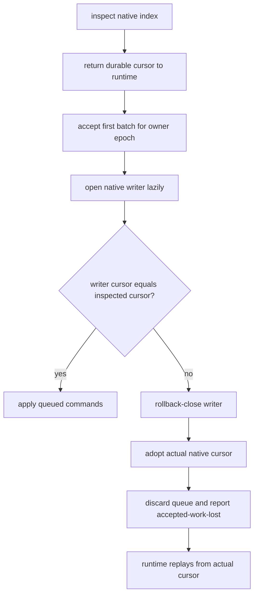
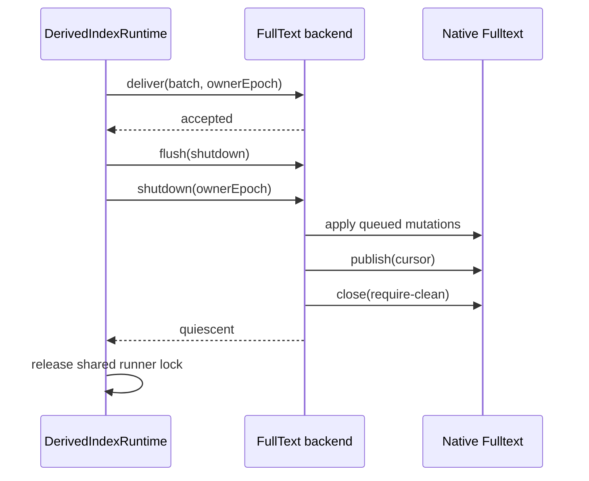

# Native Fulltext derived-index backend

## Scope

This unit connects Harper's existing `DerivedIndexRuntime` to the native
`@harperfast/fulltext` Tantivy index. It covers record identity, bounded asynchronous delivery,
durable cursor publication, restart reuse, owner fencing, shutdown, and rebuild reset. Schema
activation and the customer query API are separate units.

The Fulltext index is derived state. Harper records and transaction logs remain authoritative.
Every source node and replica builds its own local Tantivy index from the records and transactions
it receives. Neither Harper nor the Fulltext package stores postings, terms, segments, or indexed
documents in RocksDB.

## Architecture

```text
authoritative Harper records
          |
          | committed transaction log
          v
 DerivedIndexRuntime
 - elects one owner per index
 - resolves current record state
 - replays from a durable cursor
 - coordinates condemnation and rebuild
          |
          | bounded DerivedIndexBatch values
          v
 FullTextDerivedIndexBackend
 - queues and orders apply/publish commands
 - fences commands by owner epoch
 - maps canonical Harper keys to document ids
 - reconciles native and cached cursors
          |
          | exact packed native mutation frames
          v
 @harperfast/fulltext/native
 - owns the Tantivy writer and readers
 - owns segment publication and cursor payload storage
 - owns native inspection and crash-safe reset
          |
          v
 <derived-index-root>/<sha256(logical-index-name)>.fulltext/
```

The Harper adapter does not create `CURRENT`, `STORE.json`, generation directories, or a second
publication protocol. Those would duplicate the native package's storage invariants. Harper gives
the package one deterministic path, index identity, source-generation identity, and index
configuration.

## Durability invariant

A cursor returned as durable describes exactly the mutations present in the same searchable native
publication. Harper never advances its replay position from delivery alone. The cursor advances
only after `publish(payload)` succeeds.

After `shutdown(ownerEpoch)` resolves, no apply or publish from that epoch can touch the native
index. This includes a malformed handle returned before the backend could adopt it: the lifecycle
retains that handle until rollback close succeeds. Harper keeps the shared runner lock until this
quiescence proof succeeds.

## Native binding boundary

Harper validates native ABI 4 and the native storage capability before registering the backend.
ABI 4 describes the Rust/Node binary boundary, which this integration does not change. Harper
separately validates the JavaScript module surface during activation and the opened engine surface
before accepting a handle. The binding contract is structural so tests can use a deterministic
fake without loading a platform binary.

```ts
interface NativeFullTextModule {
	NativeFullTextIndex: {
		prototype: {
			encodeMutationBatches(
				batch,
				options?
			): {
				batches: Array<{ bytes: Uint8Array; mutationCount: number }>;
				rejected: Array<{ operation: 'upsert' | 'delete'; index: number; code: string }>;
			};
		};
	};

	runtimeInfo(): Promise<{
		packageVersion: string;
		tantivyVersion: string;
		nativeAbiVersion: 4;
		storageBackends: readonly ['native'];
	}>;

	inspectNativeFullTextIndex(
		options
	):
		| { state: 'missing' | 'cursorless' }
		| { state: 'checkpointed'; committedPayload: string }
		| { state: 'incompatible'; code: string };

	openNativeFullTextIndex(options): Promise<FullTextDerivedIndexEngine>;
	resetNativeFullTextIndex(options): Promise<{ state: 'missing' } | { state: 'reset'; retiredPath: string }>;
}
```

`inspectNativeFullTextIndex()` is synchronous and read-only. It lets the existing synchronous
`DerivedIndexBackend.getDurableCursor()` contract determine the replay anchor without opening the
single native writer. `openNativeFullTextIndex()` is called lazily when the backend first needs to
apply mutations or publish a cursor for an owner epoch. This avoids holding one Tantivy writer per inactive index and avoids
adding a Fulltext-specific acquisition phase to the shared runtime.

`resetNativeFullTextIndex()` is called only inside Harper's existing rebuild protocol: the old
owner is quiescent, the condemnation marker is durable, and a new owner epoch has been minted. The
native package first makes the active path unavailable and returns any retired path for
reclamation. Harper accepts cleanup paths only beneath the expected `.fulltext-retired` sibling
directory, removes them with bounded filesystem retries before reset returns, and sweeps that
directory during initialization so a crash or transient cleanup failure does not strand old index
copies indefinitely.

## Identity and path derivation

The native directory is:

```text
<configured storePath>/<sha256(storeName)>.fulltext
```

`storeName` is the stable logical index name. `sourceGeneration` is hashed separately and passed as
the native generation identity. Changing the source generation therefore makes inspection report
incompatibility without changing where the index lives. Reset can retire that path, and the next
lazy open creates a cursorless native index at the same deterministic location.

Each document id is:

```text
<decimal table id>.<base64url(canonical writeKeyId bytes)>
```

The runtime already computes `writeKeyId(recordId)` while coalescing mutations and carries that
string as `recordKey`. The adapter does not encode the customer id a second time. Audit and rebuild
entries whose canonical key is not a string are Harper-internal entries; they are skipped while the
transaction boundary still advances.

## Delivery and publication

`deliver()` is synchronous. It validates the epoch and queue bounds, retains the batch, and returns:

- `DERIVED_INDEX_ACCEPTED` when the backend owns the batch;
- `DERIVED_INDEX_DEFERRED` when bounded queue capacity is exhausted; or
- `DERIVED_INDEX_FAILED` for a synchronous permanent rejection.

Encoding and native work happen in one FIFO drain. String and string-array projection values are
forwarded to Fulltext; unrelated values are omitted. A cursor-only batch crosses no encoder or
native apply boundary, but retains its place in publication order.

Every accepted batch receives a local sequence. A flush barrier captures the latest accepted
sequence and the complete `through` cursor at that horizon. The drain applies all earlier commands,
then publishes the encoded cursor payload. Publication success updates the in-memory durable cursor
and wakes the runtime. The payload is bounded, versioned JSON and rejects malformed formats,
reserved log names, and non-positive or non-finite positions.

Queue limits are independent count and estimated-byte soft bounds. The runtime estimate includes
source record size when the store provides it, canonical document-id bytes, and fixed mutation
overhead; it protects scheduling but is not a wire-size calculation. One batch is admitted when the
queue is empty even if its estimate exceeds the byte ceiling, matching the HNSW backend and ensuring
that a large but valid record cannot permanently stall delivery. In the drain, the opened Fulltext handle performs the exact FTMB
encoding and greedily partitions one logical batch into frames bounded by its configured
`maxBatchBytes`. Harper also passes its queue-byte ceiling as `maxTotalBytes`, so one encoding call
cannot retain an unbounded set of frames. The wrapper reports the leading logical records consumed
under that ceiling; Harper applies those frames and continues with the suffix without re-encoding
the prefix.

Harper applies every returned frame in order and verifies both each frame's mutation count and the
logical batch's total count before crossing the publication barrier. The frames remain staged in one
Tantivy writer and become durable with one `publish(cursor)` call. A failure after any frame causes
rollback-close and replay from the previous durable cursor; Harper never publishes a partial logical
batch.

The native frame limit must fit within Harper's per-call total ceiling, and both sides reject a
frame limit too small to hold the FTMB header. The wrapper may reject an individual upsert as invalid or too large for one frame. Harper replaces
that upsert with a delete for the same derived document id, so a formerly indexed value cannot
remain searchable, and records the event as unindexable. A rejected delete, duplicate or malformed
rejection index, unknown rejection code, schema mismatch, or call-level encoding failure is a
backend failure. Schema mismatch is deliberately call-level: configuration drift must never be
misclassified as bad record data and converted into document removals.

## Lazy writer reconciliation

The synchronous inspection result is cached as the initial durable cursor. Before the lazy writer
applies any accepted command, the backend decodes `engine.committedPayload` and compares it with the
cached cursor.



The mismatch can occur if another worker completed a publication between inspection and writer
open. The index is not condemned: the native payload is authoritative for the native files, and the
runtime replays from that exact cursor.

## Failure handling

Apply and publish failures discard later queued commands and rollback-close the writer once. The
backend retains its last known durable cursor and reports `accepted-work-lost` only after close
proves quiescence. The runtime discards offered progress and replays from that cursor. The backend
does not run a separate close/reopen recovery state machine; the next accepted delivery opens the
writer through the normal lazy path and reconciles ambiguous publication outcomes.

An encoder error, invalid cursor, open failure after bounded retries, applied-count contract
violation, or failure to prove writer quiescence reports a permanent backend failure. An
applied-count violation is rollback-closed before failure is reported; it is not retried as a
transient loss because the same native contract violation would repeat indefinitely. The existing
runtime condemnation and rebuild budget decide whether the index is rebuilt or becomes unavailable.

Inspection failures throw to the runtime and are not cached, so a later owner can retry. Before the
owner releases its lock, the runtime changes shared readiness from any prior `ready` value to
`unknown`; queries therefore fail closed while the durable native state cannot be inspected. A
completed inspection that reports missing, cursorless, incompatible, or a malformed payload
returns no durable cursor and enters the normal rebuild path.

## Shutdown and rebuild



If accepted work cannot be published, shutdown closes with rollback and preserves the previous
cursor. A rejected close keeps the runner lock held because another worker cannot safely open the
same index.

Rebuild follows Harper's shared derived-index sequence:

1. Persist the condemnation marker.
2. Quiesce the previous epoch.
3. Mint a new epoch.
4. Call native reset; `getDurableCursor()` must then be undefined.
5. Scan authoritative table records in bounded chunks.
6. Capture and publish the transaction-log boundary.
7. Replay transactions after that boundary.
8. Publish `ready` after the boundary is durable and clear condemnation.

A restart reuses compatible native files and replays after their embedded cursor. A new replica,
missing index, incompatible format, or interrupted condemned generation rebuilds locally before
serving full-text queries. Ordinary Harper reads and writes remain available unless the optional
derived-index lag policy has been enabled and exceeded.

## Verification

The focused test suites cover:

- deterministic path and source-generation identity;
- binding ABI validation before backend registration;
- synchronous inspection without writer acquisition;
- lazy writer open and inspection/open cursor reconciliation;
- bounded delivery, cursor-only publication, and handoff close;
- exact multi-frame application followed by one cursor publication;
- per-record rejection replacement without treating schema drift as record data;
- maximum-key delete chunk accounting and bounded encoded output;
- apply failure, rollback quiescence, and replay notification;
- invalid-handle quiescence, native reset, and restart-safe constrained retired-path cleanup;
- canonical document ids and non-text field omission;
- rebuild and incremental replay through a real audited Harper RocksDB table; and
- absence of derived-storage feedback into the authoritative transaction log.

The packed production native module remains the final binary-integration gate. Performance work
must measure rebuild throughput, incremental indexing throughput, publication cost, writer memory,
disk amplification, restart recovery time, and search latency while indexing at representative
catalog scale.
