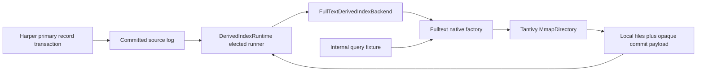

# Native Fulltext derived-index integration and benchmark

Status: revised plan, September 14, 2026. The current harness still measures the historical hosted
storage path. It must be adapted before its results can qualify the native integration.

## Objective

Measure Harper's real derived-index runtime and Fulltext backend using Tantivy native filesystem
storage. The wrapper and Harper now share the native datasource. The accepted architecture is
[Native Tantivy storage and Harper derived indexes](https://github.com/HarperFast/fulltext/blob/codex/native-storage-design/docs/native-storage-integration.md).
The [backend design](fulltext-derived-index-backend.md) owns the ordered admission/recovery adapter.

Existing hosted Directory, WAL-only, root-flush, and KV transport benchmarks remain historical
diagnostics. They do not measure the new integration, and their thresholds are not its release gate.
No production harness implementation is claimed by this plan revision.

## Architecture

The benchmark must instantiate the actual runtime and backend. It may supply the real native
lifecycle collaborator, projection configuration, instrumentation and search handle; it must not
duplicate replay, queue, cursor, flush, or failure state machines. Only the backend drives native
mutation/publication in the integrated arm.

The first slice uses a narrow internal query to isolate integration behavior. Product
`Table.search()`/REST benchmarks follow when their planner and authorization integration exist.
An internal query is not end-to-end product latency.

## Prerequisites

- Native opaque payload publication/readback using the wrapper's existing engine and publication
  code, with versioned ABI and plain-commit compatibility tests.
- Harper's lifecycle opens the selected native generation, validates its identity and payload,
  handles rebuild/reset, and proves quiescence before close/handoff.
- A reproducible paired Harper/Fulltext fixture and pinned artifact revisions.
- Real cross-worker reader attachment/publication visibility, including owner death before refresh.
- The existing backend fixes for one-channel failure reporting, cursor-only native-apply bypass,
  and bounded publication remain relevant and must be tested on native files.

## Measurement paths

| Path                                    | Work measured                                                                       |
| --------------------------------------- | ----------------------------------------------------------------------------------- |
| Standalone native wrapper               | Packed apply, native query, commit/reload, memory/disk and reopen                   |
| Harper without fulltext                 | The paired authoritative record workload and unrelated traffic                      |
| Harper runtime/backend + native wrapper | Source writes, projection, delivery, queueing, native work, visibility and recovery |

There is one storage backend. Do not describe these as native-versus-Rocks storage comparisons or
attribute the integrated/direct difference exclusively to storage or wrapper overhead.

Run identical deterministic text/query/mutation inputs and matched publication schedules where
comparable. Record the extra work present in each path. Use fixed-arrival latency from scheduled
dispatch, plus separate saturation profiles. Bounded queues must report rejection/deferral and
achieved throughput; fast admission with growing backlog is not completed indexing throughput.

## Workloads and measurements

- Initial ingestion, sustained source updates/deletes/recreates, and realistic mixed queries.
- Unrelated-only table writes to measure cursor-only publications and derived-runtime overhead.
- One and multiple indexes with active merges and bounded rebuild work.
- Heavy-tail field sizes and total bytes, filter selectivity, warm/cold caches, and replica catch-up.
- Query p50/p95/p99 by class, timeouts/errors, source-write and replication latency.
- Projection/packing/binding copies, native queue versus execution, apply, commit and reload time.
- Source-to-search lag, accepted/durable progress, backlog high-water and drain time, readiness,
  ownership epoch, failure/rebuild counts and discarded-work recovery.
- Event-loop delay, CPU, resident/mapped memory, native threads and file/disk space/I/O.
- Runtime and native command counts/provenance: prove the integrated arm actually uses the backend.

Do not double-count nested timing spans. Record hardware, OS/filesystem, revisions, dirty state,
configuration, workload fingerprint and measurement scope. Publishable JSON excludes machine paths,
record text and raw error details. Local diagnostic logs are not publishable artifacts.

## Correctness before timing claims

Test exact ID/content parity for upsert/delete/recreate across ordinary reopen and forced recovery.
Include source-commit-before-delivery, applied-but-unpublished state, commit-before-reload, and owner
loss after commit but before reader notification. Check both delete/recreate orders on the same ID.
Counts alone cannot detect an incorrect document set.

Restart reuses valid files and exact-replays from the local checkpoint. Missing/corrupt/incompatible
files, lost source history, or restored source identity require rebuild. Fresh replicas and restores
remain unavailable to full-text queries until build/catch-up finish. Exercise initial replica copy
separately from ordinary replicated transactions and include local eviction.

Real worker handoff must prove writer quiescence and next-owner acquisition. Reacquiring one
registration in the same worker is not equivalent. Include native lock conflicts/path aliases,
late completion, shutdown timeout, generation replacement, retained readers and cleanup retry.

Process kill demonstrates process-crash behavior, not power-loss durability. Test native sync
ordering and supported-filesystem durability separately; do not retain the old simulated WAL-only
test as proof of native filesystem safety.

## Gates and result history

The absolute product objective remains search p99 below 50 ms per accepted query class on an agreed
catalog workload, with the established steady-state freshness objective. Internal slice results
cannot clear that gate. Fix or explain measured source-traffic regressions before activation.

A usable run requires all requested paths to complete, sufficient timed workload coverage, valid
latency samples, zero unexplained errors, exact parity, completed backlog drain and successful
cleanup/reopen checks. Failed or incomplete runs remain evidence of failure, not a performance win.

PR CI runs correctness and output-schema smoke. Controlled scheduled/release jobs run representative
profiles and retain immutable, versioned results in GitHub. Compare only compatible cohorts across
releases; preserve old hosted measurements under their original benchmark identity.

This benchmark PR remains draft while adapting the harness and collecting real native results.
