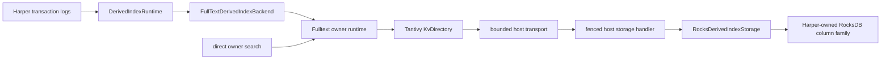

# Harper-backed Fulltext vertical slice

## Objective

Prove one owner-worker path from Harper's derived-index transaction-log runtime to a Tantivy index
stored only in a Harper-owned RocksDB column family. The slice must survive restart, reject stale
owners, rebuild safely, and execute a direct internal search while keeping non-owner readers,
schema declarations, `Table.search`, REST, fuzzy search, suggestions, and release enablement out of
scope. This is a diagnostic integration slice until its callback and durability benchmarks pass;
it is not evidence that a per-I/O JavaScript storage bridge is the final release architecture.

This plan is grounded in Fulltext `7085d394e77f1cf9f59dcd7f63b23088450d2d35` and Harper
`4cad6071a137b802c7ca7ef41c99ac820896a44c`. Fulltext's hosted runtime landed in
[Add experimental Harper-backed Fulltext runtime #30](https://github.com/HarperFast/fulltext/pull/30).
Harper's derived-index runtime and storage adapter are consolidated in
[Shared derived-index runtime for native backends #2567](https://github.com/HarperFast/harper/pull/2567),
which currently targets `main`; this implementation is stacked on its head branch until that work
lands.

## Invariant

A durable derived-index cursor never describes source mutations that are absent from the durable
and locally searchable Tantivy generation, and after an owner epoch is revoked no queued apply,
commit, cleanup operation, or storage callback from that epoch can publish state.

## Architecture

The derived-index runtime remains the only owner-election, replay, rebuild, and source-record
projection mechanism. Fulltext remains the only Tantivy indexing, search, directory-format, and
native task implementation. `RocksDerivedIndexStorage` remains a narrow adapter over existing
Harper RocksDB primitives. No rocksdb-js API or native library is added.

## Current narrow Harper unit

The first Harper unit is a performance and integration harness built directly on the #2567
`RocksDerivedIndexStorage` and the merged Fulltext hosted runtime. Before adding Harper's backend
state machine, it measures callback round trips, storage service time, root-wide flush latency and
blast radius, event-loop delay, foreground RocksDB latency, index throughput, and search p99 against
native and no-index controls. It also compares root-flushed publication with WAL-only publication,
proves publish/reload/search/close/reopen against the same RocksDB column family, and proves LMDB
rejection. This is the earliest point at which the callback or barrier architecture can fail, so it
runs before owner handoff, replay, and rebuild code is written.

If that gate passes, the next Harper unit wires one hard-coded, owner-worker-only product-title index
through the real `DerivedIndexRuntime`. It proves committed Harper write, projection, bounded
delivery, Tantivy publication with the Harper cursor as commit payload, reader reload, direct
internal search, restart, handoff, and rebuild. The backend is constructed and its asynchronous
Fulltext open is awaited before `DerivedIndexRuntime.register()`; `attach()` rejects a backend that
is not already open, and `getDurableCursor()` is valid synchronously from the first owner acquisition.
This integration requires no change to `derivedIndexRuntime.ts`.

This unit does not add schema syntax, `Table.search`, REST, non-owner search, backup/restore, or
release enablement. The Fulltext package is still version `0.0.0` and has no registry artifact, so
Harper development uses a locally packed artifact without committing a file, Git, copied-binary, or
undeclared runtime dependency. A mergeable Harper manifest change waits for a versioned Fulltext
prerelease with matching platform artifacts. Until then, the integration proof may live on the
feature branch and its reusable Harper backend code must keep the Fulltext opener and batch encoder
behind a structurally typed construction boundary so unit tests do not duplicate the native engine.

The mergeable first unit is the harness and its package-independent measurement/reporting code. A
manual run supplies the path and revision of a built Fulltext checkout and exercises the real addon.
The second
unit is the Harper-owned backend state machine plus an always-running stub-engine test. Once a
prerelease exists, a follow-up replaces the supplied factory with the pinned package import and
makes the real RocksDB/Tantivy test mandatory in CI. An absent artifact must never turn the eventual
mandatory job into a green skip.

## Delivery sequence

### 1. Landed Fulltext host-backed runtime

The explicitly experimental `./harper` package entry point accepts the existing
`HostStorage` interface, a process-local storage identity supplied by Harper, a persistent physical
generation, a byte namespace, the existing Fulltext schema and worker limits, and internal
transport limits. It creates the existing total storage handler and opens the same native runtime
used by `openNativeFullTextIndex`, substituting `KvDirectory<HostKvStore>` for Tantivy's filesystem
directory. Native and host open envelopes share a common engine configuration and contain only
their backend-specific fields; the host path never supplies a dummy filesystem path.

The host interface is strictly synchronous: point reads return bytes or absence, atomic writes and
durability barriers return `undefined`, and any Promise-returning implementation fails before it
can be acknowledged. Transport requests keep pending state inside their owning transport. A small
sharded registry resolves opaque transport IDs at the Node callback boundary; request IDs are local
to that transport and cross as fixed-width buffers alongside the moved request buffer, avoiding a
process-global pending map, decimal conversions, and an additional full request copy.

Factor runtime construction after directory creation so writer, reader, apply, commit, reload,
search, queue limits, status, and close remain one code path. Production builds compile the host
transport and phase-0 directory without compiling or exporting test handles. Runtime capabilities
report both `native` and `harper`; backend choice remains explicit and never falls back.

The opened runtime owns its `HostTransport`. Normal close seals admission, drains the writer,
merges, and searches while callbacks are still serviced, waits for every dispatched callback to
leave the storage handler, then closes the transport and removes the runtime handle. The handler
checks a synchronous active-generation fence before every storage entry. Node environment teardown
is a separate forced path: it first revokes that fence and aborts transports so queued callbacks and
native waiters fail fast, then force-closes and joins actors without attempting a clean storage
shutdown. An already executing synchronous host operation is not cancellable and must finish; host
operations therefore remain bounded and their late completion cannot reactivate the generation.

This slice does not start physical reclamation. Its tests use bounded data and close or drop the
whole generation; release enablement remains blocked on the cleanup lifecycle.

### Storage write granularity

Fulltext's existing `KvDirectory` stores large files in 256 KiB values. Each completed chunk is an
immediate one-mutation WAL write; a file flush publishes at most one tail value plus its binding;
atomic metadata such as `meta.json` is one bounded value followed by `sync()`. It does not buffer a
whole Tantivy publication into one native-memory mutation array, so the per-I/O callback cost is a
real property of the merged hosted runtime. The maximum ordinary stored value is therefore 256 KiB,
not the full segment size. Transport limits must admit one encoded chunk plus protocol overhead,
and the harness forces a merge large enough to span many chunks.

Buffering an entire publication would reduce callback count but retain potentially multi-gigabyte
segments until commit at catalog scale. That is not a safe in-place optimization of this bounded
directory; it is a different storage design covered in the alternatives.

### 2. Exact barrier and cursor publication

Implement `FullTextDerivedIndexBackend` as an asynchronous `DerivedIndexBackend`. `deliver()` uses a
bounded ordered command queue and returns accepted or deferred synchronously. Commands are
`apply(batch)`, `barrier(epoch, sequence, cursor)`, and `shutdown(epoch)`. One drain applies encoded
batches to the native writer in order. A barrier captures the highest contiguous applied sequence
and its offered cursor; later deliveries belong to the next barrier even when they arrive while a
commit is running. Flush is single-flight. Any loss of previously accepted work emits
`accepted-work-lost`; other native or storage failure emits `failed` and is latched so shutdown
cannot report success after accepted work was lost.

`flush()` queues a barrier, verifies `host.isOwnerEpoch(ownerEpoch)`, and commits the captured
cursor as an opaque, versioned, bounded Tantivy commit payload. Tantivy publishes that payload in
the same `meta.json` generation as the indexed segments, so a recovered cursor cannot get ahead of
the recovered searchable generation and Harper does not need a second cursor write. The selected
durability policy decides whether that publication also invokes the existing root-wide RocksDB
flush. The backend then reloads the owner reader before updating its in-memory durable cursor and
waking the runtime. A failure before publication leaves the prior payload; a failure after commit
but before reload or wake reopens the committed payload and safely makes replay idempotent.

A generation may publish index state during rebuild, but it must not publish a Harper cursor until
a `through` vector has been offered in that same generation. Age and threshold flush requests
before the final rebuild chunk may commit cursorless Tantivy state or coalesce, but they cannot
reuse the pre-reset payload. Only the final rebuild chunk carries the captured #2567 tail and makes
the rebuilt generation eligible for `ready`.

Fulltext treats the payload as opaque text and exposes the current committed payload on open. The
Harper backend owns its format and validates it before returning `getDurableCursor()`. The backend
caches only a payload read back from a successful Fulltext open or publish; `getDurableCursor()` is
therefore an allocation-free field read on Harper's per-batch reconciliation path, never a native or
RocksDB read. The cache belongs to an open, validated physical generation: every close clears it,
and reopen repopulates it only after the in-store identity and payload validate. A closed backend
returns no cursor and is reopened before registration. Merge-only metadata rewrites must retain the
payload, as Tantivy 0.26 does; a focused Fulltext regression test pins that dependency behavior.

`DerivedIndexBatch.records` and `bytes` are deliberately non-enumerable. The backend encoder reads
`batch.records` by direct property access and does not serialize, clone, or post the Harper batch
object. A regression test passes a real batch shape and proves that its encoded native mutation set
is non-empty.

Fulltext's Node dispatcher is the total exception boundary: every Harper storage exception becomes
a structured transport failure, native maps it to an I/O error, and no callback exception or Rust
panic may escape into the worker. All JavaScript-to-native operations that can require host storage
are asynchronous; the worker event loop must remain available to service their callbacks. A
deferral establishes an obligation to emit a later state change even if queue space became available
before Harper recorded the deferred state; that interleaving receives a focused test. Backend state
changes are always posted to a later macrotask. They never call #2567's wake callback, write a
condemnation marker, or otherwise re-enter Harper while `read`, `write`, or `sync` is still on the
synchronous host-storage callback stack.

Fulltext already compiles release artifacts with `panic = "unwind"`, marks every exported native
entry with napi-rs `catch_unwind`, and catches panics inside its writer, search, and open actors.
Harper relies on those existing boundaries and adds a corrupt-directory integration test; it does
not duplicate panic handling in JavaScript.

Epoch checks occur once per ordered apply, barrier, or shutdown command and after each asynchronous
completion, never per record. A transient apply, contention, or publish failure that leaves the
prior committed payload reopenable emits `accepted-work-lost` only after reopen has validated the
generation and repopulated the cached cursor, so Harper replays from that payload.
`failed` is reserved for a generation that cannot be reopened or whose persisted identity/payload is
invalid. A publish with ambiguous completion is never guessed: close, reopen, read the committed
payload, then either reconcile it to an offered cursor or fail closed.

### 3. Owner handoff, shutdown, and reset

`attach()` retains the runtime's epoch fence and readiness reader. Before each apply and before
cursor publication, the backend checks the epoch. `shutdown(epoch)` rejects new delivery, executes
after all preceding queue commands, and rejects if accepted work was not durably committed or
deliberately discarded under a failed/rebuild path. It closes the Fulltext runtime using the
two-phase normal close and resolves only when no native task or callback can touch storage.
Undurable accepted work is rolled back and discarded after native quiescence, leaving the prior
cursor for #2567 replay; that is a successful shutdown. Rejection is reserved for failure to prove
quiescence, because only an old task that can still write justifies #2567 holding the process-wide
runner lock.

The Harper lifecycle must register an asynchronous close point so the RocksDB column-family handle
is closed only after backend shutdown resolves. The current proof owns this ordering explicitly and
does not register a global production lifecycle or forcibly terminate an owner worker. Normal
handoff in the proof awaits #2567's `runtime.stop()`, Fulltext close, and lock release. Production
worker termination is a prerequisite unit: #2567's process-wide lock is ownerless and a shutdown
failure intentionally holds it, so killing only the worker after a drain deadline could strand the
lock in the surviving process. Before schema activation, either a generic #2567 forced-release path
must revoke the epoch, prove native callbacks quiescent, and explicitly unlock, or Harper must
restart the process rather than only that worker. A deadline is never treated as quiescence, and an
already-running `flushSync()` cannot be cancelled.

`reset(newEpoch)` first publishes a tombstone for the committed cursor/generation and applies the
selected durability policy before any destructive operation, as required by the derived-index
backend contract. That marker is defense in depth, not the sole validity proof: after a crash the
in-store engine identity and commit payload must still match the externally selected physical
generation. The reset then closes the prior Fulltext runtime, drops and recreates the owner-only
derived column family, opens a new host-backed generation and leaves the durable cursor absent. It
accepts rebuild chunks from Harper's existing scan/replay path. Fulltext does not implement a
second rebuild coordinator.

Every physical column-family name contains the stable backend id and durable generation. Backend
ids are length-delimited and base32 encoded; the separator is outside that alphabet, so prefix
matching cannot confuse `products` with `products2`. Each rebuild attempt uses a fresh random
128-bit lowercase-hex generation, never a reusable counter. Both fields are length-bounded before
reaching the store-name constructor. Reset unconditionally drops any pre-existing target name
before creation rather than adopting its bytes. On open, the single owner drops only complete,
inactive generations whose fully decoded backend id equals its own; it never drops the active
generation or a name it cannot decode. This bounds orphan growth during repeated rebuild attempts
without introducing a second reclamation coordinator.

### 4. Physical generation and process identity

Keep two identities separate. A durable physical generation is stored in Harper metadata outside
the disposable column family and changes only on rebuild, restore, or replacement. It is included
in Fulltext's persisted engine identity and survives process restart. A process-local
`KvStoreIdentity` coordinates Fulltext directory locks and reader pins for handles sharing those
bytes within one process; it may be reminted after restart and must not be derived from owner epoch.

The physical generation record uses the existing WAL-enabled root-store key/value surface under a
reserved `Symbol.for('derived-index:<id>:generation')` key. A new value is written before opening
the generation or publishing its first cursor. Under `root-flush`, the first publication flushes
both; under `wal-replay`, their order in the same root/derived RocksDB WAL ensures a recovered cursor
cannot refer to a generation record that was lost earlier in the WAL suffix.

The external generation value is only a column-family lookup name, never evidence that its contents
are valid. Fulltext's persisted engine identity is stored with the index bytes and must match that
name. A missing/recreated column family has neither a matching in-store identity nor a commit
payload, so it reopens cursorless and rebuilds rather than publishing ready over an empty index.
Each physical generation has its own column family. Fulltext's byte namespace remains part of its
directory format, but Harper does not use a shared column family or rely on a customer-controlled
namespace for isolation.

The first slice opens exactly one owner runtime and does not claim independently opened non-owner
readers. Duplicate writer opens for the same process-local identity and namespace are rejected.
Cross-worker read-only handles require a later role-specific opener plus generation retirement,
refresh broadcast, and quiescence acknowledgements before old storage can be dropped.

### 5. Narrow Harper proof

Register one hard-coded test backend for one table and project `{ title }` into one English text
field. Encode Harper record IDs with its canonical typed key encoding so supported ID types cannot
collide. Drive real committed writes through `DerivedIndexRuntime`, force a durability barrier, and
query through the owner backend's internal search method. Restart the backend against the same
RocksDB column family and verify that the committed payload and search results reopen without a
source scan. If the owner was shut down while caught up, the backend is asynchronously reopened
before it is registered again; this slice does not provide non-owner search availability.
Registration never races Fulltext open because `getDurableCursor()` is synchronous and is the first
owner-acquisition read.

Then force owner handoff and a rebuild. Prove that the old owner cannot publish, that an interrupted
commit/reload only causes replay, and that reset leaves no trusted cursor until the rebuilt
generation is durable. An LMDB construction attempt fails before registration with a clear
RocksDB-required error.

This test is not a customer API. Schema activation and query planning follow only after this storage
and lifecycle proof passes.

## Package sequencing

Fulltext has no published release or tag. Its host-backed package entry is merged, but an explicit
prerelease must be published before Harper adds the dependency. The Harper branch may use a locally
packed Fulltext artifact for development and the cross-repository proof, but its mergeable manifest
and lockfile must pin a registry artifact with matching platform binaries. A file path, floating Git
dependency, copied `.node` binary, or undeclared dynamic import is not committed.

## Performance proof

The existing native benchmark is not evidence for the Harper path. Add a host-directory benchmark
that reports storage round trips, bytes, root-wide flush count and latency, apply throughput, commit
latency, warm and cold search p50/p95/p99, Node event-loop delay, time at #2567's
`waiting-durable` cap, and independently generated foreground RocksDB operation p99 while indexing
and search run. Record database-level `rocksdb.num-files-at-level0`,
`rocksdb.estimate-pending-compaction-bytes`, SST bytes, compaction bytes, stall time, and a post-run
soak read. Sweep both publication interval and unrelated table count; include one raised
`maxAcceptedBatchesAhead` arm so callback cost is distinguishable from runtime pacing. Run
no-index, native, and Harper-callback controls at identical offered load on one machine, including
deliberate JavaScript contention, so coordinated omission does not hide stalls.

The only existing explicit durability barrier is
`RocksDerivedIndexStorage.sync()` -> `rootStore.flushSync({ allowWriteStall: true })`, which flushes
every column family and blocks the storage-serving worker. Engineering has declined a new
rocksdb-js WAL-sync primitive, so this cost is neither hidden nor mislabeled as column-family local.
The harness evaluates two policies instead of assuming the root flush is necessary:

- `root-flush`: every coalesced Tantivy publication ends with `sync()`. This gives the strongest
  machine-loss boundary but may create database-wide stalls and compaction debt.
- `wal-replay`: publication writes the Tantivy segments, metadata, and cursor to the same ordered
  RocksDB WAL but does not explicitly flush. Recovery may lose a suffix and reopen at an older
  self-consistent cursor; #2567 then exact-seeks retained source logs and replays forward. This is
  viable only if fault injection proves that no recovered cursor can name missing segment state and
  the observed recovery interval stays inside transaction-log retention. A retention miss remains
  fail-closed and rebuilds; it never silently skips source work.

This is not the same as inheriting one shared WAL durability setting. Harper opens primary table
column families with native WAL disabled and recovers them through rocksdb-js transaction logs;
`openDerivedIndexStore` explicitly opens the derived column family with WAL enabled. A root flush
therefore can make both primary memtables and the derived generation durable, while `wal-replay`
can recover a derived cursor whose independently stored source-log boundary is unavailable. The
fault matrix measures that skew and its rebuild rate. The root-flush arm is not eliminated by
configuration inference because the stores have different recovery mechanisms.

RocksDB's automatic memtable flush is not a third policy because Harper has no notification that
can atomically define which Tantivy cursor it covered. The harness sweeps 1 s, 5 s, and 30 s
publication intervals for `root-flush`; `wal-replay` publishes at #2567's normal cadence without
the explicit root flush. No backend default is selected until crash and performance results are
recorded. Shutdown follows the selected policy rather than silently strengthening it, so benchmark
and runtime semantics stay identical.

Each `RocksDerivedIndexStorage.write()` transaction currently causes a root-store `committed`
notification even though it adds no source transaction-log entry. rocksdb-js delivers that
notification after `transactionSync()` returns, so it does not re-enter the synchronous Fulltext
storage callback; it can still wake every derived-index runner in the database. The harness records
callback write wall time, derived storage transactions, synchronous notifications as an invariant
check, and total root notifications alongside the matching no-index control. The backend integration
unit adds runner wake/drain and idle-release measurements. It also creates bounded write-intent
contention to expose
`transactionSync`'s at-most-three `retryOnBusy` attempts. No runtime special case is added before
measurement; unacceptable listener-path cost or wake amplification fails the architecture gate or
justifies a separately reviewed generic quiet-internal-write primitive. A future primitive must
preserve database transaction semantics while ensuring a derived-CF write is not observable as a
new source commit.

The first slice has no hard throughput promise, but it fails the callback architecture gate
if the representative catalog workload cannot keep search p99 below 50 ms, owner-worker event-loop
delay p99 below 20 ms, or unrelated-table foreground operation p99 within 20 percent of the
no-index control. More than one empty derived-index drain per publication window per registered
runner also fails the current wake path. Any single `sync()` over 250 ms fails the root-flush arm
even when percentile gates pass. Exact corpus size, document size, offered write rate, and
the observed foreground-write regression are recorded with the result because they are not yet
known; these are diagnostic gates, not customer SLOs, and no release claim may be made from a
synthetic default.

`allowWriteStall: false` is not a deferrable barrier alternative in the current rocksdb-js API: a
synchronous flush waits until it can proceed without causing a stall and still blocks the event
loop; the asynchronous form cannot satisfy Fulltext's synchronous `HostStorage.sync()` callback and
cannot be cancelled. The harness records this limitation rather than treating the flag as retryable
backpressure.

Every host request remains bounded except an already-running synchronous RocksDB call. Fulltext
transport admission preserves foreground operation and byte headroom. Harper coalesces commits
through the derived-index runtime's existing mutation, byte, and flush-age thresholds; it does not
flush once per record. Epoch revocation prevents a new barrier from starting, including after an
earlier asynchronous stage resumes. A `flushSync()` already in progress cannot be cancelled; the
narrow proof waits for it, and production worker-deadline handling remains an explicit prerequisite.

## Verification

- Fulltext unit and Node tests: host-backed open/apply/commit-with-payload/reload/search/close,
  malformed storage responses, capacity deferral, callback-aware close with in-flight read and
  write, forced environment teardown during open/read/apply/commit, duplicate-writer rejection,
  package exports, and release artifact capability reporting.
- Fulltext parity test: run the same mutation/search contract through native and host-backed
  directories, including reload visibility and commit-payload persistence across reopen and merge.
- Harper unit tests: backend delivery bounds, FIFO barrier horizons, cursor ordering, deferral,
  failure latching, owner fencing, lazy reopen, idempotent shutdown, cursor tombstone before reset,
  direct access to non-enumerable `records`, deferral-before-wake interleaving, and LMDB rejection.
- Backend startup test: an unopen backend cannot attach, while an awaited open exposes its committed
  payload synchronously before registration and does not rebuild on restart.
- Idle-release test: closing clears the cached cursor; deleting or replacing the column family while
  released cannot let a later acquisition report `ready` until reopen validates the physical
  generation and reloads its payload.
- Failure classification tests: reopenable transport/storage failures emit `accepted-work-lost`;
  unreopenable or invalid persisted state emits `failed`. Injected three-attempt write contention is
  reopenable and must not latch `failed`; an `accepted-work-lost` notification before the cache is
  repopulated is a test failure.
- Re-entrancy test: trigger every backend state-change class from inside fake `read`, `write`, and
  `sync` callbacks and prove #2567 receives it only on a later macrotask, after the storage callback
  has returned. Add a throwing root-store `committed` listener and prove an already-committed derived
  write is not misreported to Fulltext as failed; if #2567's current adapter cannot isolate it, the
  harness fails and the adapter must be corrected before backend work.
- Rebuild publication test: force age and threshold flush requests between rebuild chunks and prove
  no Harper payload exists until that generation receives its final `through` vector.
- Generation test: repeated interrupted resets always mint distinct 128-bit generations, drop a
  stale target before creation, and never prefix-match or adopt another backend's column family.
- Normal handoff test: `runtime.stop()` waits for Fulltext and storage quiescence, releases #2567's
  process-wide lock, and lets another worker in the same process acquire and replay. Forced
  worker-deadline behavior is not claimed by this slice.
- Harper RocksDB integration: real transaction-log delivery, restart without rebuild, forced replay
  after commit/reload failure, owner handoff, rebuild, direct owner search, and asynchronous
  column-family close/drop after native quiescence.
- Publication crash tests: abort the process between segment/object writes and the commit-payload
  write, then separately inject a recoverable WAL-tail loss after the last explicit sync. Reopen and
  prove the recovered payload names exactly the recovered searchable result set. For `wal-replay`,
  resume through #2567 from that older cursor and prove convergence; purge the required log boundary
  and prove the runtime fails closed into rebuild.
- Source-skew crash test: damage the rocksdb-js transaction-log tail independently of the derived
  column-family WAL and record whether exact resume succeeds or forces rebuild. This is the
  decisive safety/recovery measurement for `wal-replay`.
- Corruption test: replace Tantivy metadata or segment bytes in the derived column family and prove
  Fulltext returns a structured native error and poisons only that index rather than aborting Harper.
- Chunking test: force a merge larger than 256 KiB and prove no stored value exceeds the directory's
  chunk bound while the reopened search result and commit payload remain intact.
- Storage lifetime test: a buffer returned from `read()` remains stable across subsequent writes and
  syncs until Fulltext releases it.
- Liveness test: every asynchronous defer/reopen path wakes #2567 in `finally`, including rejection,
  so the runner cannot remain parked in `deferred` after capacity returns.
- Default-path test: with no backend registered, no additional `committed` listener, storage work,
  or write-path cost is installed.
- Canonical repository gates and packed-package tests run in both repositories. The package-free
  fault-injecting backend tests always run. A non-required packed-artifact job runs from the first
  unit; when its opt-in artifact variable is set, absence or load failure is red rather than skipped.
  The native-addon suite is excluded from the Windows gate with an explicit unsupported-artifact
  reason until Windows binaries exist. Performance results are retained as versioned benchmark JSON
  but do not become timing assertions in shared CI.

## Approaches considered

| Axis                      | Candidate and disposition                                                                                                                                                                                                                                                                                                                                                                                                                                                                                                                                                                                         |
| ------------------------- | ----------------------------------------------------------------------------------------------------------------------------------------------------------------------------------------------------------------------------------------------------------------------------------------------------------------------------------------------------------------------------------------------------------------------------------------------------------------------------------------------------------------------------------------------------------------------------------------------------------------- |
| Different layer           | Put Tantivy integration directly in Harper or teach the derived-index runtime about text indexing. Rejected because it duplicates Fulltext's engine, queue, directory, and lifecycle code and makes the generic runtime engine-specific.                                                                                                                                                                                                                                                                                                                                                                          |
| Deeper cause              | Link Fulltext directly to Harper's RocksDB binary. Rejected because Harper owns the RocksDB version and process-wide descriptor; a second native linkage risks ABI mismatch and bypasses Harper backup, memory, and lifecycle ownership.                                                                                                                                                                                                                                                                                                                                                                          |
| Do less                   | Prototype only with Fulltext's native filesystem backend. Rejected because it cannot validate the production storage boundary, restart cursor ordering, or Harper-owned lifecycle—the exact risks this slice exists to measure.                                                                                                                                                                                                                                                                                                                                                                                   |
| Different storage         | Store Harper's Tantivy files in a Harper-owned filesystem directory and rebuild after restore. This removes the callback and root-wide-flush costs, but it is rejected because the approved Harper product architecture requires RocksDB-only full-text storage; native files remain a benchmark control, not a candidate Harper backend.                                                                                                                                                                                                                                                                         |
| Coarser storage boundary  | Build a Tantivy publication in filesystem or memory scratch, then pack changed segments and metadata into a few large RocksDB values. This reduces JavaScript callbacks from per-I/O to per-publication, but filesystem scratch violates the approved RocksDB-only Harper runtime, an in-memory directory is not credible for a 100-million-document catalog, and packing large immutable segments adds duplicate resident/disk space plus RocksDB compaction amplification. It requires a different Fulltext directory and is a separately designed fallback, not a harness arm for the existing hosted runtime. |
| Different FFI boundary    | Lease a native RocksDB column-family handle to Fulltext so sustained I/O bypasses JavaScript. This could remove callback overhead without a second RocksDB linkage, but engineering has declined the required new rocksdb-js surface. It remains the fallback only if that decision changes after the callback benchmark fails.                                                                                                                                                                                                                                                                                   |
| Different owner placement | Run the derived-index owner in a dedicated non-serving Harper worker. Harper job workers already open the database graph, so primary-record IPC is not inherently required. It still needs explicit lifecycle routing and an owner-search/non-owner-reader path, while the process-wide RocksDB flush/write stall remains. The narrow proof measures the existing elected-worker model first.                                                                                                                                                                                                                     |
| Durability policy         | Compare coalesced root-wide flushes with WAL-only publication followed by exact replay from the recovered cursor. The harness selects between them using recovered-prefix safety, transaction-log retention/rebuild exposure, p99 latency, and compaction debt; the design does not assume the stronger barrier is free or necessary.                                                                                                                                                                                                                                                                             |
| Inherit root durability   | Rejected as a distinct policy because Harper's primary table column families disable native WAL and recover from separate transaction-log files, while the derived column family enables RocksDB WAL. There is no single shared setting to inherit; the two explicit policies expose the actual tradeoff.                                                                                                                                                                                                                                                                                                         |
| No cursor durability      | Commit searchable Tantivy state without a restart cursor and replay from a conservative retained anchor after every restart. This does not remove directory writes or metadata publication and differs from `wal-replay` by only the small payload; no-index and WAL-replay already establish the useful cost floor. It also makes every restart retention-dependent, so it is retained as a fault-model control rather than a candidate policy.                                                                                                                                                                  |
| Reader topology           | Start with one owner-worker runtime. Read-only non-owner handles require refresh and generation-retirement coordination and are deferred rather than implied by a shared storage identity.                                                                                                                                                                                                                                                                                                                                                                                                                        |
| Cursor storage            | Store the Harper cursor as Tantivy's opaque commit payload. This makes the cursor and searchable segment head one publication and avoids a second root-wide durability flush.                                                                                                                                                                                                                                                                                                                                                                                                                                     |
| Chosen                    | Reuse Harper's derived-index runtime and raw RocksDB adapter, and reuse Fulltext's engine and `KvDirectory` through the bounded host transport as a measured diagnostic slice. Stage the package release before pinning it in Harper.                                                                                                                                                                                                                                                                                                                                                                             |

## Explicit release blockers

This slice does not authorize a Harper release. Release remains blocked on a benchmark-supported
decision that the callback storage path is viable (or replacement with a native lease), bounded
physical reclamation, non-owner query topology and generation retirement, benchmark-derived
cleanup/commit policy, safe same-process lock release after a worker shutdown deadline, schema
activation and validation, query planning and REST behavior, readiness/error semantics at the
customer surface, backup/restore, replication tests, and platform artifact publication.
