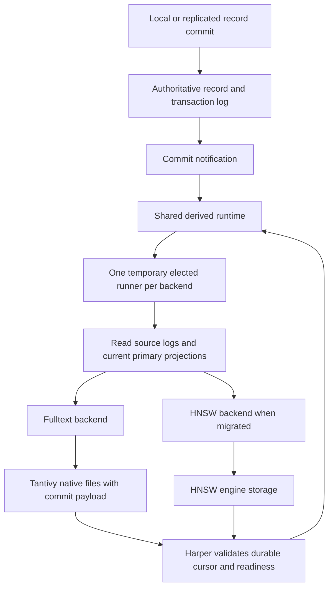

# Shared derived-index coordination for HNSW and full text

Updated September 14, 2026. Full text uses native Tantivy files on each Harper node.
See [Native Tantivy storage and Harper derived indexes](https://github.com/HarperFast/fulltext/blob/codex/native-storage-design/docs/native-storage-integration.md)
for the current architecture.

## Purpose and boundary

Harper owns one delivery/recovery protocol for non-transactional indexes derived from authoritative
records. Full text implements it; native HNSW can adopt it without sharing Tantivy's files, writer
model, or ranking behavior. This does not claim that current HNSW has already migrated.

[Implement the shared transaction-log runtime for derived indexes](https://github.com/HarperFast/harper/issues/2489)
defines the protocol. Current source uses lock-elected transaction-log runners. Earlier designs
describing direct same-thread aftercommit delivery, binary log-position leases, and pinned retention
are superseded. Source grounding: Harper main `55691f500`, September 14, 2026.

## Invariant

Every reported durable cursor equals a complete offered source boundary and belongs to a durable
index generation covering that boundary. Unpublished accepted work is replayed after loss. If
continuity cannot be proved from retained logs, Harper rebuilds; it never skips an unresolved gap.
The current runtime does not pin retention indefinitely.

## Flow

The write path does not await native work. Harper's configured lag/admission policy remains
authoritative and may reject new writes before commit. Each replica independently consumes its
local accepted source state; index files and cursors are not replicated.

## Ownership and delivery

Relevant workers register the backend; Harper's existing locks elect one temporary runner per
backend. There is no permanent worker-0 writer. Independent indexes have independent runners and
may progress concurrently.

The runner reads committed logs and projects current primary records. The backend accepts bounded
batches synchronously, defers when full, or reports failure. Accepted does not mean durable.
Cursor-only batches advance ordering without native document application. Replay, current-state
resolution, projection, deduplication, and rebuild remain Harper responsibilities.

The shared cursor is a versioned vector of physical log names and complete transaction timestamp
boundaries. Harper exact-seeks and validates saved anchors before replay. The wrapper treats the
serialized cursor as opaque and returns only the exact payload committed with its index.

## Lifecycle and failure

Owner acquisition opens the selected physical generation before resume. Graceful handoff flushes
and joins or rolls back native work before releasing ownership. Epoch checks fence delayed commands,
opens, and notifications. An inability to prove quiescence prevents unsafe ownership transfer.

Recoverable accepted-work loss reopens the last committed generation and lets Harper replay.
Missing/corrupt files, incompatible schema/format, source restore, and missing log boundaries require
rebuild. Fresh replicas and restores build locally before serving full text. Ordinary restarts reuse
valid files. Compatible prior readers may serve only within Harper's established stale-result policy.

Harper's table lifecycle owns eviction, invalidation, and deletion delivery. Eviction changes local
search eligibility and must not become a replicated canonical delete. Initial replica copy requires
Harper's copy/rebuild boundary; do not assume every bootstrap row is an audited live write.

Harper owns generation selection, activation, and retirement. Each engine proves its own durable
publication and native quiescence. Fulltext commits its checkpoint inside Tantivy metadata; HNSW
need not use that format. Backed-up source data and schema suffice to rebuild fulltext after restore.
Copying live index files is not a supported backup protocol.

## Qualification

Verify real worker handoff/loss, concurrent indexes, replicated transactions and initial copy, exact
replay, retention gaps, eviction, restore, generation replacement, and readiness. Measure source-write
latency, indexing lag, backlog drain, native memory/threads, filesystem space, and search percentiles.
Sharing a protocol does not make the engines' performance or failure behavior identical.
