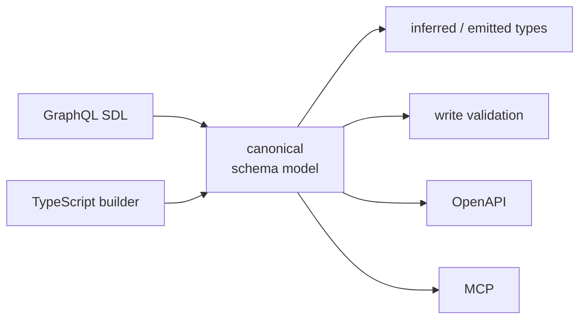

# RFC 0001 — Typed, discoverable resources

|               |                                                                               |
| ------------- | ----------------------------------------------------------------------------- |
| **Status**    | Draft · for discussion                                                        |
| **Author**    | dawson@harperdb.io                                                            |
| **Date**      | 2026-06-26                                                                    |
| **Scope**     | harper core · `schema-codegen` · mcp · openApi                                |
| **Companion** | A rendered version of this RFC is published as a Claude artifact (shareable). |

> **One declaration — authored as runtime values, with TypeScript derived from it — that strengthens types in the editor and feeds validation, OpenAPI, and MCP from a single source of truth.**

## Summary

Harper describes table-backed resources richly — the GraphQL schema flows into runtime `attributes`, which feed write validation, OpenAPI, and MCP. Everything else is comparatively opaque: a custom `extends Resource` class, its URL path, its per-method params, and the built-in filter/sort/include query grammar are invisible to the type system and to the generated API metadata. This RFC proposes closing that gap with three coordinated pillars, anchored on one principle that Harper's runtime already forces.

**The principle.** Harper strips TypeScript at runtime (`--conditions=typestrip`), which erases types and rules out metadata-emitting decorators. So **runtime metadata must be values, and TypeScript types must be derived from those values — never the reverse.** Taken to its conclusion, this means the _schema itself_ can be authored as a TypeScript value, with the record type **inferred** — no generation step, nothing to drift. `schema-codegen` already lives the value-first model for tables; we extend it everywhere and let the schema be code.

| Pillar                       | Idea                                                                                                                          |
| ---------------------------- | ----------------------------------------------------------------------------------------------------------------------------- |
| **1 — One schema model**     | Author tables in GraphQL _or_ TypeScript; both compile to one canonical model, projected to every surface from a single core. |
| **2 — A request contract**   | A per-method `params/query/body/response` contract that types handlers and feeds every surface.                               |
| **3 — Typed query behavior** | Base types for Harper's built-in filter, sort, select, and relationship-include grammar, keyed to the record.                 |

## 1. Background & motivation

When a developer builds something with Harper, the experience splits sharply along one line: _is it a table, or is it custom?_

Tables are well served — but only via one front door. A GraphQL `@table` type (today the only way to define a table) is parsed in `resources/graphql.ts` into a canonical `Attribute[]` carried on the class, and that array feeds three consumers — write validation in `Table.ts`, the OpenAPI document in `resources/openApi.ts`, and the MCP tool schemas in `components/mcp/tools/schemas/derive.ts`. The community `@harperfast/schema-codegen` plugin adds a fourth: it introspects the live `databases` object and emits a `.d.ts` that augments `declare module 'harperdb'`, so `tables.Tracks` and `extends tables.Tracks` become strongly typed.

Custom resources are not. A class that `extends Resource` has no `attributes`, so it is invisible to codegen, types as `any` in its handlers, gets an empty/generic MCP schema, and — if it declares a parameterized path — can disappear from MCP entirely. The exact things this RFC's reader asked about (customizing the path, adding method handlers, validating path/query/body params) are precisely the surface that has no typed home.

A second, quieter problem sits underneath: the same `Attribute` is translated to a type-shaped representation in **four** independent places that disagree with each other. Consolidating them is not greenfield — a shared projector (`attributeToFragment` in `resources/jsonSchemaTypes.ts`) already exists and is already on the canonical parse path; OpenAPI, MCP, and codegen simply bypass it.

## 2. Goals & non-goals

**Goals**

- **Strong, derived types** for custom resources: path params, query params, request bodies, and responses, inferred in the editor from one runtime declaration.
- **Typed base-request behavior** — filtering, sorting, field selection, and relationship inclusion — keyed to each record and its relationship graph.
- **One source of truth** that drives editor types, runtime validation, OpenAPI, and MCP, so they can never silently diverge.
- **Schema as code (optional).** Let a table be defined in TypeScript with the same builder, inferring the record type and driving validation/OpenAPI/MCP — _alongside_, not replacing, GraphQL SDL.
- **Readable JSDoc** for the JavaScript path, so non-TypeScript users get the same IDE guidance.
- **Build-grade codegen** that runs in CI, not only inside a live dev server.

**Non-goals**

- Replacing GraphQL as the way tables are defined. The data shape stays in the schema; this RFC adds the _HTTP-binding_ layer around it.
- Forcing a validation library. Bring-your-own (Standard Schema) and a zero-dependency built-in both work.
- Breaking the existing class model. `extends Resource` and `extends tables.Foo` remain the idioms.

## 3. Current state: who feeds what

| Surface          | Reads from                  | Custom resources?       | Notable gaps (verified)                                                                                                                                                 |
| ---------------- | --------------------------- | ----------------------- | ----------------------------------------------------------------------------------------------------------------------------------------------------------------------- |
| Write validation | `Table.validate()`          | No per-param path       | Throws a joined _string_, not per-field errors; ignores `enum/format/pattern` the fragment can express                                                                  |
| OpenAPI          | `openApi.ts` (own switch)   | Path only, untyped body | Emits **none** of the filter/sort/select/limit query grammar; Blob → `{type: undefined}`                                                                                |
| MCP              | `derive.ts` (own switch)    | `attributes = []`       | Mistypes nested objects/arrays (capitalized literals the parser never emits); parameterized custom routes yield **zero** tools; advertises a schema it does not enforce |
| Editor types     | `schema-codegen mapType.js` | Not covered             | Date→`string`, Blob→`any`; no enums; computed/timestamp fields neither `readonly` nor omitted from `New<T>`                                                             |
| _(shared core)_  | `attributeToFragment`       | —                       | Exists and is on the parse path, but the four surfaces above bypass it                                                                                                  |

> **Sharpest finding.** A custom resource with `static path = '/widget/:id'` is registered into a `paramRoutes` side-array and `Resources.set()` returns _before_ adding it to the base map that MCP iterates. Result: parameterized custom resources produce **zero MCP tools**, while OpenAPI emits them with string-only params and a generic body.

## 4. Pillar 1 — One canonical schema model

Today GraphQL SDL is the only way to define a table, and the canonical `Attribute[]` it produces is then translated to a type-shaped representation in **four** independent places that disagree. Two changes turn that model into a true single source of truth: let it also be **authored in TypeScript**, and serve every surface from **one projector** instead of four. Both front-ends compile to the same internal model; everything else is derived from it.



### 4.1 — Author the schema in TypeScript (code-first)

Use the _same_ `t` builder as the request contract (Pillar 2), so one vocabulary defines tables and request shapes. The schema is a runtime value; the record type is inferred from it — no generation, no drift, and it works under type-stripping because the value survives and only the type is erased.

```ts
import { defineTable, t } from 'harperdb';

export const Tracks = defineTable('Tracks', {
	id: t.id().primaryKey(),
	name: t.string().indexed(),
	duration: t.int().nullable(),
	status: t.enum(['draft', 'published']), // -> 'draft' | 'published'
	createdAt: t.createdTime(), // server-managed -> readonly, omitted from insert
	album: t.relation(() => Albums, { from: 'albumId' }), // a real reference -> exact typed graph
});

type Track = t.Select<typeof Tracks>; // inferred read record
type NewTrack = t.Insert<typeof Tracks>; // PK + computed + timestamps omitted, inferred
```

- **Every directive maps to a builder method** — `@primaryKey/@indexed/@computed/@createdTime/@relationship/@sealed/@export` all have a `t` equivalent, so the known-directive vocabulary in `graphql.ts` and the builder stay in lockstep.
- **Relationships are real references** (`() => Albums`), not string names. Cardinality and the target type are known to the compiler — which hands Pillar 3 an exact relationship graph and removes codegen's `singularize()` name-resolution guesswork entirely.
- **Registration** — the component loader discovers exported `defineTable` values, builds the same internal `typeDef`, and drives the same `table()`/`makeTable()` + schema-evolution machinery (add/remove attributes, indices, audit, replication) that GraphQL drives today. Cross-table references resolve via the lazy thunk, so load order is not a constraint.
- **The typed handle is the import.** `import { Tracks }` is already fully typed — no `.d.ts` generation needed for code-first tables. The bare `tables.Tracks` global still works and can be augmented for those who use it.

> **Design lineage.** This is the _inferred, code-first_ model (Drizzle-style: `typeof t.$inferSelect`) rather than the _DSL + codegen_ model (Prisma-style). GraphQL SDL stays first-class for teams who prefer a declarative, at-a-glance schema file — the point is that both are front-ends to the same model, not competing sources of truth.

### 4.2 — Serve every surface from one projector

Whichever front-end authored it, the canonical model reaches all surfaces through one projector. `attributeToFragment` in `resources/jsonSchemaTypes.ts` already projects an `Attribute` to a JSON-Schema fragment and is on the parse path — but `openApi.ts`, `derive.ts`, and codegen all bypass it. Harden it to cover the full shape, then point them at it:

- **Nested objects & lists** — recurse on `attr.properties` / `attr.elements` (the parser's lowercase `'array'` + element model), fixing MCP's silent mistyping in one move.
- **Relationships** — key off `attr.relationship`, emitting a ref (to-one) or array-of-ref (to-many) with cardinality preserved.
- **Blob** in `DATA_TYPES` — fixing OpenAPI's typeless Blob.
- **Nullability as a parameter** — `union` form for MCP and TS, `nullable: true`/required-array for OpenAPI 3.0.
- **Direction** — an `input` vs `output` flag so write schemas advertise the coercible accept-set (Date accepts `string|number|Date`) while read schemas advertise the stored type.

Then make `schema-codegen` a pure _fragment → TypeScript_ printer rather than a fourth switch. Lock everything with one golden conformance fixture that asserts the **GraphQL and TypeScript front-ends round-trip to identical canonical models**, and that all surfaces agree on every edge (Long, Date, Bytes, Blob, `[Type]`, nested objects, `@relationship`, `@computed`, unspecified nullability).

> **Main implementation risk.** The TypeScript front-end must drive the exact same DDL/migration semantics as GraphQL — attribute add/remove, index changes, `sealed`, audit, replication — or the two paths subtly diverge. The front-end conformance fixture is the guardrail; schema evolution should run off the canonical `typeDef`, not off either authoring format directly.

## 5. Pillar 2 — A per-method request contract

Give custom resources the same descriptive richness tables get, by declaring a contract as runtime values and deriving the handler types from it. The contract lands in the static slots OpenAPI and MCP already read (`outputSchemas`, `mcp`), plus one new `inputSchemas`/`requestContract` slot.

**Authoring — class form (keeps `extends`, composes with table extension):**

```ts
import { Resource, t } from 'harperdb'; // or any Standard Schema lib

export class Widget extends Resource.withSchema({
	path: '/widget/:id',
	get: { query: t.object({ expand: t.array(t.enum(['parts', 'owner'])).optional() }), response: WidgetShape },
	post: { body: WidgetInput, response: WidgetShape },
}) {
	async get(req) {
		// req.params.id: string · req.query.expand?: ('parts'|'owner')[]
		return loadWidget(req.params.id, req.query.expand);
	}
	async post(req) {
		// req.body: <inferred from WidgetInput>
		return createWidget(req.body);
	}
}
```

### How the inference works

`withSchema(contract)` is a generic static returning a subclass typed by the contract. Path params come from a template-literal parse of the path string; body/query/response come from the schema's inferred output type. This matches the runtime exactly: matched params are assigned as strings onto the target.

```ts
// '/widget/:id/rev/:n' -> { id: string; n: string }
// '/files/*path'       -> { path: string }   (named trailing wildcard; bare '*' -> 'wildcard')
type PathParams<S extends string> = S extends `${string}:${infer P}/${infer Rest}`
	? { [K in P]: string } & PathParams<`/${Rest}`>
	: S extends `${string}:${infer P}`
		? { [K in P]: string }
		: S extends `${string}*${infer W}`
			? { [K in W extends '' ? 'wildcard' : W]: string }
			: {};

type RequestOf<C, V extends keyof C> = {
	params: PathParams<C['path'] & string>;
	query: Infer<C[V]['query']>;
	body: Infer<C[V]['body']>;
	user?: User;
};
```

> **One request object.** Today method args are inconsistent — `post(target, record)` but `put(record, target)`. The contract passes a single typed `req` with named `params`/`query`/`body`/`user`, which is far more discoverable on hover than a `RequestTarget` that is simultaneously the id, the `URLSearchParams`, and the parsed conditions.

### Validator interop

Accept any **Standard Schema** validator (Zod, Valibot, ArkType) so authors get `.infer` types and runtime `validate` for free, _or_ a thin built-in `t` that emits a `JsonSchemaFragment` (the zero-dependency default). The one caveat to design around: Standard Schema does not guarantee a JSON-Schema export, and OpenAPI/MCP require one — so third-party validators need a per-library adapter (e.g. Zod v4 `z.toJSONSchema`) with a dev-warning fallback. The built-in `t` is the path that always reduces to JSON Schema.

A function-style twin, `defineResource(contract, impl)`, produces identical runtime metadata for authors who prefer object literals over classes.

## 6. Pillar 3 — Typed base-request behavior

This is the layer for what Harper does _automatically_ on a GET: filter, sort, paginate, select fields, and include related records via query params. The building blocks are typed but never threaded to the record, and the grammar is undocumented downstream.

**What Harper already accepts (and parses into `RequestTarget`):**

| Capability          | Query grammar                  | Parsed onto target       |
| ------------------- | ------------------------------ | ------------------------ |
| Filter              | `?price=gt=100`, `&`/`\|`/`()` | `conditions: Conditions` |
| Relationship filter | `?author.name=Harper`          | nested `conditions`      |
| Sort                | `?sort(-price,+name)`          | `sort: Sort`             |
| Select / include    | `?select(name,books(title))`   | `select: Select`         |
| Paginate            | `?limit(20,10)`                | `limit`, `offset`        |

The typed primitives `Condition<R>`, `Sort<R>`, `Select`, and the `Comparator` union already exist in `resources/ResourceInterface.ts` — keyed on `keyof R`. The problem is the seams: `RequestTarget` is not generic (`conditions` is `any`), `select` isn't typed against relationships, OpenAPI emits none of this, and MCP's search schema omits sort and relationship include.

### 6.1 — Make the request generic over the record

```ts
class RequestTarget<R = any> extends URLSearchParams {
	id?: IdOf<R>;
	conditions?: Conditions<R>; // attribute keyed to keyof R
	sort?: Sort<R>; // { attribute: keyof R; descending?: boolean; next? }
	select?: Select<R, RelationsOf<R>>;
	limit?: number;
	offset?: number;
}
```

Now a handler that reads `req.query.sort.attribute` or builds `conditions` gets attribute-name autocomplete and rejects typos at compile time.

### 6.2 — A canonical `HarperQuery` type — the base type for GET behavior

Publish the whole grammar as one composable type, parameterized by the record and its relationship graph. This is the single public surface for "what a Harper collection GET understands."

```ts
interface HarperQuery<R, Rel = {}> {
	/** filter: each attribute accepts its value or an operator object */
	where?: Where<R, Rel>;
	/** sort by one or more attributes, with direction */
	sort?: Sort<R>;
	/** project columns and INCLUDE relationships (typed + nestable) */
	select?: SelectClause<R, Rel>;
	limit?: number;
	offset?: number;
}

// operators apply by type: strings get contains/starts_with, numbers/dates get gt/between, ...
type Where<R, Rel> = { [K in keyof R]?: R[K] | OpFor<R[K]> } & { [K in keyof Rel]?: Where<RecordOf<Rel[K]>, {}> }; // author.name=...

// include a relationship by naming it; nest a sub-select to shape it
type SelectClause<R, Rel> = (keyof R | keyof Rel | { [K in keyof Rel]?: SelectClause<RecordOf<Rel[K]>, {}> })[];
```

### 6.3 — Where the relationship graph comes from

For `Rel` to be real, the relationship map per table — to-one resolving to the related record, to-many to an array — must be available as a type. There are two paths, and code-first is the cleaner one:

- **Code-first (exact):** a `t.relation(() => Albums)` is a real type reference, so `Rel` is known to the compiler with zero emission and zero name-resolution risk.
- **GraphQL (emitted):** codegen emits a relationship map from `@relationship` with cardinality preserved (the same projector work from Pillar 1), resolving target names against the set of emitted interfaces.

```ts
// generated (GraphQL path) or inferred (code-first path), alongside the record interface
export interface BookRelations {
	author: Author;
} // @relationship(from:"authorId") — to-one
export interface AuthorRelations {
	books: Book[];
} // @relationship(to:"authorId")   — to-many
```

### 6.4 — Narrow the response to what was selected (stretch)

A mapped type can shape the _return_ type to the select clause, so including `books(title)` yields `{ ...; books: { title: string }[] }` instead of the full record. The default (no select) returns full `R`.

```ts
type Selected<R, Rel, S> = S extends undefined ? R
  : /* pick listed columns from R + shaped relationships from Rel */ never;

get(req: { query: HarperQuery<Book, BookRelations> }):
  Promise<Selected<Book, BookRelations, typeof req.query.select>[]>;
```

### 6.5 — Feed the same grammar downstream

- **OpenAPI** — emit the collection query parameters that are _entirely missing today_: a documented filter syntax, `sort`, `select`, `limit`/`offset`, plus relationship dot-paths. A shared `collectionQueryParameters(attributes, relations)` generator off the unified projector.
- **MCP** — extend `deriveSearchSchema` to add `sort` and relationship `include`, derive the comparator enum from the real `COMPARATORS` set (not the hardcoded subset), and enum the includable relationship names.

> **Payoff.** The filter/sort/include capability becomes one typed object that the editor checks, the REST docs describe, and the MCP tool exposes — instead of a powerful grammar that today is only discoverable by reading the parser.

## 7. Codegen as a first-class tool

`schema-codegen` is the right foundation; it needs fidelity and a build story.

**Fidelity fixes (flags already on the `Attribute`)**

- **Highest value:** mark `@computed` / `@createdTime` / `@updatedTime` / `@expiresAt` fields `readonly`, and omit them from `New<T>` (which today omits only the primary key) so the insert type stops inviting writes to server-managed fields.
- Support **enums / literal unions** (add an `ENUM_TYPE_DEFINITION` case in `graphql.ts`; the fragment already has an `enum` slot).
- `any` → `unknown`; `Bytes` → `string`; optional `Date` emission.
- Resolve relationship target names against the _set of emitted interfaces_, not a blind `singularize()` — a mismatch currently emits a dangling type reference that fails to compile.

**Build & CI**

Generation runs only under `DEV_MODE` behind an unawaited 5-second timer, with no CI path. Add a deterministic one-shot:

```bash
harper codegen          # load schemas headlessly, generate once, exit 0
harper codegen --check  # exit non-zero if committed output is stale (PR gate)
```

Replace the blind timer with the GraphQL loader's "schemas ready" signal, commit the generated files (so clean checkouts type-check), and gate drift with `--check`. Collapse the six emitted aliases per table (`Track`, `NewTrack`, `Tracks`, `TrackRecord`, `TrackRecords`, `NewTrackRecord` — several identical) down to three.

## 8. Validation & error model

Today MCP advertises an input schema but does not enforce it — even for tables it relies on `Table.validate` downstream, which throws a single joined string and ignores the `enum/format/pattern` constraints the fragment can already carry.

The contract makes one edge validator possible: before dispatch, validate `params/query/body` against the contract fragment and return **structured per-field 400s** whose shape matches the emitted OpenAPI. Refactor `Table.validate` to build the same structured shape from its existing per-property error list, and have MCP pass the structured errors through rather than flattening to a message.

```ts
// instead of: throw new ClientError(errors.join('. '))
throw new ValidationError({
	status: 400,
	errors: [
		{ path: 'body.price', code: 'minimum', message: 'must be ≥ 0' },
		{ path: 'query.sort', code: 'unknown_attribute', message: 'no attribute "naem"' },
	],
});
```

## 9. Discoverability & ergonomics

- **One entry point.** Capabilities are scattered across `static path`, `@export(name:)`, prototype methods, and `static properties/outputSchemas/mcp`. `withSchema`/`defineResource` collapses path + methods + params + responses + MCP hints into a single hoverable object.
- **JSDoc parity.** The codegen JSDoc path already gives JS users typedef hover; extend it with the same relationship and readonly fidelity so JS and TS guidance match.
- **Document the query grammar in-type.** The `HarperQuery` type doubles as living documentation of the filter/sort/include syntax, surfaced on hover instead of buried in a rules doc.
- **Fix the small sharp edges:** generic `RequestTarget`, consistent handler arg shape, and a real JSDoc block on `RequestTarget` explaining its triple role.

## 10. Rollout

Each phase ships value on its own; later phases depend on the projector and the relationship graph from earlier ones.

| Phase        | Work                                                                                                                                                                                                                                                                                                                |
| ------------ | ------------------------------------------------------------------------------------------------------------------------------------------------------------------------------------------------------------------------------------------------------------------------------------------------------------------- |
| **0 · days** | Quick wins: JSDoc/`.d.ts` hygiene on `RequestTarget` and method signatures; collapse codegen aliases 6→3; `readonly` + `New<T>` omission for computed/timestamp fields; `singularName` override + warning.                                                                                                          |
| **1**        | Unify the projector: harden `attributeToFragment`; point OpenAPI, MCP, and codegen at it; add the golden conformance fixture. Fixes the MCP nested-typing and OpenAPI-Blob bugs for free.                                                                                                                           |
| **2**        | The request contract: `withSchema`/`defineResource` + built-in `t`; wire OpenAPI + MCP (incl. registering parameterized resources); edge validation with structured 400s. Establishes the `t` vocabulary the code-first schema reuses.                                                                              |
| **2b**       | Code-first schema: `defineTable` as a second front-end to the canonical model — builder + inference, loader registration into `table()`/`makeTable()`, schema-evolution off the canonical `typeDef`, and front-end round-trip conformance with GraphQL. The largest piece — gate on the migration-parity guardrail. |
| **3**        | Typed query behavior: generic `RequestTarget<R>`; publish `HarperQuery<R, Rel>`; emit the relationship graph from codegen; OpenAPI collection params + MCP sort/include.                                                                                                                                            |
| **4**        | Reach: Standard Schema adapters; `Selected<R, Rel, S>` response narrowing; per-attribute operator typing.                                                                                                                                                                                                           |

## 11. Verified findings

Claims in this RFC were checked against source by independent verification passes. The high-confidence findings and their evidence:

| Finding                                                                                                          | Evidence                                                                              |
| ---------------------------------------------------------------------------------------------------------------- | ------------------------------------------------------------------------------------- |
| Four translators of one `Attribute`; shared `attributeToFragment` already exists but is bypassed                 | `openApi.ts`, `mcp/.../derive.ts`, `schema-codegen/mapType.js`, `jsonSchemaTypes.ts`  |
| MCP mistypes nested objects/arrays via capitalized `'Object'`/`'Array'` literals the parser never emits          | `derive.ts` vs `graphql.ts` (lowercase `'array'` + `.elements`)                       |
| Parameterized custom resources produce zero MCP tools                                                            | `Resources.set()` returns before base-map add; `application.ts` iterates the map only |
| OpenAPI emits no filter/sort/select/limit query params                                                           | `openApi.ts` attaches path params only                                                |
| Computed/timestamp fields not `readonly`, not omitted from `New<T>`                                              | `generateInterface.js` (`Omit` of PK only); flags present on `Attribute`              |
| MCP advertises an input schema it does not enforce; `Table.validate` throws a joined string                      | `application.ts` handlers; `Table.ts` validation section                              |
| Codegen runs only under `DEV_MODE` behind a 5s timer; no CI one-shot                                             | `schema-codegen/extensionModule.js`                                                   |
| Existing programmatic table factory `table()` already used by `dataLoader.ts` (de-risks code-first registration) | `resources/databases.ts` `table()`; `dataLayer/.../dataLoader.ts`                     |

---

## Appendix — Spikes tracked in this PR

This RFC is paired with proof-of-concept spikes, added to this PR as they land:

- **Spike B — `t` builder + `defineTable` inference.** A self-contained, type-checked module proving `t.Select`/`t.Insert` inference (readonly + computed/timestamp/PK omission) and the `t.relation` typed graph.
- **Spike C — `defineTable` → `table()` registration.** Compiles a `defineTable` value into the options the existing `table()` factory consumes and registers a working table from a value (no GraphQL), validated by a unit test.
