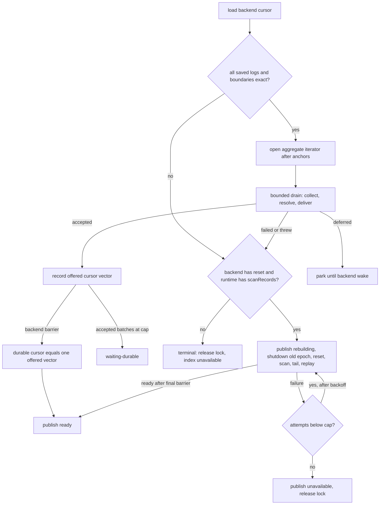

# resources/indexes/ — Design notes

The derived-index runtime and the HNSW vector index (JS graph and native plane).

**Read this when:** touching `derivedIndexRuntime.ts`, `HierarchicalNavigableSmallWorld.ts`, `hnswDerivedIndex.ts`, `hnswPlaneBinding.ts`, or vector query planning.

Index of every design note: [DESIGN.md](../../DESIGN.md).

---

## Graph size on the HNSW query path must come from node ids (`resources/indexes/HierarchicalNavigableSmallWorld.ts`)

The ef auto-scale needs to know how big the graph is, on every query. Two sources that look right
are not.

`getKeysCount()` on a RocksDB store is an exact key scan, so it is O(N): measured at 13 ms per call
at 10K keys, 128 ms at 100K, ~1 s at 500K. Calling it per query puts a linear-in-corpus-size term in
front of every vector search — 34% of query latency at 20K vectors on the real table stack.

RocksDB's `rocksdb.estimate-num-keys` property is O(1) and looks like the obvious replacement, but it
counts entries across memtable and SST files without reconciling overwrites. Building an HNSW graph
rewrites each node many times as its neighbours change, so on a real index it reads far high: 37,775
for a 2,000-record table whose exact key count is 4,001, and worse after deletes. It reads exact on a
fresh store with simple puts, so it validates clean in isolation and only misleads on a real index.

Node ids are the sound source. They are allocated monotonically from a `getUserSharedBuffer` counter,
so the counter (or one reverse seek to the largest id) gives the node count in O(1), unaffected by
how many times a node has been rewritten. Deletes leave it reading high until a rebuild, which only
makes ef slightly generous. A file-primary (`nativePlane`) index keeps no node-id keys in its store
at all — the plane slot carries the primary key — so its count is the plane's id high-water, which
reads the same way (allocation high-water, generous after deletes until a rebuild).

Note the unit: the JS index store holds two keys per record — the graph node and the primary-key
mapping — so a key count is twice the node count. `AUTO_EF_REF` is expressed in nodes for that
reason, and any change between the two units has to move it to keep the resolved ef the same.

## HNSW layers above 0 are for routing only, and must be searched greedily

Each layer above 0 exists to hand the next layer down an entry point: `search()` and `index()` both
take `results[0]` and discard the rest. Searching them at the full `ef` therefore buys nothing and
costs work proportional to the layer's population rather than to ef — layer 1 holds ~N/M nodes, and
at ef 512 a query visited ~95% of it. That is a second linear-in-N term: upper-layer visits per query
grew 342 → 2,421 across 5K → 41K vectors on real embeddings, and reached 75% of query time at 100K. Greedy descent
(`ROUTING_EF`) is what standard HNSW does. Measured against the same graphs searched at the full `ef`
on every layer, across 16 (size, `ef`) points on a held-out real-embedding corpus, the worst
recall@10 change was -0.002 — one displaced neighbour at a single point — and 0.000 everywhere else.

The connection-building pass in `index()` is not routing — it selects the edges that get stored — so
it keeps `efConstruction`.

The insert-side change is the one that alters stored graphs, recoverable only by a reindex, so it was
measured separately (`benchmarks/hnsw-scale.js --build-upper-ef=100` restores the previous
index-time descent). At 20,000 real 768-dim embeddings with identical corpus and level assignments,
the two builds were indistinguishable on every metric measured — same recall at each `ef`, same visit
counts, same mean layer-0 degree — and the greedy build was 1.28x faster. That is consistent with the
graphs being identical, though equal metrics do not prove it. It is the expected result either way:
the upper layers are sparse enough that a greedy walk reaches the same entry point, which is why
standard HNSW descends this way.

Greedy-equals-full is statistical, not per-graph: rare level layouts route to a different layer-0
entry point and displace the tail of the top-k (~2-3% of random 600-node graphs in the unit test's
corpus). Tests that assert exact result-set equality across search strategies must therefore pin the
graph: level assignment draws from the instance's `random` property (a test seam defaulting to
`Math.random`), which the routing test replaces with a seeded PRNG. One pinned graph samples the
property once, so that test sweeps a fixed list of seeds, each verified non-divergent when the list
was written — a seed that starts diverging after an intentional index change is a re-pin, not
necessarily a routing regression.

## `efConstruction` and the search-`ef` ceiling both auto-scale with the graph

The connection-building pass selects each node's stored edges from a candidate list of
`efConstruction` entries. Held at a constant (100) while the corpus grows, edge quality erodes in a
way no search-side setting can compensate: at 1M nodes (768-dim, int8, calibrated hard corpus)
recall@10 fell to 0.935 and sweeping the search `ef` from 512 to 1536 only reached 0.957 raw / 0.967
set at 4.7x the latency — the missing neighbours were not deep in the candidate list, they were
unreachable. Rebuilding the identical corpus (same seed, same level assignments) with
`efConstruction` 200 restored 0.985/0.997 and made queries _faster_ at the same `ef` (3,110 nodes
visited vs 3,948 — better-selected edges route more directly). Quantization contributed ~1.5 points
(float32 rebuild: 0.952); construction quality was the dominant term. Full sweep in #2180.

So when the schema does not configure `efConstruction`, it scales as `AUTO_EF_BASE * sqrt(nodes /
AUTO_EFC_REF)`, capped at `AUTO_EFC_MAX`. The healthy write path reads the count directly from the
shared id counter: one atomic load with no memo lag during bulk ingest. If an update-only worker
cannot attach that counter, it warns once, falls back to the memoized reverse seek, and retries the
attach after the memo TTL; a new insert still requires the shared counter rather than risking ids
from a private counter. Scaling starts at 250K nodes: efC 100 held recall through 500K (0.978), so
smaller graphs — the common case — build exactly as before. The sqrt shape mirrors the search-side
scale; the cost is build time (1.77x at 1M for efC 200), paid only by tables that actually grow
large, and partly returned as cheaper queries.

An explicit `efConstruction` stays authoritative and is structural, so changing it triggers a full
index rebuild. It also seeds the search `ef`: setting `efConstruction: 100` alone cuts query effort
to 100. Retaining the former large-graph search default while opting out of build scaling requires
an explicit `efConstructionSearch` as well (512 after the former auto-scale reached its plateau).
There is currently no "pinned build, auto search" combination.

The search side scales past its old plateau for the same reason. `AUTO_EF_MAX` (512, pinned from
~13K nodes) was calibrated when layers above 0 were searched at the full `ef`, which made large efs
cost seconds; after the greedy-descent fix the same headroom costs tens of milliseconds (ef 1024 at
5M nodes: ~45ms p50), and holding the pin leaves measured recall on the table — set-recall at a
pinned 512 on well-built graphs decays 0.997 → 0.955 → 0.935 across 1M/2M/5M. So past
`AUTO_EF_LARGE_REF` (1M nodes, where 512 was last measured sufficient) the scale resumes from the
plateau — `512 * sqrt(nodes / 1M)` — up to `AUTO_EF_CEILING` (2048, binding at ~16M). The 5M point
resolves 1,145, bracketed by the measured ef-1024 sweep there (0.985 set). The default's query
latency therefore grows as sqrt(N) on large tables; that is the recall-first trade chosen here, and
apps preferring latency pin `efConstructionSearch` or a per-query `ef`. The filtered-traversal
budget (`maxVisits`, #1241) deliberately does not follow the second regime: each budgeted visit is
a synchronous record load plus predicate evaluation, so an auto-scaled ef's budget contribution
stays capped at `AUTO_EF_MAX` — the recall decision and the filtered-scan bound are separate
decisions, and an explicit ef (per-query or schema) still raises the budget for callers who own
the cost. Both ceilings are finite on
purpose: total build work grows as N^1.5 under sqrt scaling, and past roughly tens of millions of
nodes per graph, sharded medium graphs beat one huge graph on build and query cost alike — scaling
the constants further is the wrong tool there.

Two caveats are accepted deliberately, both inherited from the count being a lifetime high-water
mark of allocated node ids rather than a live count. First, churn: a table that deletes heavily
(TTL eviction, delete-and-reinsert ingest) reads high forever, so its build-side efC can sit at the
cap while the live graph is small. The 6–7x build-time extrapolation applies to a comparably large
graph; it is not a bound for a small rolling window. When efC exceeds the live graph size, the
candidate list cannot fill and an insert can traverse a large fraction of the graph before storing
only `M << 1` edges. This wastes throughput without improving recall. The search side accepted the
same over-count as "slightly generous ef" on an opt-in read path; the write path inherits it as a
known cost until a live count exists (tracked follow-up). Second, ramp history: nodes indexed before
the graph crossed a scale threshold keep their original edges — the scale applies to inserts from
that point on. A reindex in a live process rebuilds roughly uniformly (the id counter keeps its
high-water mark), but a reindex after a restart re-seeds the counter from the largest id in the
rebuilding store and therefore repeats the ramp — its first 250K nodes rebuild at the base efC.
Later inserts add reverse edges to older nodes, but a default-ramp 1M build has not been compared
directly with the uniform-200 A/B. The larger default-ramp runs reached 0.988 set-recall at 2M and
0.985 at 5M when searched at ef 1024, which shows that the measured neighbours remained reachable
at those sizes without proving uniform convergence.

Deletes have a separate tail-latency cost: connectivity repair can synchronously reinsert an orphan
and up to 256 nodes from a severed island. Those reinserts use the current auto-scaled efC, so the
per-insert build multiplier can land hundreds of times within one delete.

## An approximate index returns at most `ef` rows, so `limit` has to reach it

Layer 0 keeps at most `ef` candidates, and ef resolves from the auto-scale, not from the query. A
`limit` above it came back short with no error: with the 512 cap no vector query could return more
than 512 rows however large the limit, and `{offset: 250, limit: 200}` returned zero rows, so
paginating a vector search past the first page returned nothing. `searchByIndex` threads the query's
`offset + limit` to the custom index as `minResults`, which widens the candidate list to cover the
request. Any future approximate index needs the same plumbing.

Two bounds keep that from becoming a new problem. `ef` drives a synchronous traversal that holds
every admitted candidate in a sorted array with an O(len) insert, so a limit-derived `ef` is capped
at `LIMIT_EF_MAX`; without it, ordinary deep pagination (`offset` in the millions) would walk the
whole graph on the event loop, which is worse than the truncation being fixed. And schema-level or
per-query `ef` values stay authoritative: each is an explicit cost ceiling, so it bounds the result
set rather than being raised by the limit. Only automatically scaled indexes widen toward
`LIMIT_EF_MAX` to satisfy a larger bounded request.

`LIMIT_EF_MAX` is the _only_ bound on the widening — deliberately not also the graph size. Clamping
there is tempting and costs more than it saves: the memoized size reads low while a table grows, so
it truncates the limit it was supposed to honour, and resolving a size exact enough to clamp against
puts a store lookup back on every query whose `limit` exceeds the table — the linear-in-N term this
whole change removed, reintroduced in miniature. An `ef` above the node count is free anyway: the
traversal is bounded by the nodes it can reach, so it ends at the graph, not at `ef`.

The filter budget deliberately does not follow a limit-derived `ef`. It is computed from the `ef`
the index resolved for itself, with an automatically scaled `ef` capped at `AUTO_EF_MAX` before it is
multiplied by `filterExpansion`; explicit schema or per-query `ef` values remain authoritative.
Multiplying the budget by a caller's `limit` would turn a filtered vector query into a record-loading
scan wearing an index's clothes.

Paging a vector search is best-effort, not a stable partition. Each page re-runs the approximate
search at a different `ef` (`offset 0, limit 250` resolves 250; `offset 250, limit 200` resolves 450),
and an HNSW candidate set at a larger `ef` is not guaranteed to be an ordered superset of the smaller
one, so a record can repeat across pages or be skipped. Honoring `limit` fixes the "second page is
empty" defect; it does not make offsets a cursor. Callers who need stability should fetch one page
large enough for the whole result set, or pin an explicit `ef`.

One consumer is still calibrated in index-store keys rather than nodes: `estimateCountAsSort`, the
planner's cost estimate for a vector sort. It is scaled by `INDEX_KEYS_PER_NODE` so the count-source
unit switch does not shift the estimate on its own. The ef term remains the configured search value,
not the runtime auto-scaled value, so the planner increasingly underestimates vector traversal cost
as an automatically scaled graph grows.

## Derived-index runtime: committed-log delivery to native index backends (`resources/derivedIndexRuntime.ts`)

A derived index (the native HNSW plane, a future Tantivy full-text index) is a materialized view
that lives outside the record transaction: its apply is native, costs 0.2–1.4 ms per mutation, and
its durability barrier is an `msync` or a segment publish, none of which belong on the commit path.
The runtime is the one Harper-side implementation of the delivery protocol in harper#2489: **the
transaction log is the durable fact, a commit only wakes a runner, and every backend resumes from an
exact cursor into that log.** There is deliberately no second delivery fact — no transactional
dirty-key outbox, no `aftercommit` staging — because a second durable write per indexed mutation, a
cleanup protocol for it, and a new column family for every audited table would still not let an
engine-specific native file commit atomically with RocksDB, so the cursor protocol would be needed
anyway.

### Invariants

1. Only committed entries are delivered; the runtime never reads uncommitted log entries.
2. One worker runs a given backend at a time (a process-wide `tryLock` per backend). The owner
   merges every physical log into one serial stream and keeps a cursor per log.
3. A cursor is `{ format: 1, logs: { <log name>: <completed transaction timestamp> } }`. It advances
   only at `endTxn` and only after the backend's durability barrier covers the whole transaction.
4. Live delivery and restart use the same cursor validation, iterator and dispatch code. A lost wake
   or a full backend queue delays indexing; it cannot skip durable log work.
5. Resume proves every saved log position with `exactStart`. A missing, incomplete or duplicate
   boundary condemns the generation; approximate resume is not permitted.
6. The runtime resolves the current primary entry once per changed record and projects only the
   registered attributes. Backends never see the log entry's body: a conflict retry can re-resolve a
   record after its log payload was staged, so the entry is identity and version evidence, not state.
7. No exception from log iteration, primary reads, projection, backend calls or unlock callbacks
   escapes the scheduled drain or interferes with subscriptions and replication.
8. Registration adds nothing to the commit path except a local-only eviction marker for registered
   caching tables (below). No `aftercommit` listener, no retained `AuditRecord`s, no awaited work.

### Ownership and wake-up

Each worker holds one `DerivedIndexRuntime` per RocksDB root store, with the same schema-derived
registrations on every worker; the drain is lock-elected, registration is not. The runtime listens
to the root store's `committed` event and coalesces wakes through `setImmediate`. The winner keeps a
reusable aggregate iterator (`RocksTransactionLogStore.getRange` with `startByLog`, `exactStart`,
`resumeAfterExactStart`, `includeLogName`) and drains for bounded count, bytes and wall time per
turn. Ownership is sticky: the lock is not one record writers take, so holding it across turns
delays no commit, and it is released only after an idle grace period once durable progress equals
offered progress. The intended wake for a waiting runner is the lock's own unlock callback
(`tryLock(key, onUnlocked)`): one primitive, and a holder that dies releases natively and wakes the
waiters the same way. **Temporarily** the lock is taken without one: the pinned rocksdb-js queues
that callback as a thread-safe function of the caller's env, and on Node 22 one left behind by a
worker that was `terminate()`d aborts the process when another thread unlocks (Harper's thread
manager terminates workers on restart). Until the pin includes the fix (HarperFast/rocksdb-js#849),
successors are woken by the releasing owner's `notify()` on the readiness buffer and, for an owner
that died without releasing, by a retry timer (`lockRetryMilliseconds`, 5 s by default); the
releasing runner ignores the one notification it caused, and a runner already parked on that timer
does not re-probe the lock on commit wakes. This is a workaround with a tracked revert — the callback
path is simpler and picks up a dead owner immediately.

Configuration-level database aliases can load several table classes over the same physical audit
store, index column family and plane file. They must not run that backend more than once. Registration
therefore hands the backend to the newest class generation: it synchronously retires the predecessor,
installs the new class's index handle, projection, table id and lag policy, and lets the native lock keep
the successor idle until the predecessor releases ownership. A normal class cleanup only retires its own
generation. `dropTable()` is the destructive exception: it fences the immutable table id, retires every
registered backend for that generation (including settlement chains owned by another alias), and checks
that the catalog still names that table id before deleting name-keyed storage. A same-name recreation can
therefore register its new id without being retired by a stale alias.

Transaction timestamps are unique per physical log but **not monotone in physical order**
(`TransactionLogStore::writeBatch` only advances `latestTimestamp` when the batch's is greater), so
the runtime never compares timestamps to decide progress or retention. Resume is exact-start: find
the transaction, iterate after it. Repeat detection is a per-log set of completed timestamps
retained since the durable cursor. A log the cursor does not name is read from its beginning only
if it still retains it — `fileCount === 0 || oldestSequenceNumber === 1`; rocksdb-js reports
`oldestSequenceNumber: 0` for a log that has never written a file — otherwise the generation is
condemned.

### Offered versus durable progress

A native backend accepts several batches before its next barrier, so the owner tracks **offered**
progress (cursor vectors of accepted batches, in memory, under the lock) separately from the
backend's **durable** cursor. Every acquisition mints an owner epoch from a process-wide atomic
counter and stamps it on each batch; a new epoch — including after a worker restart — resets offered
progress to the durable cursor before opening its iterator, because replaying work that survived
in a native queue is safe and trusting a dead worker's non-durable position is not. A reported
durable cursor must equal one offered vector exactly; validating logs independently would let a
backend assemble a cursor from different batch boundaries and hide work. Accepted-not-durable
progress is capped (`maxAcceptedBatchesAhead`, 64); at the cap the owner keeps the lock, stops
reading (`waiting-durable`) and resumes on a backend state-change wake, not on commit wakes.

### Authoritative record resolution and the eviction marker

The log decides what must be revisited; the primary store decides what is in the index now. A
present entry yields its current version and projection; a missing, deleted, evicted or
invalidated entry yields `absent`, which is sound only because every removal now has a durable
fact: `delete`, `invalidate`, `relocate`, or the local-only `evict` marker that `Table.evict()` and
`createEvictionBatcher().stageInto()` stage into the same RocksDB transaction as the row removal for
tables with a registered derived index (`hasDerivedIndexRegistration`). The marker is `LOCAL_ONLY`,
a no-op in boot replay, filtered from customer history and subscriptions, and rejected by
replication. `message`, `publish` and structure entries advance progress without becoming
documents; a `reload` marker (replica base copy) condemns the generation because its rows have no
per-record entries. A projection that throws a 4xx `ClientError` yields
`{ kind: 'unindexable', reason: '<class> (<status>)' }` — the backend removes any entry and counts
it; the message never reaches shared memory or the backend because validation messages quote
record values. Any other projection or primary-read failure is fail-closed.

### Backend contract

```ts
interface DerivedIndexBackend {
	readonly id: string;
	attach(host: { isOwnerEpoch(epoch: bigint): boolean; getReadiness(): DerivedIndexReadiness }): void;
	getDurableCursor(): DerivedIndexCursor | undefined;
	deliver(batch: DerivedIndexBatch): DERIVED_INDEX_ACCEPTED | DERIVED_INDEX_DEFERRED | DERIVED_INDEX_FAILED;
	flush(reason: 'age' | 'threshold' | 'shutdown'): void | Promise<void>; // barrier request
	shutdown(ownerEpoch: bigint): void | Promise<void>; // quiescence: nothing further applies or publishes for the epoch
	onStateChange(wake: (change?: 'changed' | 'accepted-work-lost' | 'failed') => void): () => void;
	reset?(ownerEpoch: bigint): void | Promise<void>; // destroy state and cursor; first durable action invalidates the cursor
}
type DerivedIndexBatch = {
	ownerEpoch: bigint;
	transactions: { logName; timestamp; mutations }[];
	records: DerivedIndexMutation[]; // last-write-wins per (tableId, writeKeyId(recordId)); non-enumerable
	through?: DerivedIndexCursor; // absent on a rebuild scan chunk and while a transaction is still open
	bytes: number; // estimate; non-enumerable
	rebuild?: true;
};
```

There is one contract and every hook is required. What an ownership handoff has to fence is work
that survives a method return — a queued apply, a barrier that completes later, a cursor that
trails delivery — so every backend supplies the epoch fence, the barrier request and the quiescence
handshake; one that completes inside `deliver()` implements them trivially. `deliver()` is not
bounded by the runner's turn budget (the runtime cannot bound work it does not perform): the
expected shape is enqueue, return `accepted`, apply in the backend's own time slices, advance the
durable cursor at its barrier, return `deferred` when its queue is full. `accepted` means the backend
owns the batch, not that the cursor may advance. `deferred` holds the batch until a state-change
wake. `accepted-work-lost` makes the owner rebuild its iterator from the durable cursor; `failed` or
`DERIVED_INDEX_FAILED` condemns the generation. `reset` is optional — without it `needs-rebuild` is
terminal — and a backend that implements it owns its crash safety: it must invalidate the cursor
before anything destructive, because shared readiness is process memory and is no evidence after a
restart. The runtime also writes a condemnation marker to the root store
(`Symbol.for('derived-index:<id>:condemned')`) before any reset and clears it at the first durable
`ready`, so a restart between condemning a cursor and destroying it still rebuilds; a marker that
cannot be written issues no reset. The cursor's atomic durability mechanism is the backend's
(Tantivy publishes it with segment state; HNSW writes it after the plane barrier), which is why the
cursor is backend-owned and validation is Harper's.

### Native full-text backend

`resources/indexes/fullTextDerivedIndex.ts` adapts the shared runtime to
`@harperfast/fulltext/native`; it does not implement another replay or ownership protocol. Harper
turns each resolved mutation into one stable document id from `tableId` and the record id's
ordered-binary storage-key bytes, and
passes only the schema-selected string and array fields to the wrapper. Harper does not rescan array
contents; the wrapper owns value validation, Tantivy schema, exact frame partitioning, its exclusive writer, segment publication, and file
lifecycle. Harper keeps accepted runtime batches in a 64 MiB bounded queue and submits at most 256
records or 5 ms of conversion work per turn, so the runtime's 4096-record chunk cannot become one
long event-loop task. A rebuild chunk without a source-size estimate consumes the adapter's entire
queue-byte allowance, ensuring that only one unknown-size chunk is retained at a time. Wrapper
rejections remove the previous document and count it as unindexable; they do not leave stale search
content. A projector returning null or no string-valued fields deletes the prior document rather
than indexing an empty replacement.

Every runtime flush is a native publication barrier. Full-text activation chooses and benchmarks the
runtime flush thresholds; the adapter does not reinterpret a flush because the runtime uses durable
cursor progress to bound replay work and transaction-log retention.

The native commit payload contains Harper's exact derived-index cursor. A publish makes the Tantivy
mutations and that payload visible together; only then does the adapter report durable progress.
An ordinary apply or publish failure rollback-closes the writer, discards accepted-but-unpublished
work, and wakes the runtime to replay from the last native payload after exponential backoff to a
five-second ceiling. It does not condemn a structurally valid generation. During a rebuild, the same
accepted-work-lost signal aborts that rebuild attempt; the runtime retires the partial generation and
spends one of its bounded rebuild attempts before rescanning. A mutation-batch protocol
violation remains permanent because retry cannot change the wrapper contract. Writer open is lazy.
After a small immediate attempt budget, open errors use the same retry ceiling unless their stable
code proves the native generation is structurally incompatible or corrupt. Configuration, binding,
process-state, and unknown codes retry by default: they may require operator action or restart, but do
not prove the index files should be reset. Persistent writer unavailability emits one warning without native paths
or record content. Ownership handoff does not finish until drain and close prove quiescence. A
writer-open failure that lands after shutdown begins discards queued work before finalization so it
cannot enter another retry drain. Harper
gives native close its own 35-second bound and bounds the complete handoff at 70 seconds. If that proof fails, shutdown rejects and the runtime keeps its
runner lock, preventing a second writer. The underlying native operation continues and a later operator
retry attaches to the same shutdown rather than starting a competing close. A cursor that cannot fit
the native commit-payload limit is terminal for that backend instance: accepted work is rollback-closed
and reported lost, then further delivery stays deferred. The adapter does not report a permanent
backend failure because condemnation and reset cannot shrink the cursor. Automatic reset is refused
until configuration changes replace the backend instance. This terminal park keeps readiness
non-terminal; when the derived-index lag policy is enabled, source writes remain rejected after the
lag limit is crossed until the deployment is changed so the cursor fits and the backend is replaced,
or the index is disabled. Inspection accepts any payload within Harper's fixed 64 KiB format bound,
independent of the current publication limit, so lowering that limit never turns an already-valid
native generation into rebuild work.

Inspection is synchronous and writer-free. The first durable-cursor read in each ownership acquisition
refreshes native state, while later reads in the same acquisition use the cache; every shutdown path
invalidates it, including an owner that received no batch. A refresh failure never falls back to a
cached checkpoint because the runtime can publish `ready` before lazy writer-open reconciliation.
The synchronous backend contract has no retryable acquisition result, so an inspection exception
deliberately fails closed: the runtime condemns the generation and rebuilds from authoritative
records rather than trusting an unverified cursor. A transient filesystem error can therefore cost
a full rescan; reintroducing asynchronous acquisition solely to avoid that trade is out of scope.
Missing, cursorless, incompatible, or malformed native state has no usable cursor and therefore enters
the runtime's ordinary local rebuild from records.
Reset first asks the wrapper to retire the live generation atomically, then reclaims only wrapper-
validated retired paths. The reset operation is tracked and bounded; shutdown attaches to the same
operation and keeps the runner lock if it cannot prove settlement. Retired-path reclamation is
best-effort, serialized per lifecycle, and never extends that reset handoff. The native directory is node-local derived state: restarts reuse it and
replay after its payload; replicas independently derive it from their own applied transaction log;
backup and restore need only authoritative records and schema. A new or unusable directory serves no
full-text queries until rebuild and catch-up publish `ready`.

A table drop keeps the tombstoned catalog descriptor, including its native index names, until
retirement completes. The drop broadcast first unloads peer attachments and awaits their writer
shutdown; only then may the wrapper retire native storage, followed by RocksDB column families and
catalog rows. If native retirement cannot prove success, the table remains logically dropped and
unloaded but its tombstone stays durable so restart or same-name creation retries cleanup. Removing
the catalog first would turn a crash in that interval into an untraceable native-directory leak.

Tantivy files are not an opaque encrypted cache. They contain the document-id term dictionary,
analyzed term dictionaries, postings, frequencies and optionally positions; `surfaceTerms: true`
also stores the original projected strings needed for surface-term features. Operators must protect
the full-text directory with the same filesystem controls as Harper data. Removing source records
does not erase old segment bytes immediately; normal Tantivy merge/reclamation governs physical
removal, and destroying an index uses the wrapper's retirement protocol.

The binding remains unloaded until a full-text declaration is activated. Before activation can
construct this backend, Harper must exact-pin the Fulltext package, document the dependency in
`dependencies.md`, and prove that its native prebuild loads on Linux, macOS, and Windows CI. A
missing or incompatible binding is an activation error; Harper must not silently omit the declared
index.

### Bounded delivery

A drain turn **collects** identities from the iterator — `(tableId, recordId, logVersion)` per
eligible entry, no primary read — under `maxTransactionsPerTurn`, `maxBytesPerTurn`,
`maxMillisecondsPerTurn` and `maxChunkRecords` distinct keys, then **resolves** each key once after
its last collected occurrence, under `maxChunkBytes` and the same wall budget, carrying the
remainder to the next turn. Resolving after the last occurrence, not on first encounter, is what
keeps a writer committing between two occurrences of a key from having its later state certified by
the cursor while the earlier state stayed indexed. An oversized transaction is delivered across
chunks with `through` withheld until the chunk that contains its `endTxn`; nothing marks such a
chunk because a backend can do nothing with the distinction, and query-visible atomicity of one
transaction across chunks is not promised. `bytes` is an estimate from stored record sizes (or the
log entry size), never a serialization; `maxChunkRecords` is the hard bound. All bounds are settable
per registration.

### Durability cadence

`maxAcceptedBatchesAhead` is a ceiling; the runtime, which already tracks accepted-not-durable work,
is the scheduler. It requests `flush('age')` when the first accepted batch since the last request is
`maxFlushAgeMilliseconds` old (1 s), `flush('threshold')` at `flushAfterMutations` (4096) or
`flushAfterBytes` (8 MiB), and `flush('shutdown')` at release. The backend runs the barrier
asynchronously, coalesces requests that arrive mid-barrier, and publishes `through` atomically with
what the barrier made durable. Reaching the end of the log requests no extra barrier — arrivals
spaced just beyond drain completion would otherwise pay one per write; the age timer is idle
completion. The timer is armed at a flush request while earlier work is still non-durable, and
again after a barrier that stopped short of the offered cursor; a later write keeps an armed timer,
so a write's barrier lands anywhere in (0, 1 s]. A test that needs a coverage wait to outlive the
transaction monitor must therefore hold `flushDerived` until the monitor has acted (`holdBarrier`
in `unitTests/resources/derivedIndexCoverage.test.js`).

### Rebuild

When the backend has `reset` and the runtime was built with `scanRecords`, `needs-rebuild` is a
phase, not an end state: publish `rebuilding`; `shutdown(previousEpoch)`; mint a new epoch and
republish; `reset(newEpoch)` (afterwards `getDurableCursor()` must be `undefined`); capture the
**committed tail** of every log; scan every registered table (tombstones and symbol keys skipped),
project, deliver bounded chunks with `through` absent; deliver a final chunk with `through` = tail;
install the tail as offered progress and replay through the ordinary drain; publish `ready` at the
first durable advance past the tail or the first idle pass with durable == offered.

The tail is safe because a committed read is a contiguous physical prefix: rocksdb-js keeps the
physically-written-but-uncommitted start offsets in a sorted set and `commitFinished()` advances
`lastCommittedPosition` to the earliest of them (`TransactionLogStore::commitFinished`,
`uncommittedTransactionPositions.front()`), so a transaction that wrote at offset 200 and committed
before one pending at 100 stays invisible until 100 commits. Everything committed before the
capture is in the scan; everything after it is replayed; a reload marker is therefore met exactly
once, with no capture-time bookkeeping. A log that cannot be read to its tail fails the attempt
closed — corruption inside the committed prefix cannot be replayed from any anchor. Attempts retry
with backoff (`rebuildBackoffMilliseconds` 1 s doubling to 5 min) up to `maxRebuildAttempts` (8),
then publish `unavailable` and release; the attempt count travels in shared memory so a peer
honours an exhausted budget. `requestRebuild()` from any worker sets a request word the owner
consumes at its next wake.

### Native HNSW query coverage

Generation readiness and read freshness are separate. A `ready` native index can still be applying
committed mutations. Native vector sort/threshold conditions accept `maxIndexLagMilliseconds`:
**3000 ms by default**, `0` for strict coverage, or an explicit finite nonnegative number. This default
allows three ordinary 1000 ms flush ages; it does not change the separate writer backpressure budget.
Synchronous/non-native indexes ignore the native coverage options. For example, an HTTP QUERY body can contain:

```json
{
	"sort": {
		"attribute": "vector",
		"target": [1, 0, 0, 0],
		"distance": "cosine",
		"maxIndexLagMilliseconds": 0
	},
	"limit": 10
}
```

For read-after-write, add `waitForIndexMilliseconds: 10000` to that sort (or vector condition).
Omitted or `0` preserves immediate admission; a positive finite number, capped at **30,000 ms**,
opts into a bounded wait for coverage of writes committed before the native search begins on first iteration.
The wait takes precedence over lag tolerance: a recent but stale proof cannot satisfy it. An already
physically current index proceeds immediately. Otherwise the query captures one monotonic target and
waits for the owner's certified time to reach it; later writes never reset the target. Each consumed
waiting branch has its own budget; sequential OR or concatenated branches can take longer in total.
A timeout throws retryable `DERIVED_INDEX_LAGGING`. On an already-started HTTP stream this is an error
record, not a new HTTP status. Request cancellation and iterator closure also end pending waits.

Waiting preserves the normal 1000 ms flush-age schedule: a small write followed by a search commonly
waits about a second plus barrier time. Shorter deadlines are valid but may expire. Replay must reach
an end-of-log pass with readable committed prefixes to publish a new capture; sustained overload or
unfinished transactions can prevent certification and cause timeouts even for unaffected tables.
The wait does not promise exact ANN recall, a historical graph snapshot, or visibility of writes that
have not committed locally.

When a vector condition also provides the sort order, each explicit coverage option takes precedence;
missing options inherit the sort's values. The query planner preserves both when combining them.

An ordinary non-waiting native query certifies coverage **at admission**. `Harper-Index-Coverage` is
`current; lag=0; tolerance=<requested-ms>` or `bounded; lag=<upper-bound-ms>; tolerance=<requested-ms>`.
Bounded coverage can omit recent committed mutations; it is not a claim of known incompleteness or an
ANN recall guarantee. The header is exposed to CORS clients and does not certify a later traversal.
Multiple non-waiting searches append one entry each.

Waiting queries retain the synchronous instance iterable API: custom resources can directly use
`super.search(query).map(...)` or concatenate results. Validation and unavailable/rebuilding checks
remain synchronous; the adapter opens a start gate only on consumption, so unused searches start no
wait or traversal. A zero-size page skips native work. The iterable library can pull one extra source
row at a page boundary; an exact boundary between branches can therefore start the next branch.

Waiting queries publish no HTTP coverage header: a header sent before consumption cannot certify the
pending work. The caller must consume results and check streamed errors. JSON array streams may include
an error element such as `{ "error": "DerivedIndexLagError: ..." }`; error serialization may instead
provide a separate `message` field. SSE/NDJSON use their existing terminal error records. HTTP 200 alone
is not evidence of successful completion. Prefix rows can precede a later branch error. Count pages
materialize before headers and can still return an error status. First-item HTTP status deferral is a
separate follow-up (#2670), not a guarantee here. Direct custom-index arrays retain `indexCoverage`;
ordinary native promises expose it before awaiting, while waiting promises expose it on resolved arrays
except for the zero-size fast path, which skips certification and carries no proof.

Waiting consumes the ordinary transaction timeout without special monitor renewal. An expired read
snapshot fails with `ReadSnapshotExpiredError`; timed-out staged writes retain their existing 422
failure and rollback. The adapter uses the captured snapshot for materialization and guards predicate
reads, so it never recreates a snapshot after waiting. Dropping an unconsumed iterable starts no work;
once consuming, close its iterator or abort the request to cancel. Lag rejection never invalidates a
healthy plane. The default/strict no-wait lag rejection remains HTTP 503.
File-primary node-to-record mappings are read from current storage, just like the native graph itself:
an older record snapshot must not hide mappings published after a record already visible in that snapshot.
Record filtering and materialization retain the request's snapshot; the native graph is not an MVCC index.

The runner captures the RocksDB process-wide transaction clock (`getMonotonicTimestamp()`) before listing
physical logs and polling their committed
prefixes. It synchronously adds discovered logs to the audit store's worker-local map. A capture is
usable only when each stats snapshot's committed position equals its written head: an earlier unfinished
transaction can hide later committed transactions behind the readable prefix. The native statistics
counter alone is insufficient here (it can remain nonzero at an equal head). Positions include both file
sequence and byte offset; cursor timestamps and origin clocks are never ordered or subtracted to prove
freshness.

After a poll reaches the end with no undelivered records, the capture is associated with its offered
cursor. Reconciliation publishes it only when that cursor, or a later entry in the ordered offered queue,
is durable. Unrelated-only progress may publish without a new barrier only if **all** non-durable
registered mutations, including unanchored chunks, are absent. Thus a queued relevant mutation cannot
be skipped by a later unrelated commit. Publication is owner/epoch fenced. The physical vector is an
optional `coverage` field in the existing durable cursor value, preserved by later cursor writes and
removed with the cursor before reset. No native file format changes.

Persisted coverage rewrites are limited to the flush cadence, including unrelated-table traffic. The
shared time can refresh sooner once its prefix is durable. A coverage-only write failure logs and skips
publication instead of rebuilding the healthy graph. Strict queries may wait for the next persisted proof.

Restart identity relies on the existing storage durability ordering: these index column families disable
WAL, and [RocksDB's database-flush callback](https://github.com/HarperFast/rocksdb-js/blob/v2.9.1/src/binding/transaction_log/transaction_log_store.cpp#L1080-L1111)
flushes transaction-log files before their index-store flush can become durable. Under successful storage
flushes, surviving coverage cannot refer to a lost, reusable log tail. Recovery also protects the flushed
prefix. [Age-based rotation runs on a write](https://github.com/HarperFast/rocksdb-js/blob/v2.9.1/src/binding/transaction_log/transaction_log_store.cpp#L947-L963),
so an ordinary idle log does not advance its head merely because time passed. These are dependency
contracts, not a guarantee against externally replacing log files or failed storage durability.

Bun gives each worker a different `process.hrtime.bigint()` origin, so it cannot certify cross-worker
coverage. The transaction clock is shared across workers; its milliseconds are encoded as integer
nanoseconds without multiplying the full epoch-sized floating-point value.

The monotonic time lives only in the process-wide shared readiness buffer and is cleared on non-ready
health transitions. An owner refreshes idle coverage at its flush cadence without extending its idle
release deadline. A query within the certified age bound reads only shared memory and the monotonic
clock; strict or older queries compare the persisted vector with current physical positions. This also
certifies an unchanged index after owner release or process restart, when no usable time proof remains.
Concurrent waiters on one worker/index share a single 25 ms poll timer, removed when all resolve,
time out, or abort. A first waiter nudges its local runner without changing writer-lag accounting or
retrying a deferred batch; an active peer owner already refreshes at flush cadence. No cross-worker
notification or per-query persisted coverage write is needed. Closing a registration rejects its waiters.
A completed nonempty drain also attaches its capture to the accepted boundary; ongoing writes need
not leave an empty turn between batches. The capture remains fenced behind every indexed mutation
accepted through that boundary.
The strict/ownerless path costs a cursor read and stats per physical log. If a database-wide backlog
prevents the owner from inspecting unrelated writes, coverage can conservatively become unprovable
for an otherwise unaffected index; queries do not scan logs to classify that backlog.

### Handoff fencing

Release drops ownership, calls `flush('shutdown')` then `shutdown(epoch)`, and unlocks only when
that settles; a rejected `shutdown` **keeps the lock** and publishes `unavailable`, because a backend
that cannot prove its queue quiescent must not hand the index to another owner. `stop()` and the
unregister function return one cached promise that resolves after every backend settled and rejects
if any shutdown failed, so a caller cannot close storage while a backend is still draining into it.
`isOwnerEpoch(epoch)` is an `Atomics.load` of the shared counter; a backend checks it before each
apply, after each await and in barrier completions, and drops work for a superseded epoch. The
runner tracks a generation that changes on every acquisition, discard, reset and release and
ignores continuations from an earlier one.

### Shared readiness

`indexStore.isIndexing` is per worker, so the owner publishes into one `getUserSharedBuffer`
allocation per backend (`derived-index:<id>:readiness`, `READINESS_BYTES`): `Int32` words for state
(`unknown | ready | rebuilding | needs-rebuild | unavailable`), a `DerivedIndexReadinessReason` code,
attempt count, rebuild request and lag-exceeded flag, then the `BigInt64` owner-epoch counter. Each
word is read with a plain `Atomics.load`; nothing needs two of them atomically, so there is no
sequence lock — the owner stores reason and attempts before state. The shared reason is a code,
never a message. `readDerivedIndexReadiness(logStore, id)` reads it on any worker without a runtime;
a query path uses it to choose between a 503 and an answer. `Atomics` over rocksdb-js's external
`ArrayBuffer` wrappers is the same dependency primary-key allocation (`Table.ts`), blob holds
(`blob.ts`) and HNSW node ids already carry; wakes use the binding's `notify()`, never
`Atomics.wait`. A successor publishes `ready` on acquisition one `setImmediate` before its lazy
`exactStart` validation can condemn the inherited cursor; readers see the previous, self-consistent
generation for that turn.

### Lag policy

Opt-in per registration (`maxLagMilliseconds`; 0 = none; raised to two flush ages since catch-up is
only proven at a barrier). The owner takes the longest of: cursor distance behind what it has read,
time parked on backpressure or the ceiling, time since the oldest commit it may not have read
(bounded by how far its newest read trails the clock), and the age of the oldest accepted work not
yet durable. Past the budget it sets the shared flag; every worker's `derivedIndexWriteRejection`
(`resources/derivedIndexRegistry.ts`, one `WeakMap` miss for tables without a derived index) then
fails local user writes to the index's tables with `DerivedIndexLagError` — 503,
`DERIVED_INDEX_LAGGING`, `retryable: true` — at the staging layer (`_writeUpdate`, `_writeDelete`,
`_writeInvalidate`, `_writeRelocate`), never canonical-source applies (`transaction.sourceApply`),
crash-recovery replay or replication notifications, since a rejected canonical write would advance
the source cursor past a write that never landed. The flag is owned by the lock holder: it clears
with hysteresis once the owner has proven catch-up (a durable advance and the end of the log both
reached since acquiring, lag below half the budget), and on every transition out of "behind and
still reading" — entering a rebuild (no cursor to guard; readers act on `rebuilding`), `unavailable`,
a `needs-rebuild` the runtime cannot leave, a condemnation marker it could not write (its retry
needs a commit wake, and commits were what was being shed), and a held lock. An ordinary handoff
preserves it. The policy sheds writes; it does not pin retention — rocksdb-js has no protected
position registration — so a budget belongs well inside the effective retention window, and it must
be enabled only once every worker runs a runtime with the admission check.

### Failure flow



## Native HNSW plane: a file-primary mmap graph on the derived-index runtime (`resources/indexes/HierarchicalNavigableSmallWorld.ts`, `resources/indexes/hnswDerivedIndex.ts`, `resources/indexes/hnswPlaneBinding.ts`)

For a new locally declared HNSW index, Harper uses the native plane by default when the table's
primary descriptor already stores `audit: true` (or the same declaration explicitly enables it),
the native binding loads, RocksDB is in use, and the index has compatible geometry. An explicit
`nativePlane: false` selects the JS graph. The native plane replaces the RocksDB graph with a
memory-mapped fixed-slot file owned by `@harperfast/hnsw` (Rust, napi-rs, exact-pinned optional
dependency; crate at HarperFast/hnsw). The file **is the index**: graph nodes, adjacency, the entry
point, the id allocator, the freelist and each node's primary key exist only there. RocksDB keeps
the primary records, the `pk → nodeId` mapping (which node a key owns, for replacement and replay)
and the one durable replay cursor.

The decision belongs to the durable index-creation boundary, not `openIndex()` or the HNSW
constructor: those are also catalog-reload paths. An existing descriptor is therefore authoritative
when a later declaration omits `nativePlane`; legacy descriptors with no field stay on the JS graph,
and legacy string values retain their historical truthiness while an exactly matching declaration
keeps the stored spelling; a numerically equivalent value produced by the GraphQL numeric-literal
coercion does the same for a pre-upgrade numeric spelling. Numeric HNSW options are likewise
normalized and validated only at the declaration boundary: an exact redeclaration retains persisted
legacy values and their previous runtime coercion, while a different canonical declaration triggers
a rebuild when that interpretation changes (notably zero-valued `optimizeRouting` strings). A table
whose primary descriptor already stores `audit: true` qualifies for the default even when that value
originally came from the global audit setting. In
contrast, a new table and its omitted-mode index in the same declaration do not qualify unless that
declaration explicitly enables audit, because audit was not durable at the index-creation boundary.
A replicated new attribute uses native mode only when the receiving node is independently audited
and eligible, because the plane is node-local derived state. An ineligible receiver persists its
fallback as `nativePlane: false` in the local catalog, so installing the binding or changing storage
later does not switch that index automatically; redeclare it locally with `nativePlane: true` after
the node becomes eligible. Set
`HNSW_NO_NATIVE_DEFAULT=1` to keep newly omitted declarations on JS during rollout; it does not
disable an explicit or already persisted native index. Set it before creating indexes when a
rollback must remain cheap: an older release sees an omitted declaration against the persisted
`nativePlane: true` decision as a mode change and rebuilds that index back to JS. In a cluster, keep
the switch enabled on every node until all nodes run a release with the replicated-attribute fallback.

The default accepts the native implementation's existing operational contract: maintenance is
post-commit; writes receive retryable 503 responses after derived-index lag exceeds 30 seconds;
per-query distance overrides are rejected; the default capacity is 16M nodes; and adding the index
to a populated table keeps searches unavailable for the rebuild, which can take hours at large
sizes. `nativePlane: false` is the durable per-index opt-out.

Why the whole search loop is native and not just the distance kernel: at 5M nodes / ef 512, ~85% of
a warm JS visit is object bookkeeping (candidate heap, visited `Set`, property access, GC), the int8
cosine is 10%, and a warm RocksDB `Get` per visit (~1–2 µs) is 20–40× the SIMD distance it feeds. A
native loop over direct-addressed slots (`base + id × slot_size`, ~100–200 ns) with one NAPI crossing
per query is the only shape that reaches the ceiling; measured 7.2 ms → 0.75 ms p50 at 1M × 768-d,
recall@10 0.997 → 0.999.

### File format

One file per index, `<index store path>/<store name>.hnsw`, created sparse at `nativePlaneMaxNodes`
slots (16M default; a structural, create-time header field — exhausting it makes the index
unavailable until the value is raised and the index rebuilt). Header page: magic + format version
(mismatch → rebuild, by contract), dims, quantization mode, `slot_size`/`layer0_cap`/`upper_cap`
(`layer0_cap` from `nativePlaneLayer0Cap` at creation; `upper_cap` fixed at 64 by the crate), entry point, atomic `id_high_water`, tag-guarded
freelist head, a transaction watermark advanced only after an `msync` barrier, and a clean-shutdown
flag. Layer-0 slot: seqlock word, flags + level, `scale`/`invMag`, degree, int8 vector padded to a
4-byte boundary, `u32` neighbour ids, then the record's msgpack-encoded primary key (format v8;
`nativePlaneKeyCap` inline bytes, default 40; a longer key spills to an overflow arena after the
upper region, reserved at max(128, 4 × keyCap) bytes per node — a table whose keys are mostly
longer than 40 encoded bytes should raise `nativePlaneKeyCap` rather than live in the arena) — at the default degree cap of 64, 1,088 B at 768-d and 448 B at 128-d, the key fitting the cache-line padding.
Upper layers (~6% of nodes) live in a fixed-entry region in the same file, per-entry seqlocked.
Per-edge cached distances are dropped: recomputing costs ~50 ns natively, storing costs 8 B and
~40% of a node. Searches and predicate batches return each hit's key with it, so no lookup by node
id remains on the query path.

Degree cap is the per-index `nativePlaneLayer0Cap`, **default 64** (supersedes the fixed 128 of
2026-08-31, re-measured in [hnsw#14](https://github.com/HarperFast/hnsw/pull/14)): at 128-d and
768-d int8, cap 64 holds recall@10 within ~0.5 pt of cap 128 at every ef ≥ 128 at 1M and 4M, and
within ~0.3 pt at 768-d, at the same resident latency — while cutting the 128-d slot 704 → 448 B and
the 768-d slot 1,344 → 1,088 B, which keeps a 4M-node plane resident under a 2 GB limit that makes
the cap-128 plane thrash. A live 7.7M-node plane carries a mean layer-0 degree of 29
([hnsw#7](https://github.com/HarperFast/hnsw/issues/7)), so the reserved slot was mostly padding.
Cap 32 halves the slot again but trails cap 128 by 1.3–2.2 pts below ef 1024 at 4M and by 1.7 pts
at 1M for 768-d vectors, so it is a declaration for narrow vectors on a plane that outgrows RAM,
not a default. The cap is a create-time header field: `getPlane` compares it with the index's
value on attach and invalidates a plane that disagrees rather than reusing or truncating it, so
revising it is a rebuild, not a format change. A file-primary index builds no JS graph, so this is
the only layer-0 maximum it has; the JS graph's own cap in `addConnection` governs
non-`nativePlane` indexes only. A binary-code v2 slot reopens the question.

Upgrading a plane built at 128 costs one rebuild per node, the first time a process opens it under
the new default; no GA release line carries plane files, so this reaches 5.3 pre-releases only.
Declaring `nativePlaneLayer0Cap: 128` does not avoid that rebuild — adding the property changes the
attribute's canonical structural options, which reindexes the attribute by itself
(`indexOptionsStructurallyChanged` in `resources/databases.ts`); it preserves the geometry only once
it is already the persisted declaration. The default is not written into a descriptor that omits
the option, so nodes upgrade independently: a mixed-version cluster has each node rebuild its own
file as it reaches the new code, and no node invalidates another's.

### Concurrency

Per-slot lock word: bit 31 locked, low bits the owner's pid; unlocked values are generations that
readers validate seqlock-style. A lock unchanged for 20 ms whose owner pid is dead is taken over and
the slot sanitized (marked invalid — a dead writer's payload is half-written; invisible until
rewritten, never spliced-but-valid). Elapsed time alone never robs a live writer. There is no
cross-slot atomicity: an insert writes its slot plus ~M neighbours' back-edges independently, and a
traversal may see a half-linked state — a missing edge or a just-deleted neighbour is skipped. That
relaxed adherence is safe _here_ because the read path loads the record and rescores exactly, which
rejects a wrong candidate; it is not a general storage pattern. Fields a reader acts on are read
through aligned `read_volatile`; the stored vector is an ordinary load so the int8 kernel keeps
autovectorizing, and a torn vector only perturbs a distance the generation check discards.

### Durability

`msync` on a cadence, not per commit; the header watermark advances after a completed barrier. The
graph therefore has bounded-lag durability with deterministic catch-up, while the source of truth
(records, mappings, cursor) stays transactional. Backup treats the file as node-local derived state:
include it after a barrier, or rebuild on restore. A file whose format or checksum does not validate
is rebuilt from records. macOS `msync` is a weaker barrier than Linux (an `F_FULLFSYNC` pass is a
known follow-up); Windows is supported through the prebuild; performance is a Linux target.

### Search

One crossing per query: `plane.search(query, k, ef, filter?)` runs on the module's thread pool with
an epoch-stamped visited array and a fixed-capacity heap, asymmetric int8 distance with SIMD
(AVX2/VNNI, NEON) and a scalar fallback. Filtering has two paths: a bitset over node ids for
allow-lists and companion-condition candidate sets (zero callbacks), and a pipelined
`ThreadsafeFunction` batch path for arbitrary JS predicates that keeps expanding in distance order
while verdicts are in flight, bounded by the same `filterExpansion` visit budget as the JS path.
Traversal never blocks on the event loop. A plane-backed `customIndex.search()` returns a
promise-backed, async-only iterable (`resources/search.ts` wraps it); a synchronous consumer throws.
Auto-ef reads the node count from the plane's `id_high_water` (freed ids are reused, so it stays
close to the live count; deletes leave it generous until a rebuild, as with the RocksDB graph). Every vector reaching the plane — a
committed projection or a query target — passes one invariant (`assertPlaneVector`): array-like of
positive length, every component a finite f32, a magnitude representable in f32, and the plane's
`dims` once known. What fails it is the client's 400, never a plane failure; a query the plane
cannot accept must not be read as corruption and cost a rebuild.

### Delivery: a backend on the shared runtime

Maintenance is off the record transaction. The commit path (`prepareCommitted`) only validates a
changed projection; the derived-index runtime (§ above) reads the committed log and delivers batches
to `HnswDerivedIndexBackend`:

- `deliver()` enqueues and returns `accepted` (or `deferred` at 64 MiB queued); an applier drains
  in 5 ms `setImmediate` slices. Each `records` entry (last-write-wins per key) becomes one
  `applyDerivedValue(pk, vector | undefined, version)`: the stored mapping's signature short-circuits
  an unchanged vector, an older observation is discarded, otherwise the old node is removed and the
  new vector inserted — with the primary key in its slot, so it is searchable at once — and the
  `pk -> node` mapping written **pending**. The store holds no `node -> pk` entries: hits and
  predicate candidates carry their keys out of the plane, and a query deduplicates by key for the
  crash case where a replayed record's earlier node survives without a published mapping.
- `flush()` runs at the next completed batch that carries `through`, or at the drain when none does:
  `plane.flushAsync()`, then pending mappings are published, then that batch's `through` vector is
  written as the cursor under `Symbol.for('derived-index-cursor')`. Waiting for the drain instead
  would leave a catch-up — which never empties the queue — with no barrier at all, so the runtime's
  `flushAfterMutations` / `flushAfterBytes` / `maxFlushAgeMilliseconds` cadence would be inert for
  its whole duration. A rebuild scan chunk carries no `through` and so never interrupts a slice;
  its barrier is the drain one, which the runtime's per-chunk `setImmediate` keeps reaching. An
  interrupting barrier then idles for three times its own duration before another may interrupt:
  application is paused for a barrier, and the runtime re-requests on a 1 s age timer, so on a plane
  whose `flushAsync()` costs seconds — measured at 2–6.5 s on the Windows CI runner — honouring every
  request would spend the whole catch-up inside barriers. The drain barrier is never delayed.
  Application pauses while a barrier is in flight so the barrier publishes exactly the mappings it
  covers. That order is the crash contract: a crash before the barrier leaves pending mappings that
  replay re-derives; after it, a cursor that replays idempotently; never a published mapping to a
  node the file did not durably get, and never a cursor over uncovered state.
- `reset(epoch)` removes the cursor first, then the file (invalidated in-band and via a `.stale`
  sidecar so no peer adopts a stale inode or an undeletable Windows file), then the mappings.
- A vector the plane cannot hold at apply time (a dimensionality mismatch only the plane-holding
  worker can see) is skipped and counted, never a rebuild.

Readiness is the runtime's shared record on every worker, not `indexStore.isIndexing`: a search on
a non-`ready` index is a 503 (`unavailable` after the rebuild budget); a `ready` index with no file
and no surviving node mapping answers no results; one whose file is gone while mappings survive
asks its owner for a rebuild. A search failure detaches this process from the plane and requests a
rebuild — only the owner's `reset` destroys state, so a failure observed after a peer has already
replaced the file cannot take out the replacement. Writer backpressure is the runtime's lag policy
(`maxLagMilliseconds`, 30 s default on a `nativePlane` attribute), required because accepting
unique-key load above native insert throughput and then rebuilding at that same throughput cannot
converge.

### What native-plane mode requires, and what it does not promise

| requirement                                                                                                                                                                                                                                                                                                                                                                                                                                                 | enforcement                                                                                                                                                                                                                                                                                                                                                                                                                                                                                                                                                                            |
| ----------------------------------------------------------------------------------------------------------------------------------------------------------------------------------------------------------------------------------------------------------------------------------------------------------------------------------------------------------------------------------------------------------------------------------------------------------- | -------------------------------------------------------------------------------------------------------------------------------------------------------------------------------------------------------------------------------------------------------------------------------------------------------------------------------------------------------------------------------------------------------------------------------------------------------------------------------------------------------------------------------------------------------------------------------------- |
| For the automatic default, a primary descriptor with `audit: true` or an explicit `audit: true` in the same local declaration — the transaction log is the recovery source, and the default must not widen the audit-readable surface by inheriting the global setting. On an existing table whose durable audit field is absent, explicit native mode may pin the effective audit value; a stored `false` wins. A new table still requires explicit audit. | On an existing table, `table()` writes an audit enable before the native index row. A new table publishes its primary row last as the catalog-completeness marker, already carrying explicit audit. Disabling audit writes every non-primary descriptor first, whether native mode is opted out or the index is removed, then writes the primary row last. Catalog reload propagates durable audit to an already-loaded class, and `attachDerivedIndexes()` checks the runtime flag; enabling logs warns once that the audit API retains full record history for the retention window. |
| RocksDB; `M=16`, `efConstruction=200`, `mL=1/ln(16)`, `optimizeRouting=0.5`, int8 cosine (the package's standalone `insert` fixes this geometry)                                                                                                                                                                                                                                                                                                            | `ClientError` at index construction — never a silent rebuild under native defaults                                                                                                                                                                                                                                                                                                                                                                                                                                                                                                     |
| `@harperfast/hnsw` loads on the platform                                                                                                                                                                                                                                                                                                                                                                                                                    | absence is 503, not degraded: there is no JS graph to fall back to                                                                                                                                                                                                                                                                                                                                                                                                                                                                                                                     |
| The log retains entries back to the cursor                                                                                                                                                                                                                                                                                                                                                                                                                  | a cursor the log cannot resolve rebuilds from records; 503 for the rebuild's duration                                                                                                                                                                                                                                                                                                                                                                                                                                                                                                  |

Not promised: a single total order across concurrent CRDT/source-resolution arrivals (both delivery
and replay re-read the authoritative record, so the index converges on what the primary store
resolved; divergence is bounded by candidate selection, which the exact rescore filters), byte-identical
graphs across nodes or rebuilds, or in-place format upgrades. Rebuild rate falls with graph size
(≈4,700 inserts/s at 100k, 1,242/s at 1M measured), so a 16M rebuild is hours of 503; a native batch
insert is the phase-3 follow-up.
